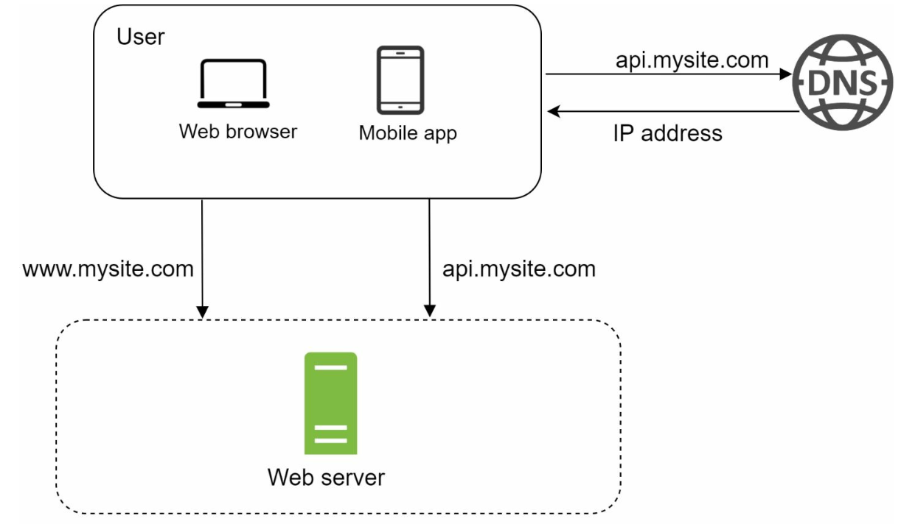
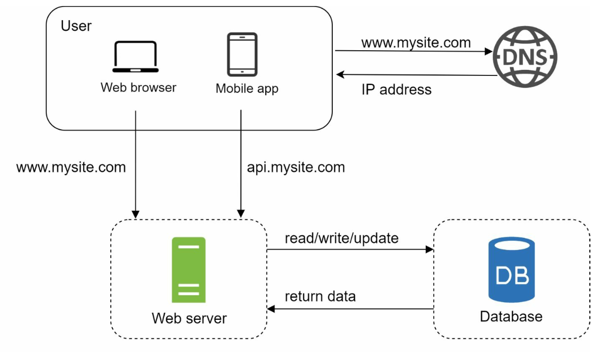

# 第1章：从零扩展到数百万用户

## 引言
将系统扩展以支持数百万用户是一个复杂的、迭代的过程，需要不断的优化和改进。本章概述了如何从单服务器架构开始，逐步扩展系统以处理数百万用户。

---

## 第1节：单服务器架构
最初，所有组件（Web 应用、数据库、缓存）都运行在单台服务器上。

   

### 请求流程
1. 用户通过域名（例如 `api.mysite.com`）访问应用，域名通过 DNS 解析为 IP 地址。
2. Web 服务器的 IP 地址返回给浏览器或移动应用。
3. 浏览器或移动应用向 Web 服务器发送 HTTP 请求，服务器返回 HTML 或 JSON 响应。

### 流量来源
1. **Web 应用：** 使用服务端语言（如 Python、Java）处理业务逻辑，使用客户端语言（如 JavaScript、HTML）进行页面渲染。
2. **移动应用：** 通过 HTTP 和 JSON 与 Web 服务器通信，实现轻量级的数据交换。

---

## 第2节：数据库分离
随着用户数量的增长，数据库被迁移到独立的服务器上，以便 Web 层和数据库层可以独立扩展。

   

### 数据库选型

1. **关系型数据库（SQL）：** 结构化数据存储在表中。示例：MySQL、PostgreSQL。
2. **非关系型数据库（NoSQL）：** 适用于非结构化数据或低延迟需求。类别包括：
   - 键值存储
   - 图数据库
   - 列式存储
   - 文档存储

- 在以下情况下，非关系型数据库可能是合适的选择：
   - 应用需要超低延迟。
   - 数据是非结构化的，或者不存在关系型数据。
   - 只需要序列化和反序列化数据（JSON、XML、YAML 等）。
   - 需要存储海量数据。

---

## 第3节：垂直扩展与水平扩展
### 垂直扩展
- 为现有服务器增加更多资源（CPU、RAM）。
- 受硬件限制，且缺乏冗余。

### 水平扩展
- 向服务器集群中添加更多服务器，更适合大规模系统。
- 使用负载均衡器来处理服务器之间的请求路由。

---

## 第4节：负载均衡器

   

**负载均衡器**在多台服务器之间分发流量。优点包括：
1. 冗余性：如果某台服务器宕机，流量会被重新路由。
   - 如果服务器 1 宕机，所有流量将被路由到服务器 2。
2. 可扩展性：可以轻松添加服务器以应对流量高峰。
   - 如果网站流量快速增长，可以添加后续服务器来处理额外的流量。

---

## 第5节：数据库复制

   

### 主从模型
- **主数据库：** 处理写操作。
   - 所有修改数据的命令（如插入、删除或更新）都必须发送到主数据库。
- **从数据库：** 处理读操作，提高性能和可靠性。
   - 由于大多数应用中读操作与写操作的比例较高，因此系统中从数据库的数量通常多于主数据库。

### 优点
1. 通过并行读操作提升性能。
2. 通过冗余实现高可用性和数据可靠性。

### 故障处理
- 如果只有一个从数据库可用且发生宕机，读操作将临时导向主数据库。
- 如果有多个从数据库可用，读操作将被重定向到其他健康的从数据库，同时新服务器将替换故障服务器。
- 如果主数据库宕机，一个从数据库将被提升为新的主数据库。
- 在生产系统中，选定的从数据库可能不是最新数据，因此需要通过运行数据恢复脚本来更新数据（多主节点和环形复制等方法可能有所帮助）。

---

## 第6节：缓存
**缓存**将频繁访问的数据存储在内存中，以降低数据库负载。缓存层是一种临时数据存储层，速度远快于数据库。

   

### 缓存考虑事项
1. **使用场景：** 当数据被频繁读取但很少修改时，考虑使用缓存。
2. **过期策略：** 缓存数据过期后，会从缓存中移除。如果没有设置过期策略，缓存数据将永久存储在内存中。
3. **一致性：** 这意味着保持数据存储和缓存同步。由于数据存储和缓存上的数据修改操作不在同一个事务中，可能会出现不一致。
4. **故障缓解：** 单台缓存服务器是一个潜在的单点故障，建议在不同数据中心部署多台缓存服务器以避免 SPOF。
5. **淘汰策略：** 当缓存满时，需要淘汰部分数据以释放内存。LRU 是最流行的缓存淘汰策略。

## 第7节：内容分发网络（CDN）
**CDN** 通过在地理分布的服务器上缓存静态内容（图片、CSS、JavaScript）来提升加载速度。

   

### 工作流程
1. 用户从最近的 CDN 服务器请求内容。
2. 如果内容不可用，则从源服务器获取并缓存。

### CDN 注意事项
1. **成本：** CDN 由第三方提供商运营，会对进出 CDN 的数据传输收费。
2. **缓存过期：** 缓存过期时间既不能太长，也不能太短。
3. **CDN 降级：** 如果出现临时 CDN 故障，客户端应能检测到问题并向源服务器请求资源。
4. **文件失效：** 如果文件更新了，应使缓存失效以指向更新后的文件。

---

## 第8节：无状态 Web 层
通过将会话数据移至共享数据存储，Web 服务器变得无状态。这允许：
1. 更轻松的水平扩展。
2. 基于流量的自动伸缩。

   

---

## 第9节：多数据中心部署
跨多个数据中心部署可提高可用性并降低延迟。策略包括：

   

1. **GeoDNS 路由：** 将用户引导到最近的数据中心。
2. **数据复制：** 跨数据中心同步数据以防止不一致。

### 关键注意事项
- **流量重定向：** 需要有效的工具来将流量引导到正确的数据中心。
- **数据同步：** 常见策略是在多个数据中心之间复制数据。
- **测试与部署：** 自动化部署工具对于保持所有数据中心的服务一致性至关重要。

---

## 第10节：消息队列
**消息队列**是一种存储在内存中的持久化组件，支持异步通信。它充当缓冲区并分发异步请求。

   

- 输入服务称为生产者/发布者，它们创建消息并将其发布到消息队列。
- 其他服务称为消费者/订阅者，连接到队列并执行消息定义的操作。

---

## 第11节：日志、指标与自动化

   

### 重要性
1. **日志记录：** 追踪错误和系统健康状态。
2. **指标：** 提供性能和用户活动的洞察。
3. **自动化：** 简化测试、部署和扩展流程。

---

## 第12节：数据库扩展
### 垂直扩展
- 增加硬件资源，但存在物理和成本限制。
- 有多个缺点：
   - 单点故障风险更高。
   - 垂直扩展的整体成本很高。

### 水平扩展（分片）

   

- 使用键（如 `user_id`）将数据分布在多个分片上。
   - 分片将大型数据库分离为更小、更易于管理的部分，称为分片。
   - 每个分片共享相同的模式，尽管每个分片上的实际数据是唯一的。
- 在实施分片策略时，分片键至关重要。选择分片键时，重要的是选择一个能够均匀分布数据的键。

#### 挑战
1. **重新分片数据：** 在以下情况下需要重新分片：
   - 由于快速增长，单个分片无法再容纳更多数据。
   - 由于数据分布不均，某些分片可能比其他分片更快耗尽容量。
   - 使用一致性哈希来克服这些问题。

2. **名人问题：** 对特定分片的过度访问可能导致服务器过载。
   - 为解决此问题，可能需要为每位名人分配一个分片。

3. **连接与反规范化：** 一旦数据库跨多个服务器分片，跨数据库分片执行连接操作就很困难。
   - 常见的变通方法是反规范化数据库，以便可以在单个表中执行查询。

---

## 结论
### 核心要点
1. 保持 Web 层无状态。
2. 在每一层构建冗余。
3. 使用缓存和 CDN 优化性能。
4. 通过分片扩展数据层。
5. 解耦组件以提高灵活性。

本章为构建能够处理数百万用户的可扩展系统奠定了坚实基础。

