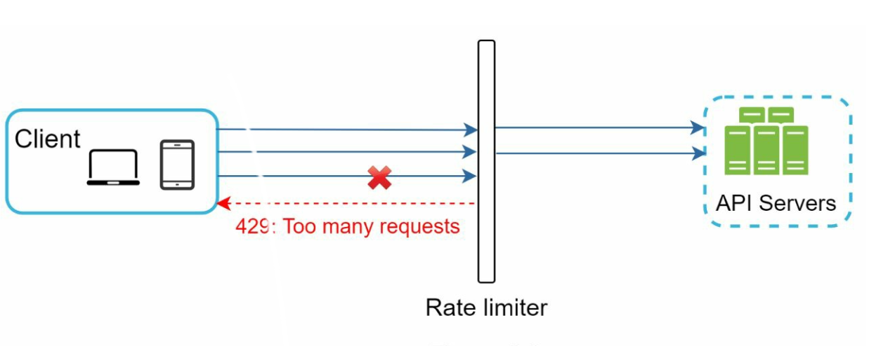
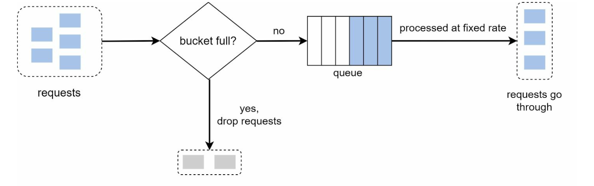

# 第4章：设计限流器

## 引言
本章探讨限流器的设计与实现——限流器是一种用于控制客户端或服务发送流量速率的系统组件。限流器对于防止滥用、降低成本以及确保服务器资源的稳定性至关重要。其应用场景包括限制发帖、账户创建和奖励领取等。

## 限流的优势
- **防止 DoS 攻击：** 拦截超额请求，避免资源耗尽。
- **降低成本：** 限制不必要的请求，减少服务器开支。
- **防止过载：** 过滤过多请求，稳定服务器性能。

## 第一步：理解问题
### 核心功能
- 服务端 API 限流器。
- 支持多种限流规则。
- 在分布式环境中处理大规模系统。
- 可选择独立服务或应用层代码实现。
- 被限流时向用户发出通知。

### 需求
- 精确的请求限流。
- 低延迟。
- 低内存占用。
- 分布式能力。
- 清晰的异常处理。
- 高容错性。

## 第二步：高层设计
### 部署位置选择

    

1. **客户端实现：** 由于可能被滥用，可靠性较低。
2. **服务端实现：** 出于控制和可靠性考虑，优先选择。
3. **中间件（API 网关）：** 集成限流的灵活方案。

### 部署位置选择指南
- 评估现有技术栈，选择高效的方案。
- 根据业务需求选择合适的算法。
- 若采用微服务架构，使用 API 网关。
- 若资源有限，可选择商业解决方案。

## 第三步：限流算法
### 1. 令牌桶

  

- **描述：** 以固定速率向桶中添加令牌，每个请求消耗一个令牌。
- **参数：** 桶容量和令牌补充速率。
- **优点：** 易于实现，内存效率高，支持突发流量。
- **缺点：** 需要仔细调整参数。

### 2. 漏桶

  

- **描述：** 使用 FIFO 队列以固定速率处理请求。
- **优点：** 内存效率高，输出速率稳定。
- **缺点：** 突发流量可能延迟最近的请求。

  示例：https://github.com/uber-go/ratelimit

### 3. 固定窗口计数器

  

- **描述：** 将时间划分为固定区间，使用计数器限制请求数量。
- **优点：** 简单，适用于特定场景，效率高。
- **缺点：** 窗口边缘的流量突发可能超出限制。

- 时间窗口边缘的突发流量
  可能导致通过的请求数超过允许的配额。

  

### 4. 滑动窗口日志

  

- **描述：** 记录时间戳以实现滚动时间窗口。
- **优点：** 限流精确。
- **缺点：** 内存消耗较高。

### 5. 滑动窗口计数器

  

- **描述：** 结合固定窗口和滑动日志方法，平滑流量峰值。
- **优点：** 内存效率高，能应对突发流量。
- **缺点：** 近似计算可能不够严格。

## 高层架构

  

- **数据存储：** 使用内存缓存（如 Redis）以实现快速的计数操作。
- **流程：**
  1. 客户端向中间件发送请求。
  2. 中间件在 Redis 中检查计数器。
  3. 根据限制处理或拒绝请求。

## 高级考量
### 分布式环境
- **挑战：** 竞态条件、同步问题。
- **解决方案：** 使用锁、Lua 脚本或 Redis 中的有序集合。采用集中式数据存储进行同步。

### 性能优化
- 多数据中心部署以降低延迟。
- 采用最终一致性模型进行同步。

### 监控
- 定期分析以确保算法有效性，并根据需要调整规则。