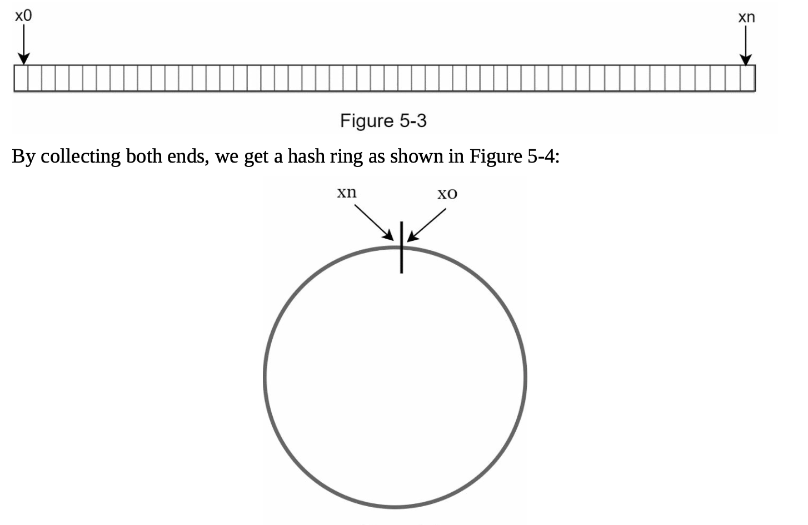
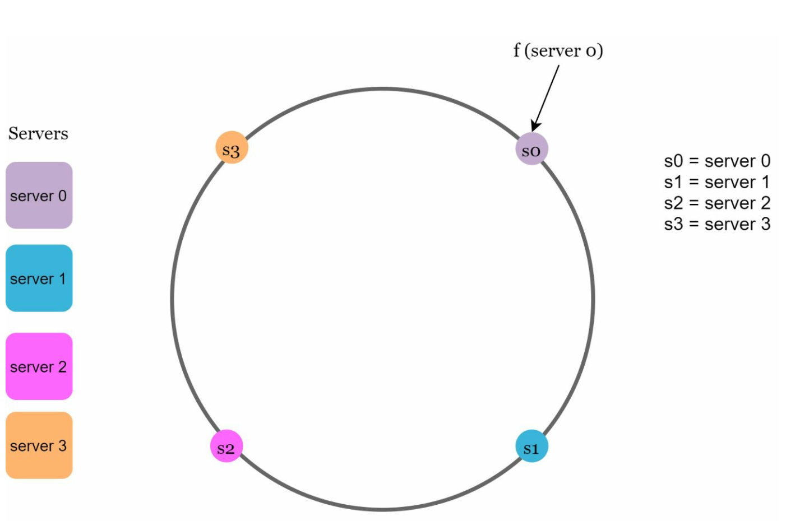
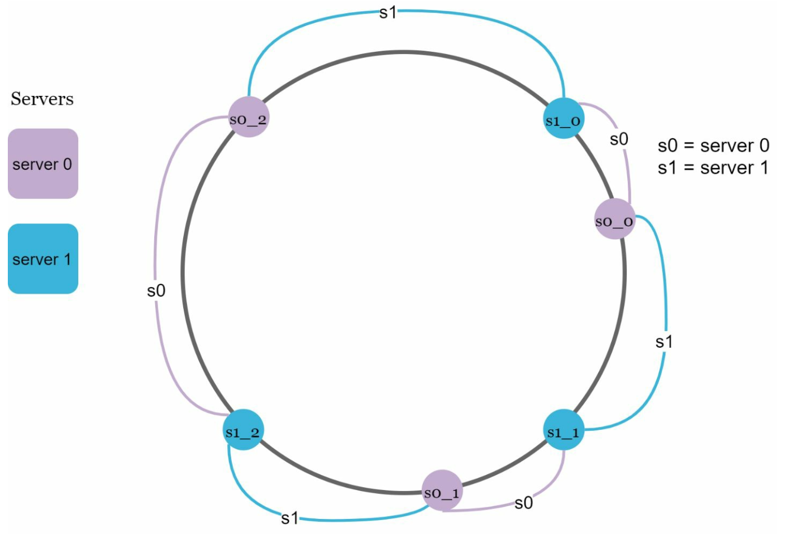

# 第5章：设计一致性哈希

## 引言
本章探讨一致性哈希，这是一种通过高效地将请求和数据分布到多个服务器上来实现水平扩展的关键技术。它在添加或移除服务器时能够最小化数据重新分布，并确保数据均匀分布，从而缓解服务器热点等问题。

## 再哈希问题
### 解释
在传统的哈希方法中，例如 `serverIndex = hash(key) % N`，当服务器数量发生变化时，数据重新分布会变得很棘手。例如：
- 移除服务器会导致大多数键被重新分配，从而引发缓存未命中。
- 添加服务器会导致不必要的键重新分布。

  

- 当服务器池大小固定时，这种方法效果很好。然而，当添加新服务器或移除现有服务器时，就会出现问题。

  

### 关键问题
服务器数量变化时大多数键的重新分布会导致效率低下和负载过载。

## 一致性哈希
### 定义
一致性哈希确保在添加或移除服务器时，只有部分键需要重新映射。这最大限度地减少了中断并增强了可扩展性。

### 核心概念
1. **哈希空间与环形结构：** 哈希空间形成一个连续的环，哈希值分布在 `0` 到 `2^160-1` 之间（例如使用 SHA-1 等哈希函数）。将两端连接起来就形成了一个环。
    

    
    

- 使用相同的哈希函数 f，我们根据服务器 IP 或名称将服务器映射到环上。  

    

    
    

1. **服务器查找**
- 通过顺时针遍历环形结构，直到找到服务器为止，来确定键对应的服务器。

  

  
  

2. **添加和移除服务器**
- 添加服务器只会重新分布附近的键。只有一部分键会被重新分配到新服务器上。
  
  

  
  

- 移除服务器只会影响其范围内的键。只有被移除服务器的键会被顺时针重新分配到下一个服务器上。

  

  
  

## 挑战与解决方案
### 基本方法中的两个问题
1. **分区大小不均：** 服务器可能拥有不相等的数据分区。
2. **键分布不均匀：** 某些服务器接收的键可能显著多于其他服务器。

### 解决方案：虚拟节点
- 每个服务器在环上由多个均匀分布的虚拟节点表示。
- 虚拟节点改善了键分布并平衡了负载。随着虚拟节点数量的增加，键的分布变得更加均衡。这是因为虚拟节点越多，标准差越小，从而实现均衡的数据分布。
   
  

  
  

## 受影响的键
当添加或移除服务器时：
- **添加服务器：** 受影响的键位于新服务器与其前驱节点之间。
  在以下示例中，服务器 4 被添加到环上。受影响的范围从 s4（新添加的节点）开始，沿环形逆时针移动，直到找到服务器（s3）。因此，位于 s3 和 s4 之间的键需要重新分配给 s4。

  

  
  

- **移除服务器：** 受影响的键位于被移除的服务器与其前驱节点之间。在以下示例中，当服务器（s1）被移除时，受影响的范围从 s1（被移除的节点）开始，沿环形逆时针移动，直到找到服务器（s0）。因此，位于 s0 和 s1 之间的键必须重新分配给 s2。
   
  

  
  

## 一致性哈希的优势
- **最小化重新分布：** 只有部分键被重新分配。
- **可扩展性：** 支持水平扩展。
- **缓解热点：** 平衡数据分布以避免服务器过载。

## 现实应用
- Amazon Dynamo DB
- Apache Cassandra
- Discord
- Akamai CDN
- Maglev 负载均衡器