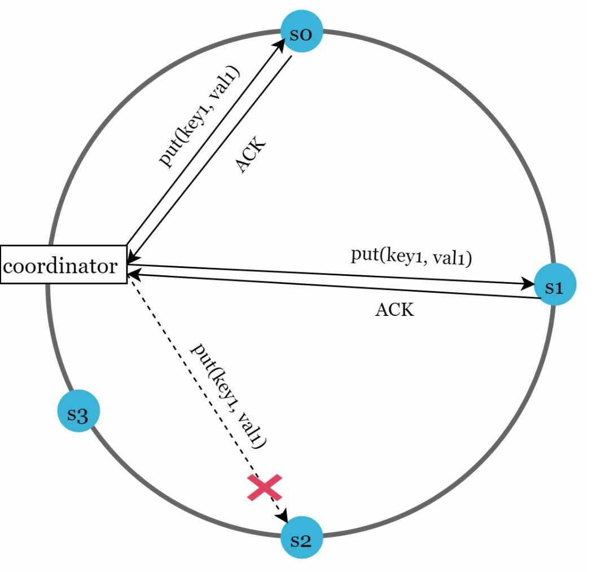
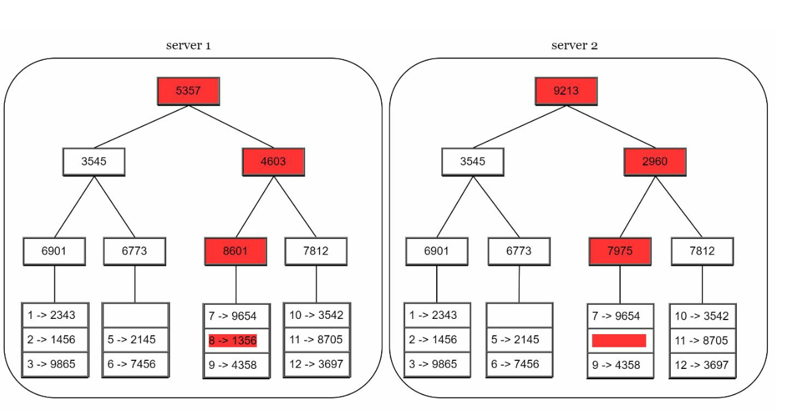

# 第六章：设计键值存储

## 引言
**键值存储**是一种非关系型数据库，数据以键值对的形式存储。每个键都是唯一的，值通过这些键进行访问。本章详细介绍了如何设计一个可扩展、高可用的分布式键值存储，支持以下操作：
- `put(key, value)` 用于插入数据。
- `get(key)` 用于检索数据。

### 设计特性
- 小型键值对（<10 KB）。
- 支持高可用性和可扩展性的大数据场景。
- 自动扩展和可调一致性。
- 低延迟。

---

## 单服务器键值存储
### 实现
- 使用**哈希表**在内存中存储键值对。
- 优化手段：
  - 数据压缩。
  - 将访问频率较低的数据存储在磁盘上。

### 局限性
单台服务器的内存有限，需要采用**分布式方案**来实现可扩展性。

---

## 分布式键值存储
**分布式键值存储**将数据分区存储在多台服务器上，必须解决**CAP 定理**所描述的权衡问题。

### CAP 定理
1. **一致性：** 所有客户端同时看到相同的数据。
2. **可用性：** 系统响应每个请求，即使某些节点宕机。
3. **分区容错性：** 系统在网络分区的情况下仍能继续运行。

**权衡：** 根据 CAP 定理，三个保证中只能同时满足两个。

  

#### 系统类型：
- **CP 系统：** 保证一致性和分区容错性，牺牲可用性（例如银行系统）。
- **AP 系统：** 保证可用性和分区容错性，牺牲一致性（例如最终一致性）。
- **CA 系统：** 保证一致性和可用性，牺牲分区容错性。

    **由于网络故障不可避免，分布式系统必须容忍网络分区。因此，CA 系统在实际应用中不存在。**

    在分布式系统中，分区是不可避免的。当分区发生时，必须在一致性和可用性之间做出选择。例如，如果节点 n3 宕机，
    写入节点 n1 或 n2 的数据无法传播到 n3。反之，如果数据写入 n3 但尚未同步到 n1 和 n2，则 n1 和 n2 上的数据将是过期的。

    

    
    

    
- 如果选择 CP 系统，必须阻塞对 n1 和 n2 的所有写操作，以避免数据不一致。
- 如果选择 AP 系统，系统继续接受读取操作，即使可能返回过期数据。对于写操作，n1 和 n2 继续接受写入，
  当网络分区恢复后，数据将同步到 n3。

---

## 系统组件
### 1. 数据分区
- **技术：** 使用**一致性哈希**将数据均匀分布到多台服务器上。
- **优势：**
  - 服务器增减时自动扩展。
  - 通过虚拟节点实现异构性。服务器的虚拟节点数量与服务器容量成正比。

### 2. 数据复制
- 将数据复制到 `N` 台服务器以实现高可用性。
- N 台服务器的选择方法是从当前服务器位置沿顺时针方向查找，选取环上的前 N 台服务器存储数据副本。将副本放置在不同的数据中心，以提高可靠性（尤其是在使用虚拟节点的情况下）。

    

    
    

### 3. 一致性
由于数据在多个节点上复制，必须在副本之间同步。
- **法定人数共识：**
  - `N`：总副本数。
  - `W`：写法定人数大小。写操作被认为是成功的，需要 W 个副本确认。
  - `R`：读法定人数大小。读操作被认为是成功的，需要至少 R 个副本响应。
  - **规则：** `W + R > N` 确保强一致性。
  - W、R 和 N 的配置是延迟与一致性之间的典型权衡。

    

    
    

    
    - 如果 R = 1 且 W = N，系统针对快速读取进行了优化。
    - 如果 W = 1 且 R = N，系统针对快速写入进行了优化。
    - 如果 W + R > N，保证强一致性（通常 N = 3，W = R = 2）。
    - 如果 W + R <= N，不保证强一致性。

- **模型：**
  - **强一致性：** 读操作返回的值对应于最新写入数据项的结果。
  - **弱一致性：** 后续读操作可能看不到最新的值。
  - **最终一致性：** 经过足够长的时间，所有更新都会被传播，所有副本最终达到一致。

### 4. 不一致性的解决
复制带来了高可用性，但也导致了副本之间的不一致。使用版本控制和向量锁来解决不一致性问题。
- **版本控制：**
    - 使用**向量时钟**来跟踪数据版本并解决冲突。
    - 版本控制意味着将每次数据修改视为数据的新不可变版本。
        

        
        
        
- 服务器 1 更改了名称，服务器 2 也更改了名称。这两个更改同时发生。现在，我们得到了冲突的值，称为版本 v1 和 v2。

- **向量时钟（Vector Clock）**
    1. **设置：** 向量时钟是一个与数据项关联的 [服务器, 版本] 对。它可以用来检查一个版本是否先于、后于或与其他版本冲突。
        - 假设向量时钟表示为 D([S1, v1], [S2, v2], …, [Sn, vn])，如果数据项 D 被写入服务器 Si，系统必须执行以下任务之一。
        - 其中：`D` 是数据项，`Si` 是服务器标识符，`vi` 是服务器 `Si` 上数据的版本计数器。

    2. **更新向量时钟：** 当数据项在某台服务器上被修改时：
        - 如果该服务器已存在于向量时钟中，其版本计数器递增。
        - 否则，向向量时钟中添加一个新条目。

    3. **冲突检测：**
        - **无冲突：** 如果版本 X 中的所有计数器都小于或等于版本 Y 中的对应计数器，则版本 X 是版本 Y 的祖先。
        - **存在冲突：** 如果版本 Y 中至少有一个计数器小于版本 X 中的对应计数器，则这两个版本是兄弟版本。

    4. **冲突解决：** 当检测到冲突（兄弟版本）时，系统依赖应用特定的逻辑或客户端介入来协调数据。

        

        
        

- **挑战：**
  - 增加了客户端的复杂性。
  - 随着多次更新，向量时钟的大小可能增长，需要修剪策略来限制其大小。

### 5. 处理故障

#### a. 故障检测
仅仅因为另一台服务器说某台服务器宕机就认为其宕机是不够的。通常需要至少两个独立的信息来源才能标记服务器为宕机。
- **流言协议（Gossip Protocol）：**
    

        
    

    - 每个节点维护成员 ID 和心跳计数器。
    - 每个节点定期递增其心跳计数器。
    - 每个节点定期向一组随机节点发送心跳。
    - 如果心跳在超过预设周期内没有增加，则该成员被视为离线。

#### b. 临时故障
- **松散仲裁（Sloppy Quorum）：** 使用健康节点临时维持操作。
        

        
        

    - 检测到故障后，系统需要部署特定机制以确保可用性
    - 系统不强制执行仲裁要求，而是在哈希环上选择前 W 个健康服务器进行写入，前 R 个健康服务器进行读取。
    - 离线服务器被忽略。如果某台服务器不可用，另一台服务器将临时处理请求。

- **提示移交（Hinted Handoff）：** 离线服务器在恢复后追赶更改。
    - 当宕机的服务器重新上线时，更改将被推送回去以实现数据一致性。

#### c. 永久故障
- 使用 **Merkle 树（Merkle Trees）** 在副本之间进行高效同步。
    **Merkle 树**（或哈希树）是一种数据结构，用于在永久故障期间高效检测和解决副本之间的不一致性。

- 工作原理
    1. **结构：**
        - **叶节点**存储单个数据块的哈希值。
        - **非叶节点**存储其子节点的哈希值。
        - **根哈希**代表树中所有数据的组合状态。

    2. **构建 Merkle 树：**
        - **步骤 1：** 将键空间划分为桶。
            
            

        - **步骤 2：** 使用一致哈希对每个桶中的键进行哈希处理。

            

        - **步骤 3：** 为每个桶创建单个哈希值。
        
            

        - **步骤 4：** 组合桶的哈希值以计算更高层级的哈希值，最终得到根哈希。

            

    3. **同步：**
        - 要同步两个副本：
            - 比较它们的根哈希值。
            - 如果根哈希值匹配，则副本一致。
            - 如果根哈希值不同，则递归比较子哈希值以识别不一致的桶。
        - 仅同步不一致的数据。

- 优势
    - **高效性：** 仅同步不一致的数据，减少数据传输量。
    - **可扩展性：** 对大型数据集有效，同步开销极小。
    - **可靠性：** 确保副本间的数据一致性。

### 6. 处理数据中心宕机
- 在多个数据中心之间复制数据，以确保在宕机期间的可用性。---

## 写入与读取路径
### 1. 写入路径（基于 Cassandra 架构）

    

- 将写入操作持久化到**提交日志（commit log）**。
- 将数据保存到**内存缓存**。
- 当缓存满时，将数据刷新到磁盘上的 **SSTable（Sorted String Table）**。

   

### 2. 读取路径

    
    

- 在**内存缓存**中查找数据。
- 如果不存在，使用**布隆过滤器（Bloom Filter）**定位数据所在的 SSTable。
- 读取并返回数据。

---

## 最终架构

- 客户端通过简单的 API 与键值存储进行通信：`get(key)` 和 `put(key, value)`。
- 协调器（coordinator）是客户端与键值存储之间的代理节点。
- 节点通过一致性哈希分布在环上。
- 系统完全去中心化，因此添加和移动节点可以自动完成。
- 数据在多个节点上进行复制。
- 每个节点承担相同的职责，因此不存在单点故障。