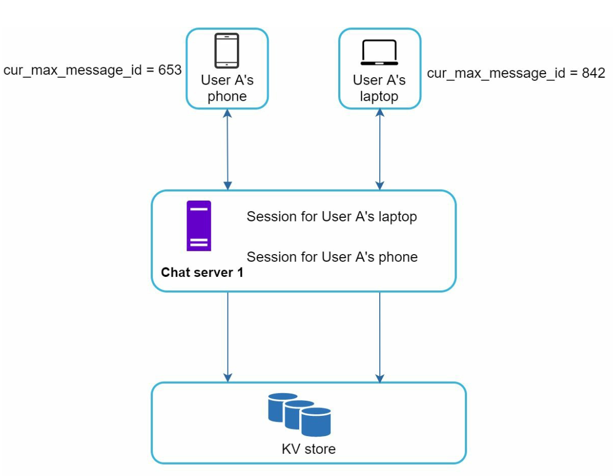
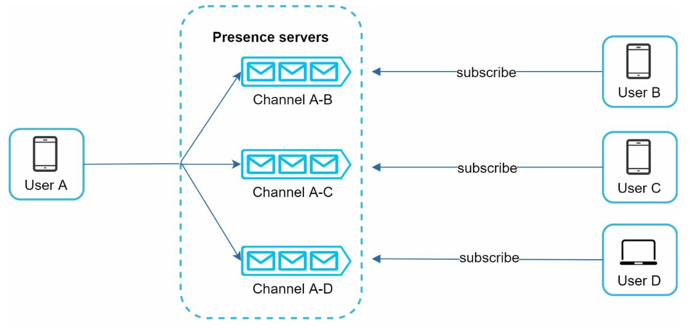

# 第12章：设计聊天系统

## 引言
**聊天系统** 支持用户之间的实时消息传递。本章重点设计一个包含以下功能的聊天应用：
- **一对一聊天**
- **群聊（最多100名用户）**
- **在线状态指示器**
- **多设备支持**
- **推送通知**

该系统面向 **5000万日活跃用户（DAU）**，并永久存储聊天历史记录。

---

## 第1步：理解问题

### 需求
1. **功能：**
   - 一对一聊天和群聊（最多100名成员）。
   - 基于文本的消息（最多100,000个字符）。
   - 在线/离线状态指示器。
   - 支持多设备。
   - 推送通知。
2. **规模：** 为5000万DAU设计。
3. **存储：** 永久存储聊天历史记录。

---

## 第2步：高层设计

### 通信协议
1. **发送端：** 使用HTTP发送消息，利用持久连接提高效率。

      

          
      

2. **接收端：**
   - **轮询：**
      - 客户端定期向服务器查询是否有可用消息。
      - 由于频繁且冗余的请求，效率较低。

             

   - **长轮询：**
      - 保持连接打开，直到消息到达。
      - 对不活跃用户效率较低。

         

   - **WebSocket：**
      - 一种双向持久连接，用于实时通信，被选为发送和接收消息的方案。
      - 使用WebSocket（ws）协议发送和接收消息。

             
   
---

### 组件

       
   

1. **无状态服务：**
   - 处理注册、登录和用户资料管理。
   - 与服务发现集成，以推荐最佳的聊天服务器。
2. **有状态服务：**
   - 聊天服务器维护持久的WebSocket连接。
   - 负责消息传递和同步。
3. **第三方集成：**
   - 推送通知服务告知用户有新消息。
   - 通知系统章节介绍了通知的实现方式。

---
### 设计

客户端与聊天服务器保持持久的WebSocket连接，以实现实时消息传递。

       

- 聊天服务器负责消息的发送和接收。
- 在线状态服务器管理在线/离线状态。
- API服务器处理所有操作，包括用户登录、注册、修改资料等。
- 通知服务器发送推送通知。
- 最后，键值存储用于存储聊天历史记录。出于以下原因，聊天历史数据采用键值存储作为数据库：
   - 它支持方便的横向扩展。
   - KV存储提供极低的数据访问延迟。
   - 关系型数据库无法很好地处理长尾数据。当索引变得非常大时，随机访问成本很高。
   - KV存储已被其他可靠的聊天应用采用。例如，Facebook Messenger和Discord。

以下是一对一聊天和群聊的数据模型。
   - 主键是消息ID，用于决定消息顺序。
   - 对于群聊，复合主键是（channel_id, message_id）。
      - 可以使用类似Snowflake的全局64位序列号生成器来生成ID。
      - 更好的方法是使用本地序列号生成器。本地意味着ID仅在群内唯一。
      - 本地ID有效的原因是，在一对一频道或群频道内维护消息顺序就足够了。
      
         
         

## 第3步：深入设计

### 服务发现

      

- 服务发现的主要作用是根据地理位置、服务器容量等标准，为客户端推荐最佳的聊天服务器。
- 使用 **Apache Zookeeper** 根据地理位置和服务器容量等标准分配聊天服务器。
- 确保高效的负载分配，并将延迟降至最低。

### 消息流程
#### 一对一聊天

1. 用户A向聊天服务器1发送一条消息。
2. 聊天服务器1分配一个唯一的消息ID，并将消息存储在键值存储中。
3. 如果用户B在线，消息将被转发到聊天服务器2，保持持久的WebSocket连接。
4. 如果用户B离线，则发送推送通知。

#### 群聊

     

- 消息会被复制到群组中每个接收者的独立收件箱中。
- 简化了同步过程，但对于大型群组来说开销较大。
- 在接收端，一个接收者可以接收来自多个用户的消息。每个接收者都有一个收件箱（消息同步队列），其中包含来自不同发送者的消息。

---

#### 消息同步

许多用户拥有多个设备。我们需要在设备之间同步消息。每个设备维护一个名为 cur_max_message_id 的变量，用于跟踪该设备上的最新消息 ID。满足以下两个条件的消息被视为新消息：

     

- 接收者 ID 等于当前登录用户的 ID。
- 键值存储中的消息 ID 大于 cur_max_message_id。

---

### 在线状态

1. **心跳机制：**
   

       
   

   
   - 客户端定期向状态服务器发送心跳，以表明自己在线。
   - 如果在阈值（例如 x = 30）内未收到心跳，则将该用户标记为离线。

2. **扇出模型：**
   

       
   

   - 状态更新通过发布-订阅模型推送给好友，每对好友之间维护一个频道。
   - 当用户 A 的在线状态发生变化时，它会将事件发布到三个频道：频道 A-B、A-C 和 A-D。
   - 这三个频道分别由用户 B、C 和 D 订阅，他们将收到在线状态更新。
   - 上述设计适用于小型用户群体。

---

## 额外考虑

### 可扩展性
- **水平扩展：** 随着用户数量增加，添加更多服务器。
- **负载均衡：** 在服务器之间均匀分配流量。
- **缓存：** 减轻数据库负载并提高响应速度。

### 错误处理
- **重试机制：** 通过重试和队列处理消息发送失败的情况。
- **服务器故障：** 使用服务发现机制在故障时分配新服务器。

### 未来扩展
1. **媒体支持：** 增加对照片和视频的处理，包括压缩和云存储。
2. **端到端加密：** 确保消息隐私。
3. **客户端缓存：** 减少数据传输以提升性能。
4. **加快加载速度：** 使用地理分布的缓存网络。

