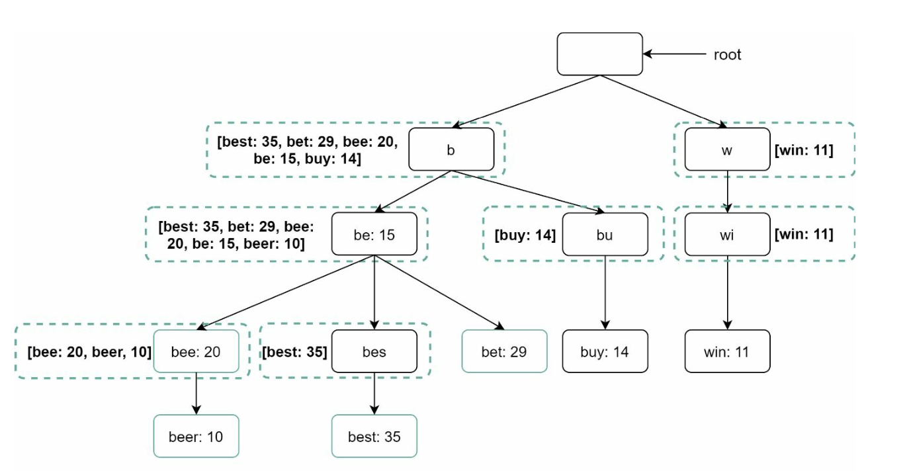

# 第13章：设计搜索自动补全系统

## 引言
自动补全（也称为输入提示或增量搜索）在用户输入搜索框时提供实时建议。系统必须根据历史查询数据高效地提供前 k 条相关且热门的建议。

### 核心特性
- 建议最多 **5 条自动补全结果**。
- 基于 **查询热度**（频率）。
- 仅支持 **小写英文字符**。
- 响应时间快（<100 毫秒）且可扩展。

---

## 第一步：理解问题

### 需求
1. **实时建议：** 随着用户输入显示相关匹配结果。
2. **前 k 条结果：** 返回最多 5 条按热度排序的结果。
3. **可扩展性：** 支持 **1000 万日活用户**，峰值 QPS 为 **48,000**。
4. **高可用性：** 在系统故障时仍能正常运行，不出现停机。
5. **数据增长：** 支持每日新增查询数据 **0.4 GB** 的存储增长。

---

## 第二步：高层设计
在高层上，系统分为两个服务：
1. **数据采集服务：**
    - 收集用户查询并实时聚合以进行频率分析。
    - 对于大规模数据集，实时处理并不实际；不过这是一个好的起点。

2. **查询服务：** 根据用户输入提供前 k 条建议。

---

### 数据采集服务

    

- 聚合分析日志中的查询数据并更新频率表。
- 每周处理历史数据以构建 **字典树**（前缀树）。

### 查询服务

    
    

- 使用数据采集服务提供的频率表。
- 处理用户输入，并使用字典树从频率表中检索前 k 条建议。
- 通过缓存和高效的数据结构优化快速查找。
- 例如，当用户在搜索框中输入“tw”时，会显示以下前 5 条搜索查询。

---

## 第三步：深入设计

### 字典树数据结构
**字典树** 是一种树形数据结构，用于高效地存储和检索查询字符串。

#### 核心特性
1. **紧凑存储：** 分层表示前缀以最小化冗余。
2. **频率信息：** 在每个节点存储查询的热度。

4. **获取前 k 条最热门查询的步骤**
   

      
   

    - 查找前缀
    - 从前缀节点遍历子树以获取所有有效子节点
    - 对子节点排序并获取前 k 条

3. **优化：**
   - 在每个节点缓存前 k 条查询，以加快检索速度并避免遍历整个字典树。

        

   - 限制前缀长度以缩小搜索空间，因为用户很少输入很长的搜索查询（例如 50 个字符）。

#### 字典树操作
1. **创建：**
    - 每周使用聚合的查询数据构建。
    - 数据来源为分析日志/数据库。
2. **更新：** 很少实时更新；每周更新会替换旧数据。
3. **删除：**
      

         
      

    - 过滤器会移除不需要或有害的建议（例如仇恨言论）。
    - 拥有过滤层使我们能够根据不同的过滤规则灵活移除结果。
    - 不需要的建议会被异步地从数据库中物理删除。
    

---

### 查询处理流程
1. **前缀搜索：**
   - 识别与用户输入对应的前缀节点。
   - 遍历子树以收集有效建议。
2. **前 k 条排序：**
   - 在每个节点缓存前 k 条建议以最小化排序开销。
3. **结果构建：**
   - 使用缓存数据构建结果以实现快速响应。

---

### 优化
1. **节点缓存：**
   - 存储前 k 条查询以避免重复遍历。
2. **限制前缀长度：**
   - 将前缀长度限制为较小值（例如 50 个字符）以加快查找速度。
3. **AJAX 请求：**
   - 使用轻量级异步请求实现实时响应。
4. **浏览器缓存：**
   - 将自动补全结果保存在浏览器缓存中，用于频繁搜索的词条。

---

### 数据采集管道
在高层设计中，每当用户输入搜索查询时，数据都会实时更新。这种方法并不实际。
- 用户每天可能输入数十亿条查询。每次查询都更新字典树是不可行的。
- 字典树构建后，热门建议可能变化不大。

#### 更新后的设计

   

1. **分析日志：**
   - 将原始查询数据存储为日志，用于每周聚合。
   - 日志为追加写入模式，不建立索引。
2. **聚合器：**
   - 将日志处理成频率表，适用于构建字典树。
   - 对于 Twitter 等实时应用，在更短的时间间隔内进行数据聚合。
   - 对于其他场景，较低频率的聚合（例如每周一次）即可满足需求。
3. **工作节点：**
   - 异步服务器负责重建字典树，并将其存储在持久化存储中。
4. **存储方案：**
   - **字典树缓存（Trie Cache）：** 一种分布式缓存系统，将字典树保留在内存中，以实现快速读取。
   - **字典树数据库（Trie DB）**
     1. **文档存储（如 MongoDB）：** 由于每周会构建一个新的字典树，我们可以定期对其进行快照、序列化，并将序列化后的数据存储在 MongoDB 等数据库中。
     2. **键值存储：**
        - 将前缀映射到节点数据，以实现快速访问。
        - 字典树中的每个前缀都映射到哈希表中的一个键。
        - 每个字典树节点上的数据都映射到哈希表中的一个值。

        
---

### 可扩展性
1. **分片：**
   - 根据前缀范围（例如 `a-m`、`n-z`）将字典树节点分布到不同的服务器上。
   - 在前缀内部进一步分片，以平衡不均匀的数据分布（例如 `aa-ag`、`ah-an`）。
2. **负载均衡：**
   

      
   

   - 使用分片映射管理器将请求路由到相应的服务器。

---

## 第四步：高级功能

### 多语言支持
1. **Unicode 字符：** 使用 Unicode 来支持非英语语言。
2. **特定国家的字典树：** 为不同国家或地区分别构建独立的字典树。

### 热门查询
- 通过动态更新字典树节点，或为近期查询赋予更高权重，来处理实时事件。