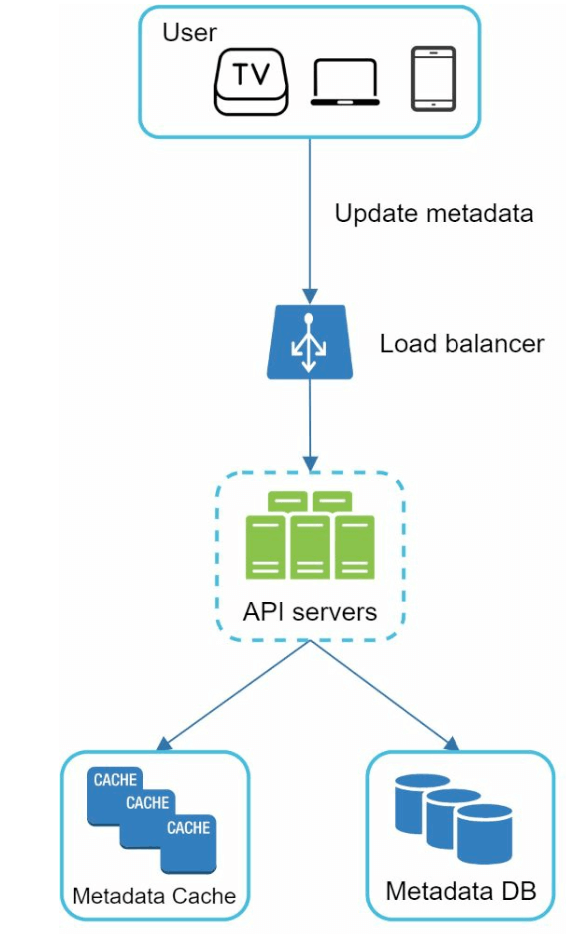
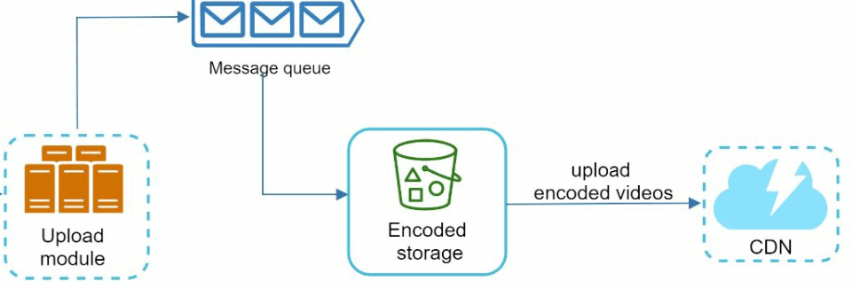

# 第14章：设计 YouTube

## 引言
YouTube 是一个庞大的视频流媒体平台，支持视频上传、播放和各种交互。本章重点在于设计一个可扩展的视频流媒体系统，具备以下核心功能：
- **快速视频上传**
- **流畅的视频播放**
- **支持切换视频清晰度**
- **低基础设施成本**
- **高可用性和可靠性**

### 关键统计数据（2020年）
- **20亿月活跃用户**
- **每天观看50亿个视频**
- **37%的移动网络流量来自 YouTube**
- 支持 **80种语言**
- 2019年广告收入 **151亿美元**

---

## 第一步：理解问题与范围

### 核心功能
1. 上传视频
2. 观看视频

### 支持的平台
- 移动应用、网页浏览器和智能电视

### 假设条件
- **日活跃用户数（DAU）：** 500万
- **平均视频大小：** 300 MB
- **上传限制：** 每个视频最大 1 GB
- **每日存储需求：** 150 TB
- **CDN 成本：** 500万 × 5个视频 × 0.3GB × $0.02 = 每天 $150,000（使用 Amazon CloudFront）

---

## 第二步：高层设计

### 组件

    

1. **客户端：** 智能手机、电脑和电视等设备。
2. **CDN（内容分发网络）：** 存储和流式传输视频。
3. **API 服务器：** 处理所有用户交互（视频流除外，例如上传、元数据更新）。
4. **元数据数据库：** 存储视频元数据（如标题、描述、大小）。
5. **原始存储：** 用于存储上传视频的对象存储。
6. **转码服务器：** 将视频转换为多种分辨率和格式。
7. **转码后存储：** 用于存储转码后视频的对象存储。

---

### 核心工作流
#### 1. 视频上传流程
- **并行流程：**
  1. 将视频上传到原始存储。
  2. 在数据库中更新视频元数据。

- **视频上传（步骤）：**

    

        
    

    - [1] 视频上传到对象存储。
    - [2] 转码服务器将视频转换为多种格式。
    - [3] 转码完成后，以下两个步骤并行执行。
        - [3a] 转码后的视频被发送到转码后存储。
        - [3b] 转码完成事件被放入完成队列。
    - [3a.1] 视频被分发到 CDN。
    - [3b.1] 完成处理器更新元数据并通知用户。

- **元数据上传（步骤）：**

    

        
    

    - 客户端并行发送请求以更新视频元数据。
    - 请求包含视频元数据，包括文件名、大小、格式等。

#### 2. 视频播放流程

  

- 视频通过边缘服务器直接从 CDN 流式传输，以最小化延迟。
- 常见的流媒体协议包括 MPEG_DASH、Apple HLS、Adobe HDS。
- *不同的流媒体协议支持不同的视频编码和播放器。*

---

## 第三步：深入设计

### 视频转码
#### 重要性
1. 原始视频占用大量存储空间。转码可减少存储空间。
2. 确保跨设备和浏览器的兼容性。
3. 根据网络条件自适应视频清晰度。

#### 组件
- **容器：** 封装视频、音频和元数据（如 MP4、AVI）。
- **编解码器：** 压缩和解压缩算法（如 H.264、VP9）。

#### 有向无环图（DAG）模型

    

- 视频转码计算量大且耗时。
- DAG 模型定义了编码、缩略图生成和水印添加等任务。
- 允许视频处理过程中的高度并行性。

- 原始视频被拆分为视频、音频和元数据。
    - 视频编码：视频被转换为支持不同的分辨率、编解码器和比特率。
    - 缩略图：可由用户上传或由系统自动生成。
    - 水印：叠加在视频上的图像，包含视频的标识信息。

---

### 视频转码架构

1. **预处理器：** 将视频拆分为更小的片段（GOP 对齐）。它有4项职责。

    

        
    

    - 视频拆分：视频流被拆分或进一步拆分为更小的 GOP 对齐片段。
    - 针对旧版客户端，按 GOP 对齐拆分视频。
    - 根据客户端程序员编写的配置文件生成 DAG。
    - 将 GOP 和元数据存储在临时存储中，以防编码失败时系统可使用持久化数据进行重试。2. **DAG 调度器：** 将任务组织为顺序或并行阶段。
    

        
    

    - 它将 DAG 图拆分为任务阶段，并将它们放入资源管理器中的任务队列。
    - 第一阶段：视频、音频和元数据。
    - 视频文件在第二阶段被进一步拆分为两个任务：视频编码和缩略图生成。

3. **资源管理器：** 负责管理资源分配的效率。
    它包含 3 个队列和一个任务调度器。
    

        
    

    - 任务队列：包含待执行任务的优先级队列。
    - 工作节点队列：包含工作节点利用率信息的优先级队列。
    - 运行队列：包含当前正在运行的任务以及执行这些任务的工作节点。
    - 任务调度器：选择最优的任务/工作节点，并指示选定的工作节点执行任务。

4. **任务工作节点：** 执行转码及其他操作。
    

        
   

    - 不同的任务工作节点可能执行不同的任务。

5. **临时存储：** 存储用于重试的中间数据。
    - 存储系统的选择取决于数据类型、数据大小、访问频率、数据生命周期等因素。
6. **输出：** 已完成转码、准备分发的视频。

---

## 系统优化

### 速度优化
1. **并行视频上传：** 将视频拆分为更小的分块，以实现更快的可恢复上传。

    

2. **分布式上传中心：** 使用 CDN 作为靠近用户的上传枢纽。
3. **并行处理：** 使用消息队列解耦模块，实现高并行度。

    
    

### 安全优化
1. **预签名 URL：** 限制视频上传仅限授权用户。

    

2. **保护视频：**
   - **DRM 系统**（如 Apple FairPlay、Google Widevine）。
   - **AES 加密。**
   - **水印。**

### 降低成本优化
1. 仅通过 CDN 分发热门视频；较不热门的视频从高容量服务器提供。
2. 对极少访问的视频按需编码。
3. 根据受欢迎程度对视频分发进行区域化。
4. 构建自有 CDN 并与 ISP 合作，以降低带宽成本。

---

## 错误处理
### 可恢复错误
- 重试失败的上传、转码或资源分配任务。

### 不可恢复错误
- 停止格式错误视频的处理，并返回错误码。