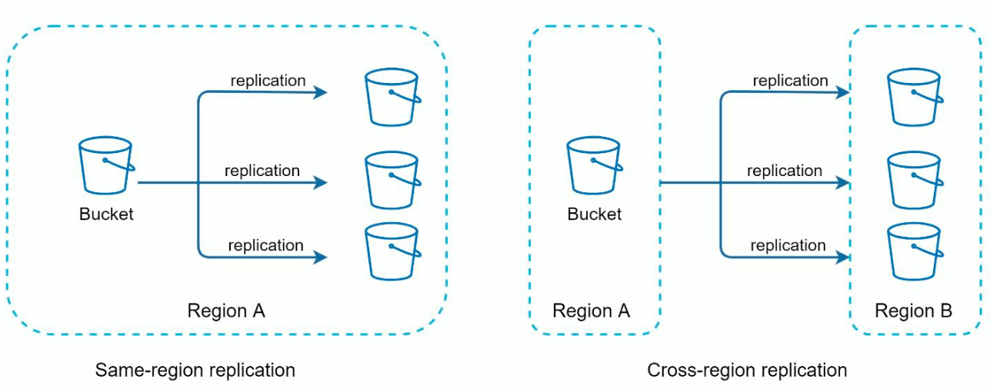
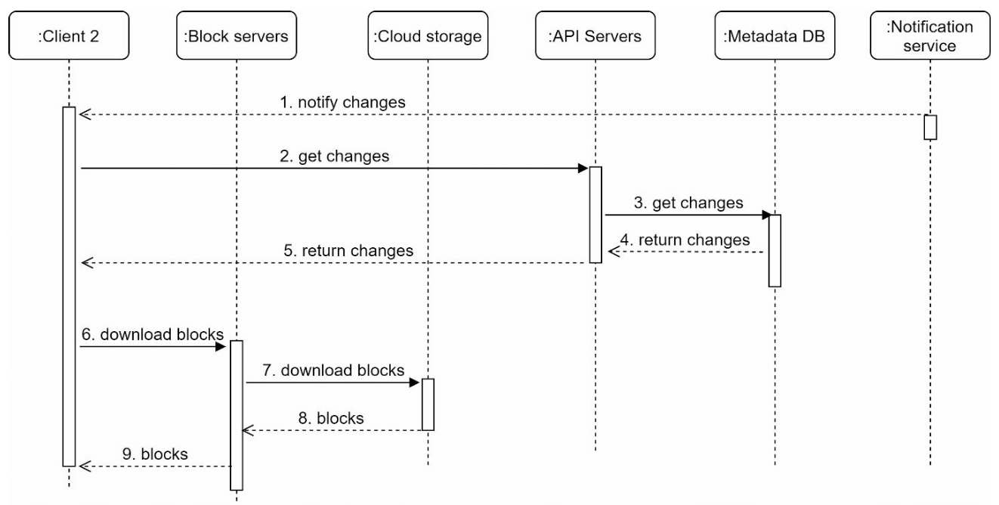

# 第15章：设计 Google Drive

## 引言
Google Drive 是一项基于云端的文件存储与同步服务，允许用户从各种设备存储、访问和共享文件。本章讨论如何设计一个具备以下功能的可扩展系统：
- **文件上传与下载**
- **跨设备文件同步**
- **文件共享**
- **文件修订历史**
- **编辑、删除和共享的通知**

---

## 第一步：理解问题

### 核心需求
#### 功能需求：
- 上传和下载文件。
- 跨多台设备同步文件。
- 维护文件修订版本。
- 支持带权限的文件共享。
- 在文件编辑、删除和共享时发送通知。

#### 非功能需求：
- **可靠性：** 数据丢失是不可接受的。
- **快速同步速度：** 避免因同步延迟导致用户失去耐心。
- **带宽效率：** 尽量减少不必要的数据传输。
- **可扩展性：** 支持每日 1000 万活跃用户（DAU）。
- **高可用性：** 在服务器故障或网络问题时仍能无缝运行。

### 约束与假设
- 用户获得 **10 GB 免费空间**。
- 最大文件大小：**10 GB**。
- 平均文件上传大小：**500 KB**。
- 上传频率：**每用户每天 2 个文件**。
- 总存储需求：**500 PB**。

---

## 第二步：高层设计

### 单服务器架构
一个基础架构包括：
1. **Web 服务器：** 处理上传和下载。
2. **元数据数据库：** 用于记录用户数据、登录信息、文件信息等元数据。
3. **存储目录：** 按命名空间组织存放文件。

    

- 设置一台 Web 服务器和一个名为 drive/ 的根目录来存储上传的文件。
- 在 drive/ 目录下，有一系列称为命名空间（namespaces）的子目录。
- 每个命名空间包含该用户上传的所有文件。
- 每个文件或文件夹可以通过命名空间与相对路径的组合来唯一标识。

该设计作为起点，但不足以支撑大规模扩展。

#### API 接口
1. **上传文件到 Google Drive：** 支持两种上传方式
    - 简单上传：适用于文件较小的情况。
    - 可续传上传：
        - 端点：https://api.example.com/files/upload?uploadType=resumable
        - 发送初始请求以获取可续传 URL。
        - 上传数据并监控上传状态。
        - 如果上传中断，续传上传。
2. **从 Google Drive 下载文件：** 下载文件时
    - 端点：https://api.example.com/files/download
3. **获取文件修订版本：**
    - 端点：https://api.example.com/files/list_revisions

### 迁移到分布式系统

#### 改进措施：
1. **分片：** 根据 `user_id` 将存储分散到多台服务器。
2. **Amazon S3：** 使用 S3 实现可扩展且冗余的文件存储，并支持跨区域复制。

    
     
3. **负载均衡器：** 将流量分发到多台 Web 服务器。
4. **元数据数据库复制：** 通过数据库分片和复制确保可用性。

#### 同步冲突：
对于 Google Drive 这样的大规模存储系统，同步冲突时有发生。
当两个用户同时修改同一文件或文件夹时，就会产生冲突。

- 在示例中，用户 1 和用户 2 同时尝试更新同一文件，但用户 1 的文件先被系统处理。
- 用户 1 的更新操作成功完成，而用户 2 遇到了同步冲突。
- 系统会同时展示同一文件的两个版本：用户 2 的本地副本和服务器上的最新版本。
- 用户 2 可以选择合并两个版本，或用其中一个版本覆盖另一个。

### 改进后的设计

1. **用户交互：** 用户通过浏览器或移动应用访问系统。

2. **块服务器：**
   - 文件被切分为 **4 MB 的块**（最大尺寸），并分配唯一的哈希值。
   - 块独立存储在云端存储（如 Amazon S3）中。
   - 文件重建通过按特定顺序拼接各块来完成。

3. **云端存储：** 块存储在云端以实现可扩展性和冗余。

4. **冷存储：** 不活跃的文件被移至冷存储以降低成本。

5. **负载均衡器：** 均匀分发请求到各 API 服务器，确保高效运行。

6. **API 服务器：**
   - 处理用户认证、用户资料管理和文件元数据更新。
   - 管理所有非上传流程。

7. **元数据数据库与缓存：**
   - 存储用户、文件、块和版本的元数据。
   - 频繁访问的元数据会被缓存以加快检索速度。

8. **通知服务：**
   - 一个**发布/订阅系统**，用于通知客户端文件的变更（新增、编辑、删除）。
   - 确保客户端能够拉取最新更新。9. **离线备份队列：** 临时存储离线客户端的文件变更信息，以便在重新上线时同步。

---

## 第三步：深度设计

### 元数据数据库
下图为高度简化的版本，仅包含最重要的表和字段。

#### 架构设计：
- **用户表：** 存储用户资料和偏好设置。
- **文件表：** 维护文件元数据（如大小、名称、路径）。
- **块表：** 追踪文件块以用于文件重建。
- **文件版本表：** 存储文件修订历史。

---

### 文件上传流程

1. **文件上传：**
   - 文件被分割成块，由块服务器进行压缩和加密。
   - 块被上传到块服务器并存储在 S3 中。
2. **元数据上传：**
   - 客户端将元数据发送到 API 服务器。
   - 元数据以 `pending` 状态存储在数据库中。
3. **完成：**
   - S3 触发回调，将文件状态更新为 `uploaded`。
   - 通知服务告知相关用户。

---

### 文件同步
1. **增量同步：** 仅传输修改的块，而非整个文件。

    

    
    

2. **压缩：** 根据文件类型使用相应的压缩算法对块进行压缩。
3. **冲突解决：**
   - 先处理的版本胜出。
   - 冲突版本单独保存，供用户手动解决。

---

### 文件下载流程
当文件在其他地方被添加或编辑时，会触发下载流程。客户端可以通过两种方式获知：
- 如果客户端 A 在线而文件被其他客户端修改，通知服务会告知客户端 A。
- 如果客户端 A 离线而文件被其他客户端修改，数据将被保存到缓存中。当离线客户端重新上线时，它会拉取最新的变更。

一旦客户端得知文件已变更，它会先通过 API 服务器请求元数据，然后下载块以构建文件。

1. **触发：** 通知服务告知客户端文件已更新。
2. **元数据获取：** 客户端通过 API 获取更新后的元数据。
3. **块下载：** 客户端从块服务器下载更新后的块并重建文件。

---

### 通知服务
1. **目的：** 保持客户端对文件变更的最新了解。
2. **机制：** 采用**长轮询**实现异步通知。
3. **示例：** 当文件被添加、编辑或删除时，通知会推送到所有相关客户端。

---

### 存储优化
1. **去重：** 通过基于哈希的比较，在账户级别移除重复的块。
2. **版本策略：**
   - 限制保存的修订版本数量。
   - 对频繁编辑的文件优先保留最近版本。
3. **冷存储：** 将极少访问的文件迁移到更廉价的存储方案（例如 Amazon S3 Glacier）。

---

### 故障处理
1. **负载均衡器故障：** 备用负载均衡器接管。
2. **块服务器故障：** 待处理任务被重新分配给其他服务器。
3. **元数据数据库故障：**
   - 将从节点提升为主节点。
   - 将流量重定向到剩余副本。
4. **云存储故障：** 使用跨区域复制来获取不可用的文件。
5. **通知服务故障：** 客户端重新连接到备用服务器。