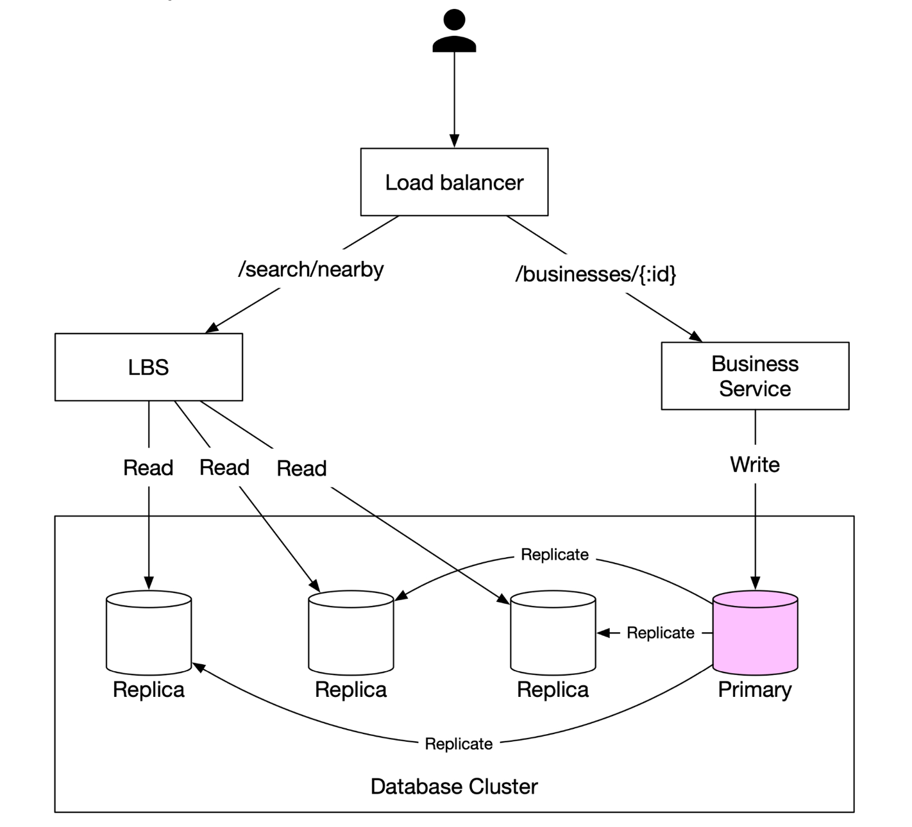
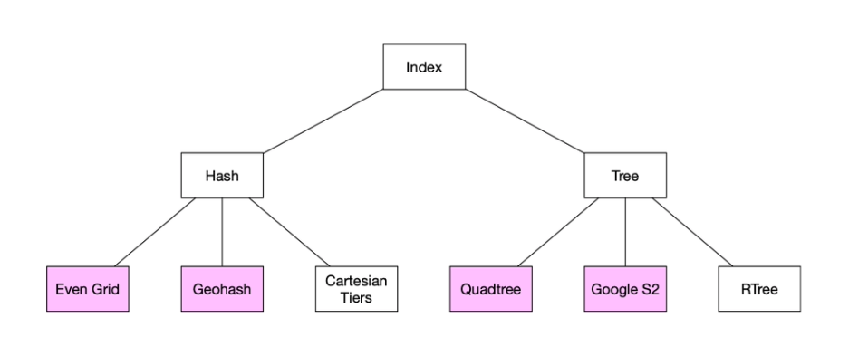

# 第16章：邻近服务

## 引言
**邻近服务**旨在查找附近的位置，例如餐厅、酒店、加油站和其他商家。该功能被应用于**Google Maps**和**Yelp**等应用中，帮助用户在指定半径内发现地点。

---

## 第一步：理解问题并确定范围

### **功能需求**
1. 根据用户位置（纬度、经度）和搜索半径**搜索商家**。
2. 允许商家所有者添加、更新或删除商家（非实时）。
3. 在请求时**提供详细的商家信息**。

### **非功能需求**
- **低延迟**：用户应获得快速响应。
- **数据隐私**：符合 GDPR 和 CCPA 法规。
- **高可用性**：应对繁忙地点在高峰时段的流量激增。

### **粗略估算**
- **1亿日活跃用户**。
- **2亿商家**在系统中。
- **搜索 QPS 计算**：
  - 用户每天进行**5次搜索**。
  - **搜索 QPS** = (1亿 × 5) / 86,400 ≈ **5,000 QPS**。

---

## 第二步：高层设计

### **API 设计**
#### **搜索附近商家**
GET /v1/search/nearby

- **请求参数**：
  - `latitude`：用户位置的纬度。
  - `longitude`：用户位置的经度。
  - `radius`：搜索半径（默认：5000米）。

#### **商家 API**
| API 端点 | 描述 |
|---|---|
| `GET /v1/businesses/{id}` | 获取商家详细信息 |
| `POST /v1/businesses` | 添加新商家 |
| `PUT /v1/businesses/{id}` | 更新商家详情 |
| `DELETE /v1/businesses/{id}` | 从系统中移除商家 |

### **数据模型**
由于读操作量很大（两个功能使用非常频繁），MySQL 等关系型数据库是一个不错的选择。
- 搜索附近商家
- 查看商家详细信息

### **数据模式**
- 关键的数据库表是商家表和地理空间索引表。
- 商家表包含商家的详细信息。

### **高层系统架构**
系统由两部分组成：基于位置的服务（LBS）和商家相关服务。

<div style="margin-left:3rem">
    
</div>

- **基于位置的服务（LBS）**：
  - 处理基于位置的搜索查询。
  - 读密集型服务，无写请求。
  - QPS 很高，尤其在密集区域的高峰时段，系统无状态。
- **商家服务**：处理两种类型的请求。
  - 商家所有者创建、更新或删除商家。
  - 客户查看商家详细信息。
- **负载均衡器**：将流量路由到 LBS 和商家服务。
- **数据库集群**：
  - 采用**主从架构**应对读密集型负载。
  - LBS 读取的数据与主数据库写入的数据之间可能存在一定差异。
  - 由于商家信息不是实时更新的，这种不一致性不是问题。

---

## 第三步：获取附近商家的算法

### **方案一：二维搜索（朴素方法）**

<div style="margin-left:3rem">
    
</div>

最直观的方法是画一个预设半径的圆，找出圆内的所有商家。

**SQL 查询：**
```
SELECT business_id, latitude, longitude
FROM business
WHERE (latitude BETWEEN :lat - radius AND :lat + radius)
AND (longitude BETWEEN :long - radius AND :long + radius);
```

**问题：**
- **低效**：需要扫描整个数据库。
- **受限于一维索引**（纬度/经度）。

一种潜在的改进是在经度和纬度列上建立索引，虽然效果稍好，但仍然非常慢。

### 更优方案
- 上一种方案的问题在于数据库索引只能在一维上加速搜索。
- 最优方案是使用地理空间索引将二维数据映射为一维数据。
  - 哈希：均匀网格、Geo Hash
  - 树：四叉树、Google S2、RTree

  <div style="margin-left:3rem">
    
  </div>

### **方案二：均匀划分网格**

  <div style="margin-left:3rem">
    
  </div>

- **将世界划分为固定大小的网格**。
- **问题**：商家分布不均（城市密度高，农村稀疏）。

### **方案三：Geohash**
- 沿本初子午线和赤道将地球划分为四个象限，然后将每个网格再划分为四个更小的网格。
- 每个网格可以通过交替经度和纬度的比特位来表示。
- 重复此细分过程。

  <div style="margin-left:3rem">
    
    
  </div>


- **将经纬度编码为单个字母数字字符串**。它有 12 个精度等级。
- **分层网格结构**支持高效搜索。
- 根据表格选择最小的 geohash 长度来确定合适的精度。
  <div style="margin-left:3rem">
    
  </div>
- Geohash 保证：两个 geohash 的公共前缀越长，它们之间的距离就越近。

- **挑战**：
  <div style="margin-left:3rem">
    
  </div>

  - **边界问题**（靠近网格边缘的商家可能会被遗漏）。
    - 两个位置可能非常接近，但完全没有公共前缀（例如位于赤道两侧）。
    - 两个位置可能有很长的公共前缀，但属于不同的 geohash。
  - 解决方案：需要搜索相邻网格。


### **方案 4：四叉树**

  四叉树是一种树形数据结构，它递归地将二维空间划分为四个象限，每个内部节点恰好有四个子节点，分别代表空间的四个子区域。
  - 四叉树是一种内存数据结构，运行在每台 LBS 服务器上，并在服务器启动时构建。

  <div style="margin-left:3rem">
    
  </div>

  - 根节点递归地划分为 4 个象限，直到没有节点包含超过 x 个商家（此处为 100 个）。

  <div style="margin-left:3rem">
    
  </div>

- 四叉树索引占用的内存不多（通常为 GB 级别），可以轻松放入一台服务器。
- 由于构建树的时间复杂度为 O(n log n)，构建树可能需要几分钟时间。
- **适合 k 近邻搜索查询**（例如查找最近的加油站）。

  <div style="margin-left:3rem">
    
  </div>

#### 运维注意事项
 - 对于约 2 亿家商家，在服务器启动时构建四叉树可能需要几分钟。
 - 构建四叉树期间无法服务流量，因此新版本应逐步部署到部分服务器上。
 - 更新商家或新增商家最简单的方法是增量重建四叉树（会导致大量缓存失效）。
 - 也可以实时更新四叉树，但实现更复杂（需要加锁机制）。

### **方案 5：Google S2**
它基于希尔伯特曲线将球面映射到一维索引。希尔伯特曲线上彼此靠近的两个点，在一维空间中也彼此靠近。

  <div style="margin-left:3rem">
    
    
  </div>

- **使用希尔伯特曲线将地球划分为小单元格**。
- 非常适合地理围栏，因为它可以用不同精度覆盖任意区域。
- 地理围栏还允许定义围绕感兴趣区域的参数。
- 另一个优势是：与其使用固定精度级别，不如在 S2 中指定最小、最大精度级别和最大单元格数量。


## 权衡对比

#### Geohash
- 易于使用和实现——无需构建/重建树
- 支持固定半径查询
- 更新索引容易
- 无法根据人口密度动态调整网格大小

#### 四叉树
- 实现稍复杂。
- 支持获取 k 个最近的商家。
- 可根据人口密度动态调整网格大小。
- 更新索引更复杂，可能需要重建整棵树。

---

## 第四步：扩展数据库与缓存策略

### **扩展商家表**
- **按商家 ID 分片**可确保数据均匀分布。
- 表中每个商家对应单独一行。

| Geohash | Business ID |
|---------|------------|
| 9q9hvu  | 343        |
| 9q9hvu  | 347        |
| 9q9hvu  | 112        |

### **扩展地理空间索引**
- 可能不适合放入 geohash 表中。在这种情况下，所有数据都可以放入单台服务器，因此没有分片的技术必要。
- 更好的方法是使用读副本分担读负载。


---

### **缓存策略**
最明显的缓存键选择是位置坐标，但存在一些问题：
 - GPS 获取的位置坐标不够精确。
 - 用户移动会导致位置坐标变化。
 - 更好的键是 geohash。

| 缓存键  | 缓存值 |
|------------|------------|
| `geohash`  | 该网格中的商家 ID 列表 |
| `business_id` | 商家详情（名称、地址、评价等） |---

## 第五步：部署策略与最终架构

### **区域与可用区**
- 将负载均衡器（LBS）和业务服务**部署在多个区域**。

### **处理实时更新**
- **业务更新采用每日批量处理**。

### **最终系统架构**

  <div style="margin-left:3rem">
    
  </div>

最终算法如下：

## 检索附近商家的步骤
1. **用户请求：**  
   - 用户搜索**500 米**范围内的餐厅。  
   - 客户端向**负载均衡器**发送**纬度（37.776720）、经度（-122.416730）和半径（500m）**。

2. **请求转发：**  
   - **负载均衡器（LB）**将请求转发给**基于位置的服务（LBS）**。

3. **Geohash 计算：**  
   - LBS 确定与半径匹配的 **geohash 长度**。  
   - 通过参考表，**500 米对应 geohash 长度 = 6**。

4. **获取相邻 Geohash：**  
   - LBS 计算**相邻 geohash** 以覆盖附近区域。  
   - 结果为一个列表：  
     ```
     [my_geohash, neighbor1_geohash, neighbor2_geohash, ..., neighbor8_geohash]
     ```

5. **从 Redis 获取商家 ID：**  
   - 对于列表中的每个 geohash，LBS 查询 **Geohash Redis 服务器**以获取**商家 ID**。  
   - 采用并行查询以最小化延迟。

6. **检索与排序商家：**  
   - LBS 从**业务信息 Redis 服务器**获取**完整的商家详情**。  
   - 商家按**距离用户位置**进行排序。  
   - **排序后的结果**返回给客户端。

## 关键优化
- **并行 Redis 调用**：缩短响应时间。  
- **Geohash 索引**：确保高效的空间查询。  
- **缓存**：加速商家数据的查找与检索。  

该方法确保**低延迟、可扩展**地检索用户位置附近的商家。

---

### **选择最佳索引方法**
| 索引方法 | 优点 | 缺点 |
|----------------|------|------|
| **Geohash** | 易于实现，适合邻近搜索 | 边界问题，固定网格大小 |
| **Quadtree** | 可动态适应密度，支持 k 近邻查询 | 更复杂，需要树再平衡 |
| **Google S2** | 高级地理围栏，Google Maps 使用 | 实现难度较高 |

---

## 参考资料
1. [Geohash 算法](https://www.movable-type.co.uk/scripts/geohash.html)
2. [Quadtree 索引](https://en.wikipedia.org/wiki/Quadtree)
3. [Google S2 几何](https://s2geometry.io/)