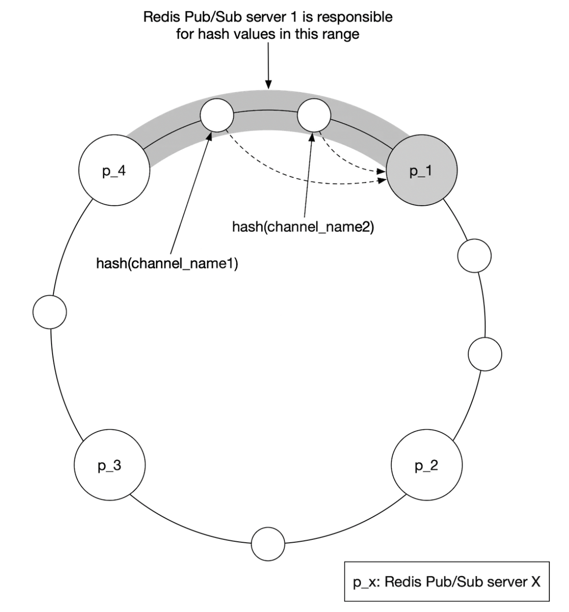

# 第17章：附近的朋友

## 引言

本章重点讨论如何为一项应用设计可扩展的后端，该应用允许用户分享自己的位置，并发现**附近**的朋友。

与“邻近性”章节的主要区别在于：本问题中**位置不断变化**，而在那一个场景中，商家地址基本保持不变。

---

## 第1步：理解问题并确定设计范围

一些有助于面试的问题：
 * C：多近才算“附近”？
 * I：5英里，这个数字应该是可配置的
 * C：距离是按直线距离计算，还是考虑朋友之间可能有河流等因素？
 * I：是的，这是一个合理的假设
 * C：这款应用有多少用户？
 * I：10亿用户，其中10%使用“附近的朋友”功能
 * C：我们需要存储位置历史吗？
 * I：是的，这对机器学习等场景很有价值
 * C：我们可以假设不活跃的朋友会在10分钟后从该功能中消失吗？
 * I：可以
 * C：我们需要担心GDPR等问题吗？
 * I：为了简单起见，不需要

### **功能需求**

 * 用户应该能够在移动应用上看到附近的朋友。每个朋友都有一个距离和时间戳，表示位置何时更新
 * 附近的朋友列表应每隔几秒更新一次

### **非功能需求**

- **低延迟**：及时接收位置更新非常重要
- **可靠性**：偶尔丢失数据点是可以接受的，但系统应保持总体可用
- **最终一致性**：位置数据存储不需要强一致性。不同副本接收位置数据时延迟几秒是可以接受的

### **粗略估算**

一些用于确定潜在规模的估算：
 * 附近的朋友是指在5英里半径内的朋友
 * 位置刷新间隔为30秒。人的步行速度较慢，因此不需要过于频繁地更新位置
 * 平均每天有1亿用户使用该功能，其中10%为并发用户，即1000万
 * 平均每个用户有400个朋友，他们都使用“附近的朋友”功能
 * 应用每页显示20个附近的朋友
 * **位置更新 QPS** = 1000万 / 30 ≈ 每秒约33.4万次更新

---

## 第2步：提出高层设计并获得认可

在探讨API和数据模型设计之前，我们将先研究将要使用的通信协议，因为它不像传统的请求-响应通信模型那样普遍。

### **高层设计**

从高层来看，我们需要建立有效的点对点消息传递。这可以通过点对点协议来实现，但对于连接不稳定且功耗受限的移动应用来说，这种方式并不实用。

一种更实用的方法是使用共享后端作为扇出机制，向你想触达的朋友转发信息：

    

后端做什么？
 * 接收所有活跃用户的位置更新
 * 对于每个位置更新，找到所有应该接收它的活跃用户，并将其转发给他们
 * 如果朋友之间的距离超过配置的阈值，则不转发位置数据

这听起来很简单，但挑战在于如何为我们所处的规模设计系统。

我们先从一个更简单的设计开始，然后在深入探讨中讨论更高级的方法：

    

- **负载均衡器**：将流量分发到REST API服务器以及双向WebSocket服务器
- **REST API服务器**：处理辅助任务，如管理好友关系、更新个人资料等
- **WebSocket服务器**：有状态服务器，负责将位置更新请求转发给相应的客户端。它还负责在初始化时为移动客户端预加载附近朋友的位置（后面会详细讨论）
- **Redis位置缓存**：用于存储每个活跃用户最近的位置数据。缓存中的每个条目都设置了TTL。当TTL过期时，用户不再活跃，其数据将从缓存中移除
- **用户数据库**：存储用户和好友数据。可以使用关系型数据库或NoSQL数据库
- **位置历史数据库**：存储用户位置数据的历史记录，不一定直接用于“附近的朋友”功能，而是用于跟踪历史数据以进行分析
- **Redis发布/订阅**：用作轻量级消息总线，为每个用户频道的位置更新启用不同的话题

    

在上面的示例中，WebSocket服务器订阅与其连接的用户所在的频道，并在接收到位置时将其转发给相应的用户。

### **周期性位置更新**

以下是周期性位置更新的工作流程：

    

* 移动端客户端向负载均衡器发送位置更新
* 负载均衡器将位置更新转发至该客户端对应的 WebSocket 服务器的持久连接
* WebSocket 服务器将位置数据保存到位置历史数据库
* 位置数据在位置缓存中更新。WebSocket 服务器同时在内存中保存位置数据，以便为该用户进行后续的距离计算
* WebSocket 服务器通过 Redis 发布/订阅在用户的频道中发布位置数据
* Redis 发布/订阅将该用户频道的位置更新广播给所有订阅者，即负责该用户好友的服务器
* 订阅了 WebSocket 的服务器接收位置更新，计算该更新应发送给哪些用户并发送出去

以下是同一流程的更详细版本：

    

平均而言，由于一个用户平均有 400 个好友，其中 10% 同时在线，因此大约需要转发 40 次位置更新。

### **API 设计**

我们需要支持的 WebSocket 例程：
* 周期性位置更新 —— 用户向 WebSocket 服务器发送位置数据
* 客户端接收位置更新 —— 服务器发送好友的位置数据和时间戳
* WebSocket 客户端初始化 —— 客户端发送用户位置，服务器返回附近好友的位置数据
* 订阅新好友 —— WebSocket 服务器发送一个好友 ID，移动端客户端需要追踪该好友，例如好友首次上线时
* 取消订阅好友 —— WebSocket 服务器发送一个好友 ID，移动端客户端因好友下线等原因取消订阅

HTTP API —— 用于辅助职责的传统请求/响应载荷。

### **数据模型**

* 位置缓存将存储 `user_id` 与 `lat, long, timestamp` 之间的映射。Redis 是该缓存的绝佳选择，因为我们只关心当前位置，并且它支持我们用例所需的 TTL 淘汰机制。
* 位置历史表存储相同的数据，但存放在关系型表中，包含上述四个列。Cassandra 可用于此数据，因为它针对写入密集型负载进行了优化。

---

## 第3步：设计深入解析

让我们讨论如何扩展高层设计，使其在我们目标规模下正常工作。

### **各组件的扩展性如何？**

- **API 服务器**：可通过自动扩展组和复制服务器实例轻松扩展
- **WebSocket 服务器**：我们可以轻松横向扩展 WebSocket 服务器，但需要确保在拆除服务器时优雅地关闭现有连接。例如，我们可以在负载均衡器中将服务器标记为"排水"状态，在最终从服务器池中移除之前停止向其发送连接
- **客户端初始化**：当客户端首次连接到服务器时，它会获取用户的好友列表，在 Redis 发布/订阅上订阅其频道，从缓存中获取好友位置，最后转发给客户端
- **用户数据库**：我们可以根据 user_id 对数据库进行分片。将用户/好友数据通过专用服务和 API 公开，并由专门团队管理可能也有意义
- **位置缓存**：我们可以通过启动多个 Redis 节点轻松分片缓存。此外，TTL 也限制了可能占用的最大内存。但我们仍需处理大量的写入负载
- **Redis 发布/订阅服务器**：我们利用了已初始化但未使用的频道不消耗内存这一事实。因此，我们可以为所有使用附近好友功能的用户预分配频道，从而避免处理用户上线时创建新频道并通知活跃 WebSocket 服务器的问题

### **Redis 发布/订阅组件的扩展深入解析**

我们将需要大约 200GB 的内存来维护所有发布/订阅频道。这可以通过使用两台各 100GB 的 Redis 服务器来实现。

鉴于我们需要每秒推送约 1400 万次位置更新，假设单台服务器可处理约 10 万次推送/秒，我们实际上至少需要 140 台 Redis 服务器来处理该负载。

因此，我们将需要一个分布式 Redis 服务器集群来处理密集的 CPU 负载。

为了支持分布式 Redis 集群，我们需要利用服务发现组件（如 ZooKeeper 或 etcd）来追踪哪些服务器处于存活状态。

我们需要编码到服务发现组件中的数据如下：

    

WebSocket 服务器使用从 ZooKeeper 获取的编码数据来确定特定频道的位置。为了提高效率，哈希环数据可以缓存在每个 WebSocket 服务器的内存中。

在扩展或缩减服务器集群方面，我们可以设置一个每日任务，根据历史流量数据按需扩展集群。我们也可以过度配置集群以应对负载峰值。

Redis 集群可以被视为一个有状态存储服务器，因为需要为频道维护一些状态，并且需要与订阅者进行协调，以便它们能够转移到集群中新配置的节点。

在扩展操作期间，我们必须注意一些潜在问题：
* 由于频道被重新分配，WebSocket 服务器将产生大量重新订阅请求
* 操作期间可能会丢失一些位置更新，这对于此问题是可以接受的，但仍应尽量减少其发生。建议在一天中流量最低点时执行此类操作
* 我们可以利用一致性哈希来最小化在添加/移除服务器时移动的频道数量

    

### **添加/移除好友**

每当添加或移除好友时，负责受影响用户的 WebSocket 服务器需要订阅/取消订阅该好友的频道。

由于“附近好友”功能是更大应用的一部分，我们可以假设当任何事件发生时，可以在移动端注册回调，客户端将向 WebSocket 服务器发送消息以执行相应操作。

### **拥有大量好友的用户**

我们可以对一个人能拥有的好友总数设置上限，例如 Facebook 的最大好友数上限为 5000。

处理“鲸鱼”用户的 WebSocket 服务器可能会有更高的负载，但只要我们有足够多的 WebSocket 服务器，就应该是没问题的。

### **附近的随机人物**

如果面试官希望更新设计，加入一个可以偶尔在附近好友地图上看到随机人物弹出的功能，该怎么办？

处理这个问题的一种方法是基于 Geohash 定义一个发布/订阅频道池：

    

位于 Geohash 范围内的任何人都会订阅相应的频道，以接收随机用户的位置更新：

    

我们还可以订阅多个 Geohash，以处理某人距离较近但位于相邻 Geohash 边界的情况：

    

### **Redis 发布/订阅的替代方案**

使用 Redis 进行发布/订阅的替代方案是利用 Erlang——一种通用编程语言，专为分布式计算应用进行了优化。

使用它，我们可以生成数百万个小型 Erlang 进程，它们之间相互通信。我们可以在分布式 Erlang 应用中同时处理 WebSocket 连接和发布/订阅频道。

然而，使用 Erlang 的一个挑战是它是一门小众编程语言，可能很难招聘到优秀的 Erlang 开发人员。

---

## 第4步：总结

我们成功设计了一个支持“附近好友”功能的系统。

核心组件：
* **WebSocket 服务器**：客户端与服务器之间的实时通信
* **Redis**：位置数据的快速读写以及发布/订阅频道

我们还探讨了如何扩展 RESTful API 服务器、WebSocket 服务器、数据层、Redis 发布/订阅服务器，并探讨了 Redis 发布/订阅的替代方案。我们还探讨了“随机附近人物”功能。
