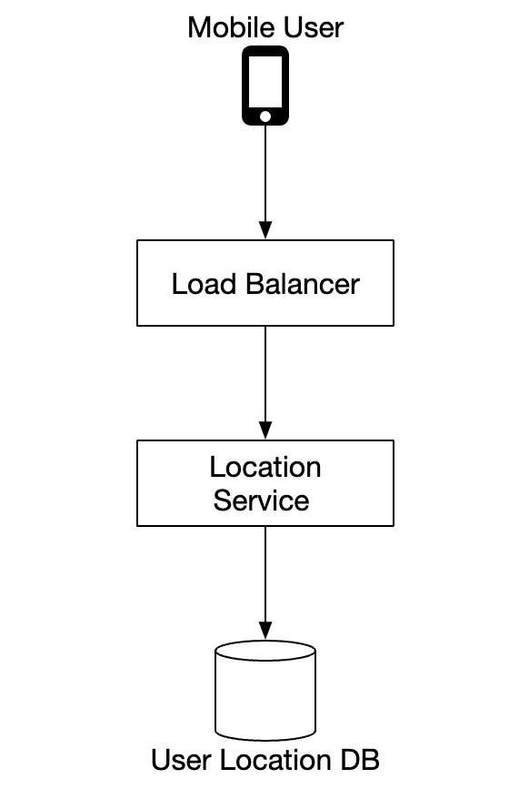
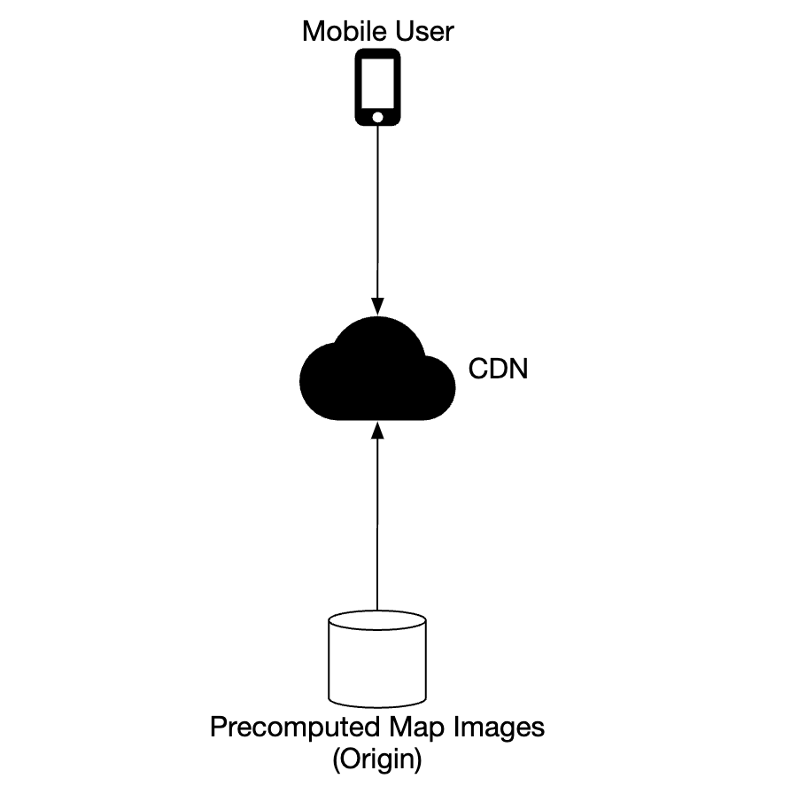
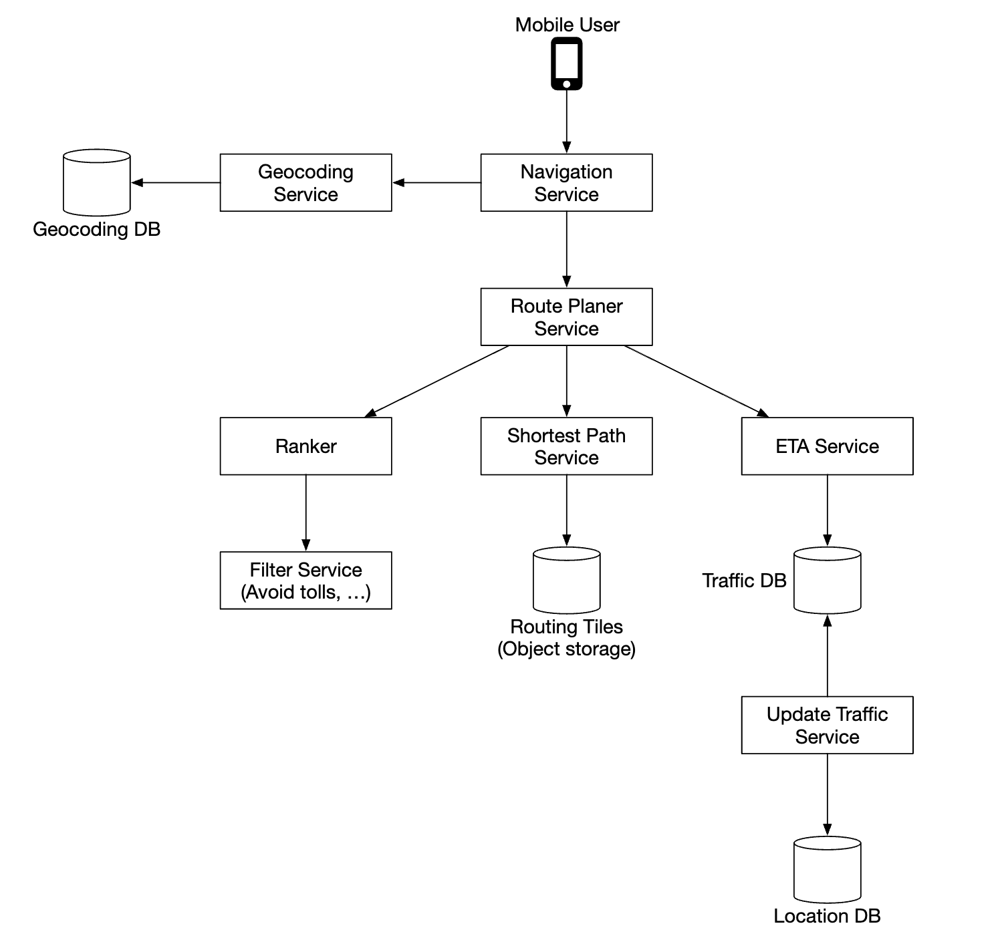

# 第18章：Google 地图

## 引言

我们将设计一个简化版的 **Google 地图**。

关于谷歌地图的一些事实：
* 始于2005年
* 提供多种服务——卫星图像、街道地图、实时交通状况、路线规划
* 到2021年，每日活跃用户达10亿，覆盖全球99%的区域，每日有2500万条实时位置更新

---

## 第一步：理解问题并确定设计范围

候选人与面试官之间的问答示例：

* C：我们要处理多少每日活跃用户？
* I：10亿 DAU
* C：我们应该关注哪些功能？
* I：位置更新、导航、预计到达时间（ETA）、地图渲染
* C：道路数据有多大？我们能获取吗？
* I：我们从多个来源获取了道路数据，是TB级的原始数据
* C：我们应该考虑交通状况吗？
* I：是的，为了准确的时间估算，我们应该考虑
* C：不同的出行方式呢——步行、骑行、驾车？
* I：我们应该支持这些方式
* C：多站点的路线指引呢？
* I：为了面试范围，我们暂不关注这个
* C：商业地点和照片呢？
* I：好问题，但不需要考虑这些

我们将聚焦于三个核心功能——用户位置更新、包含ETA的导航服务、地图渲染。

### **非功能性需求**

- **准确性**：用户不应收到错误的导航方向
- **流畅导航**：用户应体验流畅的地图渲染
- **数据和电量消耗**：客户端应尽可能少地消耗数据和电量。这对移动设备尤为重要。
- 一般可用性和可扩展性需求

### **地图基础**

在深入设计之前，我们需要了解一些与地图相关的概念。

#### 定位系统

世界是一个球体，绕地轴自转。位置由纬度（南北方向的距离）和经度（东西方向的距离）来定义：

<div style="margin-left:3rem">
    
</div>

#### 从三维到二维

将三维点转换为二维平面的过程称为"地图投影"。

有不同的实现方式，各有优缺点。几乎所有投影都会扭曲实际几何形状。

<div style="margin-left:3rem">
    
</div>

谷歌地图选择了一种修改版的墨卡托投影，称为"Web 墨卡托"。

#### 地理编码

地理编码是将地址转换为地理坐标的过程。

逆过程称为"逆地理编码"。

实现这一目标的一种方法是使用插值——利用来自不同来源（例如GIS）的数据，将街道网络映射到地理坐标空间。

#### 地理哈希

地理哈希是一种编码系统，将地理区域编码为字母和数字组成的字符串。

它将世界展平为一个表面，并递归地将其划分为四个象限：

<div style="margin-left:3rem">
    
</div>

#### 地图渲染

地图渲染通过分块（tiling）实现。与其将整个地图渲染为一张大图，世界被分割成更小的图块。

客户端只下载相关的图块，并将它们拼接渲染，如同拼贴马赛克。

不同缩放级别对应不同的图块。客户端根据自身的缩放级别选择合适的图块。

例如，缩小到整个世界的视图只需下载一张256x256的图块，即可代表整个世界。

#### 导航算法的道路数据处理

在大多数路由算法中，交叉路口被表示为节点，道路被表示为边：

<div style="margin-left:3rem">
    
</div>

大多数导航算法使用迪杰斯特拉（Dijkstra）或A*算法的改进版本。

路径查找的性能对图的大小非常敏感。要实现大规模应用，我们不能将整个世界表示为一个图并在其上运行算法。

相反，我们使用一种类似于分块的技术——将世界划分为越来越小的子图。

路由图块保存对相邻图块的引用，算法在遍历相互连接的图块时可以拼接出更大的道路图：

<div style="margin-left:3rem">
    
</div>

这种技术使我们能够显著减少内存带宽，并只加载给定起点/终点对所需的图块。

然而，对于更长的路线，拼接众多小而详细的路由图块仍然会消耗大量时间和内存。相反，存在不同细节级别的路由图块，算法会根据目的地选择合适细节级别的图块：

<div style="margin-left:3rem">
    
</div>

### **粗略估算**对于存储，我们需要保存：
* 世界地图——根据需要存储的所有瓦片估算约为 70PB，但考虑到非常相似的瓦片（例如广袤沙漠）的压缩
* 元数据——体积极小，因此可以从计算中省略
* 道路信息——以路由瓦片的形式存储

导航请求的预估 QPS——10 亿 DAU，每周使用 35 分钟 -> 每天 50 亿分钟。
假设 GPS 更新请求是批量处理的，在峰值负载下我们得出 20 万 QPS 和 100 万 QPS。

---

## 第二步：提出高层设计并获得认可

<div style="margin-left:3rem">
    
</div>

### **定位服务**

<div style="margin-left:3rem">
    
</div>

它负责记录用户的位置更新：
* 位置更新每 `t` 秒发送一次
* 位置数据流可用于随时间改进服务，例如提供更准确的 ETA、监控交通数据、检测封闭道路、分析用户行为等

与其一直向服务器发送位置更新，我们可以在客户端对更新进行批量处理，然后发送批次：

<div style="margin-left:3rem">
    
</div>

尽管进行了这项优化，对于谷歌地图规模的系统，负载仍然会很大。因此，我们可以利用一种针对大量写入进行优化的数据库，例如 Cassandra。

我们还可以利用 Kafka 来高效地处理位置更新流，以便进行进一步分析。

示例位置更新请求有效载荷：

```
POST /v1/locations
Parameters
  locs: JSON encoded array of (latitude, longitude, timestamp) tuples.
```

### **导航服务**

该组件负责在合理时间内（允许少量延迟）查找 A 和 B 之间的快速路线。路线不必是最快的，但准确性很重要。

示例请求有效载荷：

```
GET /v1/nav?origin=1355+market+street,SF&destination=Disneyland
```

示例响应：

```json
{
  "distance": {"text":"0.2 mi", "value": 259},
  "duration": {"text": "1 min", "value": 83},
  "end_location": {"lat": 37.4038943, "Ing": -121.9410454},
  "html_instructions": "Head <b>northeast</b> on <b>Brandon St</b> toward <b>Lumin Way</b><div style=\"font-size:0.9em\">Restricted usage road</div>",
  "polyline": {"points": "_fhcFjbhgVuAwDsCal"},
  "start_location": {"lat": 37.4027165, "lng": -121.9435809},
  "geocoded_waypoints": [
    {
       "geocoder_status" : "OK",
       "partial_match" : true,
       "place_id" : "ChIJwZNMti1fawwRO2aVVVX2yKg",
       "types" : [ "locality", "political" ]
    },
    {
       "geocoder_status" : "OK",
       "partial_match" : true,
       "place_id" : "ChIJ3aPgQGtXawwRLYeiBMUi7bM",
       "types" : [ "locality", "political" ]
    }
  ],
  "travel_mode": "DRIVING"
}
```

尚未考虑交通变化和重新路线，这些将在深入探讨部分中解决。

### **地图渲染**

在客户端保存整个地图瓦片数据集是不可行的，因为它的大小达到 PB 级别。

需要根据客户端的位置和缩放级别按需从服务器获取。

何时应获取新瓦片——当用户缩放以及导航时朝向前方的新瓦片移动。

应如何向客户端提供地图瓦片？
* 可以动态构建，但这会给服务器带来巨大负载，也使缓存变得困难
* 地图瓦片根据其 Geohash 静态提供，客户端可以计算。它们可以静态存储并从 CDN 提供

<div style="margin-left:3rem">
    
</div>

CDN 允许用户从最靠近用户的点位服务器（POP）获取地图瓦片，以将延迟降至最低：

<div style="margin-left:3rem">
    
</div>

确定地图瓦片时可考虑的选项：
* 地图瓦片的 Geohash 可以在客户端计算。如果是这种情况，我们应该谨慎，因为我们长期承诺这种地图瓦片计算方式，强制客户端更新很困难
* 或者，我们可以提供一个简单的 API，代替客户端计算地图瓦片 URL，代价是额外的 API 调用

<div style="margin-left:3rem">
    
</div>

---

## 第三步：深入设计

### **数据模型**

让我们讨论如何存储我们处理的不同类型的数据。

#### 路由瓦片

初始道路数据集来自不同来源。它会随着时间推移基于位置更新数据进行改进。

道路数据是非结构化的。我们有一个定期的离线处理流水线，将这些原始数据转换为应用程序所需的基于图的路由瓦片。我们不需要数据库的任何功能，因此无需将这些瓦片存储在数据库中。可以将它们存储在 S3 对象存储中，同时进行积极缓存。

我们还可以利用库将邻接表高效地压缩为二进制文件。

#### 用户位置数据

用户位置数据对于更新交通状况和进行各种其他分析非常有用。

由于 Cassandra 天然适合写密集型场景，我们可以使用它来存储此类数据。

示例行：

<div style="margin-left:3rem">
    
</div>

#### 地理编码数据库

该数据库存储经纬度与地点的键值对。

由于读取频繁而写入较少，我们可以利用 Redis 快速的读取访问速度。

#### 世界地图预计算图像

如前所述，我们将预计算地图瓦片图像并存储在 CDN 中。

<div style="margin-left:3rem">
    
</div>

### **服务**

#### 位置服务

让我们重点关注数据库设计以及用户位置在该服务中的详细存储方式。

<div style="margin-left:3rem">
    
</div>

我们可以使用 NoSQL 数据库来应对位置更新带来的沉重写入负载。我们优先考虑可用性而非一致性，因为用户位置数据经常变化，并随着新更新的到来而过时。

Cassandra 完美契合我们的所有需求，因此我们选择它作为数据库。

我们要存储的示例行：

<div style="margin-left:3rem">
    
</div>

* `user_id` 是分区键，用于快速访问特定用户的所有位置更新
* `timestamp` 是聚类键，用于按接收到位置更新的时间排序存储数据

我们还利用 Kafka 将位置更新流式传输到各种其他服务，这些服务出于不同目的需要这些位置更新：

<div style="margin-left:3rem">
    
</div>

#### 地图渲染

地图瓦片存储在不同的缩放级别上。在最低缩放级别下，整个世界由一个 256x256 的瓦片表示。

随着缩放级别增加，地图瓦片的数量变为四倍：

<div style="margin-left:3rem">
    
</div>

我们可以使用的一项优化是：不通过网络发送完整的图像信息，而是将瓦片表示为向量（路径与多边形），并让客户端动态渲染这些瓦片。

这将大幅节省带宽。

#### 导航服务

该服务负责寻找最快路线：

<div style="margin-left:3rem">
    
</div>

让我们逐一了解该子系统的各个组件。

首先，地理编码服务将地址解析为经纬度位置。

示例请求：

```
https://maps.googleapis.com/maps/api/geocode/json?address=1600+Amphitheatre+Parkway,+Mountain+View,+CA
```

示例响应：

```json
{
   "results" : [
      {
         "formatted_address" : "1600 Amphitheatre Parkway, Mountain View, CA 94043, USA",
         "geometry" : {
            "location" : {
               "lat" : 37.4224764,
               "lng" : -122.0842499
            },
            "location_type" : "ROOFTOP",
            "viewport" : {
               "northeast" : {
                  "lat" : 37.4238253802915,
                  "lng" : -122.0829009197085
               },
               "southwest" : {
                  "lat" : 37.4211274197085,
                  "lng" : -122.0855988802915
               }
            }
         },
         "place_id" : "ChIJ2eUgeAK6j4ARbn5u_wAGqWA",
         "plus_code": {
            "compound_code": "CWC8+W5 Mountain View, California, United States",
            "global_code": "849VCWC8+W5"
         },
         "types" : [ "street_address" ]
      }
   ],
   "status" : "OK"
}
```

路线规划服务根据当前交通状况计算建议路线，以优化出行时间。

最短路径服务在对象存储中的路由瓦片上运行 A* 算法的变体，以计算最优路径：
* 它接收起点/终点对，将其转换为经纬度对，并从这些对中派生出地理哈希以获取路由瓦片
* 算法从初始路由瓦片开始遍历，直到找到到达目标瓦片的足够好的路径

<div style="margin-left:3rem">
    
</div>ETA 服务由路线规划器调用，基于机器学习算法获取预估时间，根据交通数据预测 ETA。

排序服务负责根据用户传递的过滤器（例如避开收费道路或高速公路的标志）对不同可能的路径进行排序。

更新服务异步更新一些重要数据库，以保持其最新状态。

#### 改进 – 自适应 ETA 与重新路由

我们可以做的一项改进是根据新获取的交通数据自适应地更新正在行驶中的路线。

实现这一点的一种方法是在数据库中存储当前正在导航某条路线的用户，方法是记录他们需要经过的所有瓦片。

数据可能如下所示：

```
user_1: r_1, r_2, r_3, …, r_k
user_2: r_4, r_6, r_9, …, r_n
user_3: r_2, r_8, r_9, …, r_m
...
user_n: r_2, r_10, r21, ..., r_l
```

如果某个瓦片发生交通事故，我们可以识别所有路径经过该瓦片的用户并为他们重新规划路线。

为了减少存储在数据库中的瓦片数量，我们改为存储起始路由瓦片以及不同分辨率级别的若干路由瓦片，直到也包含目标瓦片：

```
user_1, r_1, super(r_1), super(super(r_1)), ...
```

<div style="margin-left:3rem">
    
</div>

使用这种方法，我们只需检查用户的最终瓦片是否包含交通事故瓦片，即可判断该用户是否受到影响。

我们还可以跟踪正在导航的用户的所有可能路线，并在有更快速的重新规划路线可用时通知他们。

#### 推送协议

我们有几种选项，可以从服务器主动向客户端推送数据：

* 移动端推送通知不可用，因为有效载荷有限，且对 Web 应用不可用
* 相比长轮询，WebSocket 通常是更好的选择，因为它对服务器的计算开销更小
* 我们也可以使用服务器发送事件（SSE），但更倾向于使用 WebSocket，因为它支持双向通信，这在例如最后一公里配送功能中会非常有用

---

## 第四步：总结

这是我们的最终设计：

<div style="margin-left:3rem">
    
</div>

我们可以提供的一项额外功能是多站点导航，可以出售给 Uber 或 Lyft 等企业客户，用于确定访问一组地点的最优路径。