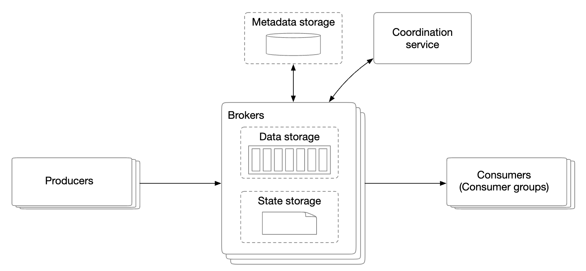
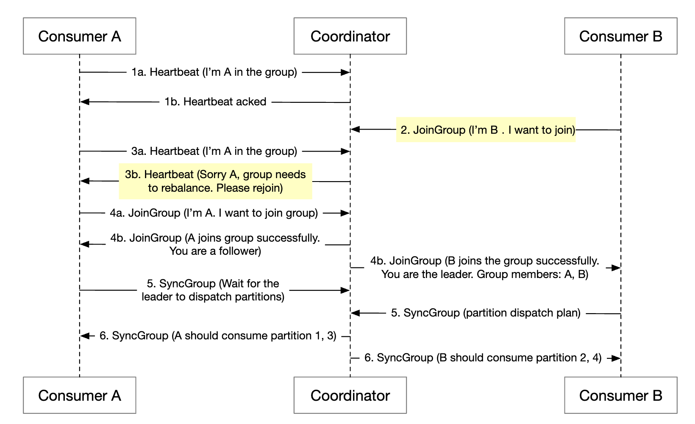
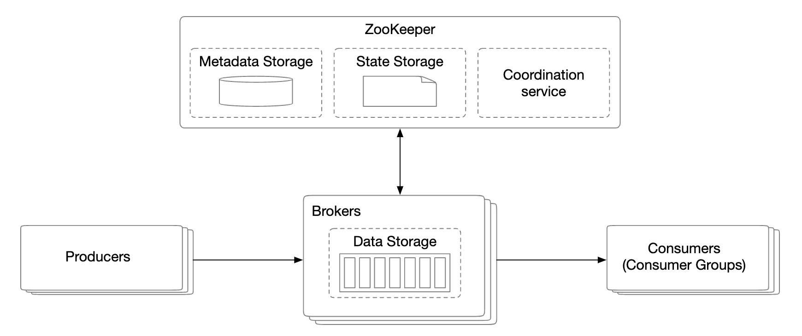

# 第19章：分布式消息队列

## 引言

本章我们将设计一个**分布式消息队列**。

消息队列的优势：
- **解耦**：消除组件之间的紧密耦合，让它们可以独立更新。
- **提升可扩展性**：生产者和消费者可以根据流量独立扩展。
- **提高可用性**：如果系统某一部分宕机，其他部分仍可继续与队列交互。
- **更好的性能**：生产者可以在不等待消费者确认的情况下发送消息。

一些流行的消息队列实现——Kafka、RabbitMQ、RocketMQ、Apache Pulsar、ActiveMQ、ZeroMQ。

严格来说，Kafka 和 Pulsar 并不是消息队列，它们是事件流平台。然而，两者功能的趋同使得消息队列与事件流平台之间的界限变得模糊。

在本章中，我们将构建一个支持更高级功能的消息队列，例如长期数据保留、消息重复消费等。

---

## 第1步：理解问题并确定设计范围

消息队列应当支持一些基本功能——生产者发送消息，消费者消费消息。然而，在性能、消息传递、数据保留等方面存在不同的考量。

以下是候选人与面试官之间可能提出的一系列问题：
 * C：消息的格式和平均大小是什么？只有文本吗？
 * I：消息仅包含文本，通常只有几 KB。
 * C：消息可以被重复消费吗？
 * I：可以，消息可以被不同的消费者重复消费。这是一个额外需求，传统消息队列不支持此功能。
 * C：消息的消费顺序与生产顺序一致吗？
 * I：是的，应保证顺序性。这也是一个额外需求，传统消息队列不支持这一点。
 * C：数据保留需求是什么？
 * I：消息需要保留两周。这是一个额外需求。
 * C：我们需要支持多少生产者和消费者？
 * I：越多越好。
 * C：我们希望支持哪种数据传递语义？至多一次、至少一次、还是恰好一次？
 * I：我们肯定希望支持至少一次。理想情况下，我们可以支持全部语义并使其可配置。
 * C：端到端延迟的目标吞吐量是多少？
 * I：它应能支持日志聚合等场景的高吞吐量，以及更传统场景的低吞吐量。

### **功能需求**

 * 生产者向消息队列发送消息
 * 消费者从队列中消费消息
 * 消息可以被消费一次或多次
 * 历史数据可以被截断
 * 消息大小在 KB 级别
 * 消息顺序需要保持
 * 数据传递语义可配置——至多一次/至少一次/恰好一次。

### **非功能需求**

- **高吞吐量或低延迟**：根据用例可配置
- **可扩展**：系统应是分布式的，并能应对消息量的突发增长
- **持久且可靠**：数据应持久化到磁盘并在节点间复制

传统消息队列通常不支持数据保留，也不提供顺序性保证。这大大简化了设计，我们将在下文进行讨论。

---

## 第2步：提出高层设计并获得认可

消息队列的关键组件包括：

    

 * 生产者向队列发送消息
 * 消费者订阅队列并消费已订阅的消息
 * 消息队列是中间服务，将生产者与消费者解耦，使它们可以独立扩展。
 * 生产者和消费者都是客户端，消息队列是服务端。

### **消息传递模型**

第一种消息传递模型是点对点模型，常见于传统消息队列：

    

 * 消息被发送到队列并由且仅由一个消费者消费。
 * 可以有多个消费者，但一条消息只被消费一次。
 * 消息被确认消费后，会从队列中移除。
 * 点对点模型中没有数据保留，但我们的设计中包含此功能。

另一方面，发布-订阅模型在事件流平台中更为常见：

    

 * 在此模型中，消息与一个主题关联。
 * 消费者订阅该主题，并接收发送到该主题的所有消息。

### **主题、分区和代理**

如果某个主题的数据量过大，一种扩展方式是将其拆分为多个分区（也称为分片）：

    

 * 发送到某个主题的消息会被均匀分布到各个分区中
 * 托管分区的服务器称为 broker
 * 每个主题像队列一样使用 FIFO 进行消息处理。消息在分区内的顺序会被保留
 * 消息在分区中的位置称为**偏移量（offset）**
 * 每条产生的消息会被发送到特定的分区。分区键用于指定消息应写入哪个分区
   * 例如，可以使用 `user_id` 作为分区键，以保证同一用户的消息顺序
 * 每个消费者订阅一个或多个分区。当同一条消息有多个消费者时，它们会组成一个消费者组

### **消费者组**

消费者组是一组协同工作以消费某个主题消息的消费者集合：

    

 * 消息按消费者组进行复制（而不是按单个消费者）
 * 每个消费者组维护自己的偏移量
 * 消费者组并行读取消息可以提升吞吐量，但会削弱顺序保证
 * 可以通过只允许组内的一个消费者订阅某个分区来缓解这一问题
 * 这意味着消费者组中的消费者数量不能超过分区数量

### **高层架构**

    

- **客户端**：生产者和消费者。生产者将消息推送到指定主题，消费者组订阅主题中的消息
- **Broker**：持有多个分区，每个分区保存某个主题的部分消息
- **数据存储**：在分区中存储消息
- **状态存储**：保存消费者状态
- **元数据存储**：存储配置和主题属性
- **协调服务**：负责服务发现（哪些 broker 存活）和领导者选举（哪个 broker 是领导者，负责分配分区）

---

## 第3步：设计深入解析

为了实现高吞吐量并满足高数据保留要求，我们做出了一些重要的设计选择：
 * 我们选择了一种磁盘数据结构，以充分利用现代硬盘和操作系统磁盘缓存策略的特性
 * 消息数据结构是不可变的，以避免额外的复制操作，这在高频/高流量系统中是我们希望避免的
 * 我们的写入设计围绕批量处理展开，因为小规模 I/O 是高吞吐量的敌人

### **数据存储**

为了找到最适合消息的数据存储方式，我们需要分析消息的特性：
 * 写密集、读密集
 * 没有更新/删除操作。在传统消息队列中，由于消息不被保留，存在“删除”操作
 * 主要为顺序读写访问模式

我们的选择有哪些：
- **数据库**：并不理想，因为传统数据库通常难以同时支持写密集和读密集的系统
- **预写日志（WAL）**：一个只支持追加的纯文本文件，对硬盘非常友好
  * 我们将分区拆分为多个段，以避免维护一个过大的文件
  * 旧段为只读，写入只由最新的段接收

    

WAL 文件在与传统硬盘配合使用时效率极高。

存在一种误解，认为硬盘访问速度慢，但这在很大程度上取决于访问模式。
当访问模式为顺序访问（如我们的场景）时，硬盘可以实现数 MB/s 的读写速度，足以满足我们的需求。
我们还利用了操作系统会积极地将磁盘数据缓存到内存中的特性。

### **消息数据结构**

消息模式在生产者、队列和消费者之间保持一致非常重要，这样可以避免额外的复制操作，从而实现更高效的处理。

示例消息结构：

    

消息的键用于指定消息属于哪个分区。一个示例映射为 `hash(key) % numPartitions`。
为了提供更大的灵活性，生产者可以覆盖默认键，以控制消息被分布到哪些分区。

消息值是消息的负载，可以是纯文本或压缩的二进制块。

**注意**：与传统键值存储不同，消息键不需要唯一。允许出现重复键，甚至允许键缺失。

其他消息文件：
- **主题（Topic）**：消息所属的主题
- **分区（Partition）**：消息所属的分区 ID
- **偏移量（Offset）**：消息在分区中的位置。可以通过 `topic`、`partition`、`offset` 定位消息
- **时间戳（Timestamp）**：消息被存储的时间
- **大小（Size）**：消息的大小
- **CRC**：校验和，用于确保消息完整性

附加功能（如过滤）可以通过添加额外字段来支持。

### **批处理**

批处理对我们的系统性能至关重要。我们在生产者、消费者和消息队列中应用了它。

它之所以关键，是因为：
 * 它允许操作系统将消息聚合在一起，分摊昂贵的网络往返开销
 * 消息以组为单位顺序写入 WAL（预写式日志），这带来了大量的顺序写入和磁盘缓存

延迟与吞吐量之间存在权衡：
 * 高批处理量带来高吞吐量，但延迟更高
 * 低批处理量带来较低吞吐量，但延迟更低

如果由于系统作为传统消息队列部署而需要支持更低延迟，可以将系统调优为使用更小的批处理大小。

如果调优以追求吞吐量，可能需要为每个主题增加更多分区，以补偿较慢的顺序磁盘写入吞吐量。

### **生产者流程**

如果生产者想要向某个分区发送消息，它应该连接到哪个代理？

一种方法是引入一个路由层，将消息路由到正确的代理。如果启用了复制，正确的代理就是主副本：

    

 * 路由层从元数据存储中读取复制计划并本地缓存
 * 生产者向路由层发送消息
 * 消息被转发给该分区的领导者代理（代理 1）
 * 从副本从领导者拉取新消息。当收到足够多的确认后，领导者提交数据并响应生产者

设置副本的目的是实现容错能力。

这种方法可行，但存在一些缺点：
 * 由于额外组件导致网络跳数增加
 * 该设计无法实现消息批处理

为了缓解这些问题，我们可以将路由层嵌入到生产者中：

    

 * 更少的网络跳数带来更低的延迟
 * 生产者可以控制消息路由到哪个分区
 * 缓冲区允许我们在内存中批处理消息，并在一次请求中发送更大的批次，从而提高吞吐量

批处理大小的选择是吞吐量与延迟之间的经典权衡。

    

 * 较大的批处理大小导致批处理提交前等待时间更长
 * 较小的批处理大小导致请求发送更快，延迟更低，但吞吐量也更低

### **消费者流程**

消费者指定其在分区中的偏移量，并从该偏移量开始接收一批消息：

    

在设计消费者时，一个重要的考虑因素是使用推模式还是拉模式：
- **推模式**：延迟更低，因为代理在收到消息后立即推送给消费者
  * 然而，如果消费速率落后于生产速率，消费者可能会不堪重负
  * 由于代理控制消费速率，处理能力不同的消费者难以协调
- **拉模式**：消费者可以自行控制消费速率
  * 如果消费速率较慢，消费者不会不堪重负，我们可以扩展它以跟上进度
  * 拉模式更适合批量处理，因为推模式下代理无法知道消费者能处理多少消息
  * 拉模式下，消费者可以积极拉取大量消息批次
  * 缺点是在没有新消息时延迟更高且需要额外的网络调用。后者可以通过长轮询来缓解

因此，大多数消息队列（以及我们）选择拉模式。

    

 * 新消费者订阅主题 A 并加入消费者组 1
 * 通过对组名进行哈希找到正确的代理节点。这样，同一组中的所有消费者都连接到同一个代理
 * 注意，这个消费者组协调器与协调服务（ZooKeeper）不同
 * 协调器确认消费者已加入该组，并将分区 2 分配给该消费者
 * 存在不同的分区分配策略——轮询、范围等
 * 消费者从最后一个偏移量拉取最新消息。状态存储保存消费者偏移量
 * 消费者处理消息并将偏移量提交给代理。这些操作的顺序会影响消息传递语义

### **消费者再平衡**

消费者再平衡负责决定哪些消费者负责哪些分区。

该过程发生在消费者加入/离开或分区被添加/移除时。

作为协调者的代理（broker）在编排再平衡工作流中发挥着巨大作用。

    

* 同一消费者组中的所有消费者都连接到同一个协调者。协调者通过对组名进行哈希查找来确定。
* 当消费者列表发生变化时，协调者会选择一个新的组领导者。
* 组领导者计算一个新的分区分配方案，并将其报告给协调者，协调者再将其广播给其他消费者。

当协调者停止接收某个组中消费者的心跳时，会触发再平衡：

    

让我们来看一下消费者加入组时会发生什么：

    

* 最初，只有消费者 A 在组中，它消费所有分区。
* 消费者 B 发送请求加入该组。
* 协调者通知所有组成员，是时候进行再平衡了——作为对心跳的被动响应。
* 当所有消费者重新加入组后，协调者选择一个领导者，并通知其他成员选举结果。
* 领导者生成分区分配方案并发送给协调者，其他消费者等待分配方案。
* 消费者开始从新分配的分区中消费。

以下是消费者离开组时会发生什么：

    

* 消费者 A 和 B 在同一个组中
* 消费者 B 请求离开该组
* 当协调者接收到 A 的心跳时，它会通知他们该进行再平衡了。
* 其余步骤相同。

当消费者长时间不发送心跳时，流程类似：

    

### **状态存储**

状态存储存储分区与消费者之间的映射关系，以及分区的最后消费偏移量。

    

组 1 的偏移量为 6，意味着所有先前的消息都已被消费。如果消费者崩溃，新消费者将从该消息之后继续消费。

消费者状态的数据访问模式：
* 频繁的读/写操作，但数据量低
* 数据频繁更新，但很少删除
* 随机读/写
* 数据一致性很重要

鉴于这些需求，像 Zookeeper 这样的快速键值存储是理想的选择。

### **元数据存储**

元数据存储存储配置和主题属性——分区数量、保留期限、副本分布。

元数据不常发生变化，数据量也很小，但一致性要求很高。
Zookeeper 是这种存储的良好选择。

### **ZooKeeper**

Zookeeper 对于构建分布式消息队列至关重要。

它是一个层次化的键值存储，通常用于分布式配置、同步服务和命名注册（即服务发现）。

    

有了这个变化，代理只需要维护消息的数据。元数据和状态存储在 Zookeeper 中。

Zookeeper 还有助于代理副本的领导者选举。

### **副本机制**

在分布式系统中，硬件故障是不可避免的。我们可以通过复制来应对这一问题，实现高可用性。

    

* 每个分区都在多个代理上进行复制，但只有一个领导者副本。
* 生产者向领导者副本发送消息。
* 从领导者拉取复制的消息。
* 当足够多的副本同步完成后，领导者向生产者返回确认。
* 每个分区的副本分布称为副本分布计划。
* 给定分区的领导者创建副本分布计划，并将其保存在 Zookeeper 中。

### **同步副本**

我们需要解决的一个问题是保持给定分区的领导者和从属副本之间的消息同步。

同步副本（ISR）是指与领导者保持同步的分区副本。

`replica.lag.max.messages` 定义了一个副本在被视为同步之前可以落后于领导者的消息数量。

    

 * 已提交偏移量为 13
* 有两条新消息被写入领导者，但尚未提交。
* 当 ISR 中的所有副本都已同步该消息时，消息才算已提交。
* 副本 2 和 3 已完全跟上领导者，因此它们处于 ISR 中。
* 副本 4 落后，因此暂时被移出 ISR。

ISR 反映了性能与持久性之间的权衡。
* 为了防止生产者丢失消息，所有副本在发送确认之前都应保持同步。
* 但一个缓慢的副本会导致整个分区不可用。

确认处理是可配置的。

`ACK=all` 表示 ISR 中的所有副本都必须同步消息。消息发送较慢，但消息持久性最高。

    

`ACK=1` 表示领导者在接收到消息后，生产者就会收到确认。消息发送较快，但消息持久性较低。

    

`ACK=0` 表示生产者在不等待领导者任何确认的情况下发送消息。消息发送最快，消息持久性最低。

    

在消费者端，我们可以将所有消费者连接到一个分区的领导者，并让它们从中读取消息：
* 这使得设计最简单，操作最便捷。
* 分区中的消息只发送给组内的一个消费者，这限制了对领导者副本的连接数。
* 只要主题不是特别热门，对领导者副本的连接数通常不会很高。
* 我们可以通过增加分区数和消费者数来扩展热门主题。
* 在某些场景下，让消费者从 ISR 中的某个副本读取数据是有意义的，例如它们位于不同的数据中心。

ISR 列表由领导者维护，领导者会跟踪自身与每个副本之间的延迟。

### **可扩展性**

让我们评估如何扩展系统的不同部分。

#### 生产者

生产者比消费者小得多。其可扩展性可以通过添加/移除新的生产者实例来轻松实现。

#### 消费者

消费者组之间相互隔离。可以随时添加/移除消费者组。

再平衡有助于处理消费者从组中添加/移除的情况。

消费者组的再平衡帮助我们实现可扩展性和容错性。

#### 代理节点

代理节点如何处理故障？

    

* 一旦某个代理节点发生故障，仍然有足够的副本来避免分区数据丢失。
* 会选举出新的领导者，代理协调器会将故障代理节点上的分区重新分配给现有的副本。
* 现有副本会接管新的分区，作为跟随者，直到它们跟上领导者并成为 ISR 的一部分。

为使代理节点具备容错性的其他考虑事项：
* ISR 的最小数量在延迟和安全性之间取得平衡。您可以根据需求进行微调。
* 如果一个分区的所有副本都在同一个节点上，那就是资源的浪费。副本应分布在不同的代理节点上。
* 如果一个分区的所有副本都崩溃，数据将永久丢失。将副本跨数据中心分布可以有所帮助，但会显著增加延迟。一个解决方案是使用[数据镜像](https://cwiki.apache.org/confluence/pages/viewpage.action?pageId=27846330)作为权宜之计。

当添加新的代理节点时，我们如何处理副本的重新分配？

    

* 我们可以暂时允许比配置数量更多的副本，直到新代理节点跟上进度。
* 一旦它跟上进度，我们就可以移除不再需要的副本。

#### 分区

每当添加新分区时，生产者会收到通知，并触发消费者再平衡。

在数据存储方面，我们只能向新分区写入新消息，而不是尝试复制所有旧消息：

    

减少分区数量则更为复杂：

    

* 一旦某个分区被退役，新消息将只由剩余的分区接收。
* 被退役的分区不会立即被移除，因为仍然可以从中消费消息。
* 一旦预配置的保留期过去，我们会截断数据，释放存储空间。
* 在过渡期间，生产者只向活跃分区发送消息，但消费者从所有分区读取。
* 保留期结束后，消费者会进行再平衡。

### **数据传递语义**

我们来讨论不同的传递语义。

#### 至多一次

在此保证下，消息最多被传递一次，也可能完全不被传递。

    

* 生产者异步地向主题发送消息。如果消息传递失败，不会进行重试。
* 消费者获取消息后立即提交偏移量。如果消费者在处理消息之前崩溃，该消息将不会被处理。

#### 至少一次

消息可能被发送多次，且不能有任何消息未被处理。

    

* 生产者使用 `ack=1` 或 `ack=all` 发送消息。如果出现问题，它会持续重试。
* 消费者获取消息，并在处理完成后才提交偏移量。
* 如果消费者在提交偏移量之前但在处理完消息之后崩溃，消息可能会被传递多次。
* 因此，这种语义适用于数据重复可以接受或可以进行去重的场景。

#### 恰好一次

对系统而言实现成本极高，但对用户而言是最友好的保证：

    

### **高级特性**

我们来讨论一些可能在面试中涉及的高级特性。

#### 消息过滤

某些消费者可能只想消费分区中特定类型的消息。

可以通过为每类消息构建独立的主题来实现，但如果系统有太多不同的用例，这种方式成本会很高。
* 在不同主题中存储相同消息是资源的浪费
* 生产者现在与消费者紧密耦合，因为每次新增消费者需求都会改变生产者

我们可以使用消息过滤来解决这个问题。
* 一种朴素的方法是在消费者端进行过滤，但这会引入不必要的消费者流量
* 或者，消息可以附带标签，消费者可以指定它们订阅哪些标签
* 也可以通过消息负载进行过滤，但这对于加密或序列化消息来说可能具有挑战性且不安全
* 对于更复杂的数学公式，消息代理可以实现语法解析器或脚本执行器，但这对消息队列来说可能过于重量级

    

#### 延迟消息与定时消息

在某些用例中，我们可能希望延迟或定时传递消息。
例如，我们可能会提交一个 30 分钟后的支付验证检查，用于触发消费者查看支付是否成功。

这可以通过将消息发送到代理中的临时存储，并在合适的时间将消息移入分区来实现：

    

* 临时存储可以是一个或多个特殊的消息主题
* 定时功能可以通过专用的延迟队列或 [分层时间轮](http://www.cs.columbia.edu/~nahum/w6998/papers/sosp87-timing-wheels.pdf) 来实现

---

## 第4步：总结

补充讨论点：
- **通信协议**：重要考量——支持所有用例和高数据量，并验证消息完整性。常见协议——AMQP 和 Kafka 协议。
- **重试消费**：如果无法立即处理消息，可以将其发送到专用的重试主题，稍后再尝试处理。
- **历史数据归档**：旧消息可以备份到高容量存储中，例如 HDFS 或对象存储（如 S3）。
