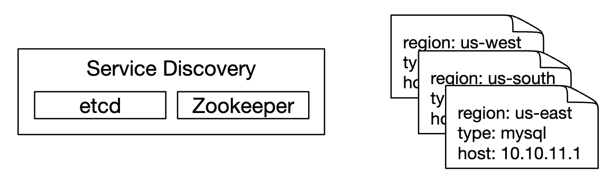

# 第20章：指标监控与告警系统

## 引言
本章重点讨论如何设计一个**高度可扩展的指标监控与告警系统**，该系统对于确保高可用性和可靠性至关重要。

---

## 第一步：理解问题并确定设计范围
指标监控系统可能意味着很多不同的东西——例如，当面试官只关注基础设施指标时，你不需要设计一个日志聚合系统。

让我们先尝试理解问题：
 - C：我们要为谁构建这个系统？是为大型科技公司的内部监控系统，还是像 DataDog 这样的 SaaS 产品？
 - I：我们仅供内部使用。
 - C：我们要收集哪些指标？
 - I：操作系统指标——CPU 负载、内存、数据磁盘空间。但也包括高级指标，如每秒请求数。业务指标不在范围内。
 - C：我们监控的基础设施规模有多大？
 - I：1 亿日活跃用户，1000 个服务器池，每池 100 台机器。
 - C：数据需要保留多长时间？
 - I：假设保留 1 年。
 - C：我们可以降低长期存储的指标数据分辨率吗？
 - I：新接收的指标保留 7 天。在接下来的 30 天内汇总为 1 分钟分辨率。30 天后进一步汇总为 1 小时分辨率。
 - C：支持哪些告警渠道？
 - I：邮件、电话、PagerDuty 或 Webhooks。
 - C：我们需要收集日志（如错误日志或访问日志）吗？
 - I：不需要。
 - C：我们需要支持分布式系统追踪吗？
 - I：不需要。

### **高层需求和假设**
被监控的基础设施是大规模的：
 - 1 亿 DAU
 - 1000 个服务器池 × 100 台机器 × 每台机器约 100 个指标 → 约 1000 万个指标
 - 1 年数据保留期
 - 数据保留策略：原始数据保留 7 天，1 分钟分辨率保留 30 天，1 小时分辨率保留 1 年

可以监控多种指标：
 - CPU 负载
 - 请求计数
 - 内存使用量
 - 消息队列中的消息数量

### **非功能性需求**
 - **可扩展性**：系统应可扩展以容纳更多指标和告警
 - **低延迟**：系统需要为仪表板和告警提供低查询延迟
 - **可靠性**：系统应高度可靠，以避免遗漏关键告警
 - **灵活性**：系统应能够在未来轻松集成新技术

哪些需求不在范围内？
 - **日志监控**：ELK 栈非常适合此用例
 - **分布式系统追踪**：这指的是收集请求生命周期中的数据，因为它在系统内的多个服务之间流动

---

## 第二步：提出高层设计并获得认可

### **基础**
指标监控与告警系统涉及五个核心组件：

<div style="margin-left:3rem">
    
</div>

 - **数据采集**：从不同来源收集指标数据
 - **数据传输**：将数据从来源传输到指标监控系统
 - **数据存储**：组织和存储传入的数据
 - **告警**：分析传入的数据，检测异常并生成告警
 - **可视化**：以图表等形式展示数据

### **数据模型**
指标数据通常以时间序列的形式记录，它包含一组带有时间戳的值。
该序列可以通过名称和一组可选的标签来识别。

示例 1——生产服务器实例 i631 在 20:00 的 CPU 负载是多少？

<div style="margin-left:3rem">
    
</div>

数据可以通过下表来识别：

<div style="margin-left:3rem">
    
</div>

时间序列由指标名称、标签以及特定时间点的单个值来标识。

示例 2——过去 10 分钟内 us-west 区域所有 Web 服务器的平均 CPU 负载是多少？

```
CPU.load host=webserver01,region=us-west 1613707265 50

CPU.load host=webserver01,region=us-west 1613707265 62

CPU.load host=webserver02,region=us-west 1613707265 43

CPU.load host=webserver02,region=us-west 1613707265 53

...

CPU.load host=webserver01,region=us-west 1613707265 76

CPU.load host=webserver01,region=us-west 1613707265 83
```

这是我们可能从存储中提取以回答该问题的示例数据。
平均 CPU 负载可以通过对最后一列的值求平均值来计算。

上面显示的格式称为**行协议（line protocol）**，被市场上许多流行的监控软件使用——例如 Prometheus、OpenTSDB。

每个时间序列由以下部分组成：

<div style="margin-left:3rem">
    
</div>

可视化数据外观的好方法：

<div style="margin-left:3rem">
    
</div>- x 轴是时间
- y 轴是你查询的维度——例如指标名称、标签等。

数据访问模式是写入密集型，读取呈突发性，因为我们收集大量指标，但它们很少被访问，不过在发生突发事件时会批量读取。

数据存储系统是整个设计的核心。
- 不建议针对此问题使用通用数据库，尽管经过专家级调优可以实现良好的扩展性。
- 理论上可以使用 NoSQL 数据库，但很难设计出可扩展的架构来高效存储和查询时序数据。

有许多专门用于存储时序数据的数据库。其中许多支持自定义查询接口，可实现对时序数据的高效查询。
- OpenTSDB 是一个分布式时序数据库，但它基于 Hadoop 和 HBase。如果你没有配置相应的基础设施，将很难使用该技术。
- Twitter 使用 MetricsDB，而 Amazon 提供 Timestream。
- 最流行的两个时序数据库是 InfluxDB 和 Prometheus。
- 它们专为存储大量时序数据而设计，均基于内存缓存 + 磁盘存储。

InfluxDB 的示例规模——配备 8 核和 32GB 内存时，每秒可处理超过 25 万次写入：

<div style="margin-left:3rem">
    
</div>

不要求你理解指标数据库的内部原理，因为这是小众知识。面试官可能只会在你简历中提到时才会问及。

就面试而言，只需理解指标是时序数据，并了解流行的时序数据库（如 InfluxDB）即可。

时序数据库的一个优点是能够通过标签高效地聚合和分析大量时序数据。
例如，InfluxDB 会为每个标签建立索引。

然而，关键是要保持标签的基数较低——即不要使用过多唯一标签。

### **高层设计**

<div style="margin-left:3rem">
    
</div>

- **指标来源**：可以是应用服务器、SQL 数据库、消息队列等。
- **指标收集器**：收集指标数据并写入时序数据库。
- **时序数据库**：以时序形式存储指标。提供自定义查询接口，用于分析大量指标。
- **查询服务**：方便从时序数据库中查询和检索数据。如果数据库接口足够强大，可以完全由其替代。
- **告警系统**：向各种告警目的地发送告警通知。
- **可视化系统**：以图表形式展示指标。

---

## 第三步：深入设计
让我们深入探讨系统中几个更有趣的部分。

### **指标收集**
对于指标收集，偶发的数据丢失并不关键。客户端采用"发送即忘"的方式是可以接受的。

<div style="margin-left:3rem">
    
</div>

实现指标收集有两种方式：拉取（pull）或推送（push）。

以下是拉取模型的示例：

<div style="margin-left:3rem">
    
</div>

在该方案中，指标收集器需要维护一份最新的服务和指标端点列表。
我们可以使用 Zookeeper 或 etcd 来实现这一目的——服务发现。

服务发现包含关于何时以及从何处收集指标的配置规则：

<div style="margin-left:3rem">
    
</div>

以下是指标收集流程的详细说明：

<div style="margin-left:3rem">
    
</div>

- 指标收集器从服务发现获取配置元数据，包括拉取间隔、IP 地址、超时与重试参数。
- 指标收集器通过预定义的 HTTP 端点（例如 `/metrics`）拉取指标数据。这通常由客户端库完成。
- 或者，指标收集器可以在服务发现中注册变更事件通知，以便在服务端点发生变化时收到通知。
- 另一种方案是指标收集器定期轮询指标端点配置的变化。

在我们这个规模下，单个指标收集器是不够的。必须部署多个实例。
但它们之间也必须进行某种同步，以避免两个收集器重复收集相同的指标。

一种解决方案是将收集器与服务器部署在一致性哈希环上，并将一组服务器仅关联给单个收集器：

<div style="margin-left:3rem">
    
</div>

而在推送模型中，服务会主动将指标推送给指标收集器：

<div style="margin-left:3rem">
    
</div>

在这种方法中，通常会在服务实例旁安装一个收集代理。
该代理从服务器收集指标，并将其推送给指标收集器。

<div style="margin-left:3rem">
    
</div>

采用这种模型，我们可以在将指标发送给收集器之前进行聚合，从而减少收集器处理的数据量。

另一方面，指标收集器可能会拒绝推送请求，因为它可能无法承受负载。
因此，重要的是将收集器放置在负载均衡器后面的自动伸缩组中。

那么哪种更好呢？两种方法各有取舍，不同的系统采用不同的方法：
 - Prometheus 采用拉取架构
 - Amazon Cloud Watch 和 Graphite 采用推送架构

以下是推送和拉取之间的一些主要区别：
|                                        | 拉取                                                                                                                                                                                                    | 推送                                                                                                                                                                                                                                    |
|----------------------------------------|---------------------------------------------------------------------------------------------------------------------------------------------------------------------------------------------------------|-----------------------------------------------------------------------------------------------------------------------------------------------------------------------------------------------------------------------------------------|
| 易于调试                         | 用于拉取指标的应用程序服务器上的 /metrics 端点可以随时查看指标。你甚至可以在笔记本电脑上这样做。拉取胜出。                                          | 如果指标收集器没有收到指标，问题可能是由网络问题引起的。                                                                                                                                        |
| 健康检查                           | 如果应用程序服务器没有响应拉取请求，你可以快速判断应用程序服务器是否宕机。拉取胜出。                                                                           | 如果指标收集器没有收到指标，问题可能是由网络问题引起的。                                                                                                                                        |
| 短期任务                       |                                                                                                                                                                                                         | 一些批处理作业可能是短期的，持续时间不足以被拉取。推送胜出。这可以通过为拉取模型引入推送网关来修复 [22]。                                                                 |
| 防火墙或复杂的网络设置 | 让服务器拉取指标需要所有指标端点都可访问。这在多数据中心设置中可能会出现问题。可能需要更复杂的网络基础设施。 | 如果指标收集器设置了负载均衡器和自动伸缩组，就可以从任何地方接收数据。推送胜出。                                                                                             |
| 性能                            | 拉取方法通常使用 TCP。                                                                                                                                                                         | 推送方法通常使用 UDP。这意味着推送方法提供了更低延迟的指标传输。反面论点是，建立 TCP 连接的努力与发送指标负载相比是微不足道的。 |
| 数据真实性                      | 要收集指标的应用程序服务器在配置文件中预先定义。从这些服务器收集的指标保证是真实的。                                                 | 任何类型的客户端都可以向指标收集器推送指标。这可以通过白名单接受指标的服务器或要求身份验证来修复。                                                                   |没有明确的赢家。大型组织可能需要同时支持两者。可能根本无法安装推送代理。

### **扩展指标传输管道**

<div style="margin-left:3rem">
    
</div>

无论使用推送模型还是拉取模型，指标收集器都部署在自动伸缩组中。

不过，如果时序数据库宕机，可能会出现数据丢失。为了缓解这个问题，我们将配置一个排队机制：

<div style="margin-left:3rem">
    
</div>

 - 指标收集器将指标数据推送到 Kafka
 - 消费者或流处理服务（如 Apache Storm、Flink 或 Spark）处理数据，并将其推送到时序数据库

这种方法有几个优势：
 - Kafka 用作高可靠且可扩展的分布式消息平台
 - 它将数据采集与数据处理解耦
 - 它可以通过在 Kafka 中保留数据来防止数据丢失

Kafka 可以按指标名称配置一个分区，以便消费者按指标名称聚合数据。
要进一步扩展，我们可以按标签/标签对分区进行细分，并对要收集的指标进行分类/优先级排序。

<div style="margin-left:3rem">
    
</div>

使用 Kafka 解决这个问题的主要缺点是维护/运维开销。
另一种方法是使用类似 [Gorilla](https://www.vldb.org/pvldb/vol8/p1816-teller.pdf) 的大规模摄入系统。
可以说，使用它与使用 Kafka 进行排队一样具有可扩展性。

### **聚合可以在哪里发生**
指标可以在多个位置进行聚合。不同选择之间存在权衡：
 - **采集代理**：客户端采集代理仅支持简单的聚合逻辑。例如，收集 1 分钟的计数器并将其发送到指标收集器。
 - **摄入管道**：要在写入数据库之前聚合数据，我们需要像 Flink 这样的流处理引擎。这减少了写入量，但由于我们不存储原始数据，因此会丢失数据精度。
 - **查询侧**：我们可以在通过可视化系统运行查询时聚合数据。没有数据丢失，但由于大量数据处理，查询可能会很慢。

### **查询服务**
将查询服务与时序数据库分离，可以将可视化和告警系统与数据库解耦，从而使我们能够将数据库与客户端解耦并随意更改它。

我们可以在此处添加缓存层以减少对时序数据库的负载：

<div style="margin-left:3rem">
    
</div>

我们也可以完全避免添加查询服务，因为大多数可视化和告警系统都有强大的插件可以与大多数时序数据库集成。
如果选择了合适的时序数据库，我们可能也不需要引入自己的缓存层。

大多数时序数据库不支持 SQL，仅仅是因为它对查询时序数据无效。以下是计算指数移动平均值的 SQL 查询示例：

```
select id,
       temp,
       avg(temp) over (partition by group_nr order by time_read) as rolling_avg
from (
  select id,
         temp,
         time_read,
         interval_group,
         id - row_number() over (partition by interval_group order by time_read) as group_nr
  from (
    select id,
    time_read,
    "epoch"::timestamp + "900 seconds"::interval * (extract(epoch from time_read)::int4 / 900) as interval_group,
    temp
    from readings
  ) t1
) t2
order by time_read;
```

以下是 InfluxDB 中使用的查询语言 Flux 中的相同查询：

```
from(db:"telegraf")
  |> range(start:-1h)
  |> filter(fn: (r) => r._measurement == "foo")
  |> exponentialMovingAverage(size:-10s)
```

### **存储层**
仔细选择时序数据库非常重要。

根据 Facebook 发布的研究，对运营存储的查询中约有 85% 是针对过去 26 小时的数据。

如果我们选择一个能够利用这一特性的数据库，它可能会对系统性能产生重大影响。InfluxDB 就是这样一个选项。

无论我们选择哪种数据库，我们都可以采用一些优化措施。

数据编码和压缩可以显著减小数据大小。这些功能通常内置在优秀的时序数据库中。

<div style="margin-left:3rem">
    
</div>

在上面的示例中，我们可以存储时间戳差值，而不是完整的时间戳。

我们可以采用的另一种技术是降采样——将高分辨率数据转换为低分辨率以减少磁盘使用。

我们可以对旧数据使用这种方法，并让数据科学家配置规则，例如：
 - 7 天 - 不降采样
 - 30 天 - 降采样到 1 分钟
 - 1 年 - 降采样到 1 小时例如，以下是一个 10 秒采样率的指标表：

| metric | timestamp            | hostname | Metric_value |
|--------|----------------------|----------|--------------|
| cpu    | 2021-10-24T19:00:00Z | host-a   | 10           |
| cpu    | 2021-10-24T19:00:10Z | host-a   | 16           |
| cpu    | 2021-10-24T19:00:20Z | host-a   | 20           |
| cpu    | 2021-10-24T19:00:30Z | host-a   | 30           |
| cpu    | 2021-10-24T19:00:40Z | host-a   | 20           |
| cpu    | 2021-10-24T19:00:50Z | host-a   | 30           |

降采样为 30 秒分辨率后：

| metric | timestamp            | hostname | Metric_value (avg) |
|--------|----------------------|----------|--------------------|
| cpu    | 2021-10-24T19:00:00Z | host-a   | 19                 |
| cpu    | 2021-10-24T19:00:30Z | host-a   | 25                 |

最后，我们还可以使用冷存储来保存不再使用的旧数据。冷存储的财务成本要低得多。

### **告警系统**

<div style="margin-left:3rem">
    
</div>

配置会被加载到缓存服务器中。规则通常以 YAML 格式定义。以下是一个示例：

```
- name: instance_down
  rules:

  # 告警：任何实例不可达超过 5 分钟。
  - alert: instance_down
    expr: up == 0
    for: 5m
    labels:
      severity: page
```

告警管理器从缓存中获取告警配置。根据配置规则，它还会按预设的间隔调用查询服务。
如果满足某条规则，就会创建一个告警事件。

告警管理器的其他职责包括：
 - 过滤、合并和去重告警。例如，如果某个实例的告警被多次触发，只会生成一个告警事件。
 - 访问控制 —— 限制只有特定人员才能执行告警管理操作，这一点非常重要。
 - 重试 —— 确保告警至少被传递一次。

告警存储是一个类似 Cassandra 的键值数据库，用于保存所有告警的状态。它确保通知至少被发送一次。
一旦告警被触发，就会被发布到 Kafka。

最后，告警消费者从 Kafka 拉取告警数据，并通过不同渠道发送通知 —— 邮件、短信、PagerDuty、Webhooks。

在现实中，市面上有很多现成的告警系统解决方案。自建一套告警系统在成本上很难被合理化。

### **可视化系统**
可视化系统用于展示一段时间内的指标和告警。以下是使用 Grafana 构建的仪表盘：

<div style="margin-left:3rem">
    
</div>

构建一个高质量的可视化系统非常困难。使用 Grafana 这类现成方案，而不自行开发，是非常合理的选择。

---

## 第四步：总结
以下是最终的设计方案：

<div style="margin-left:3rem">
    
</div>