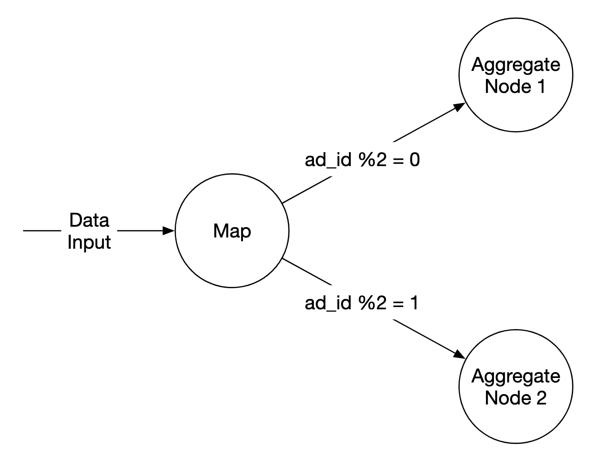
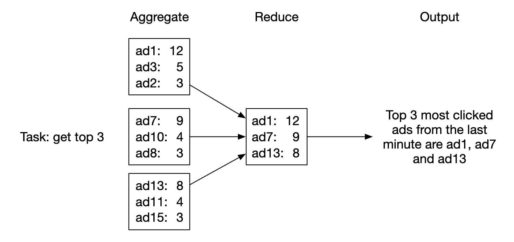
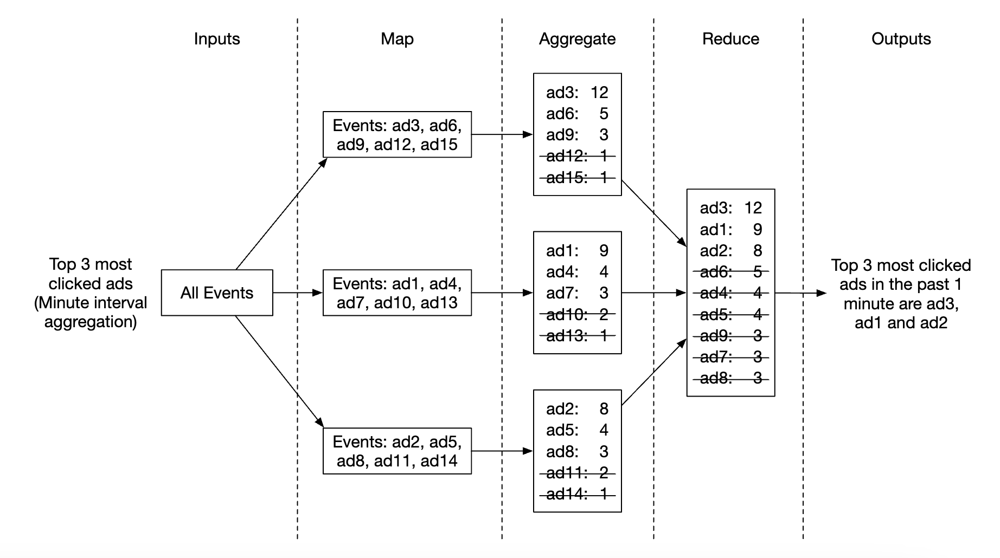
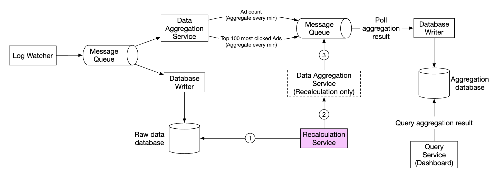
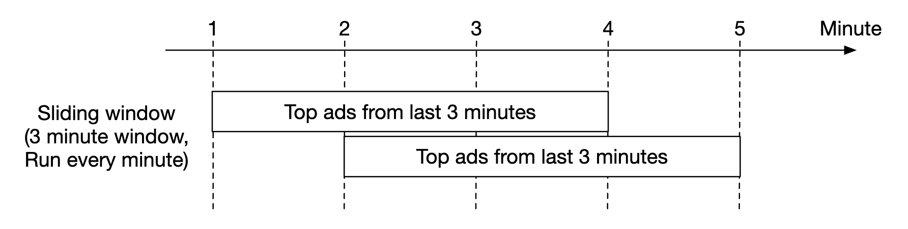
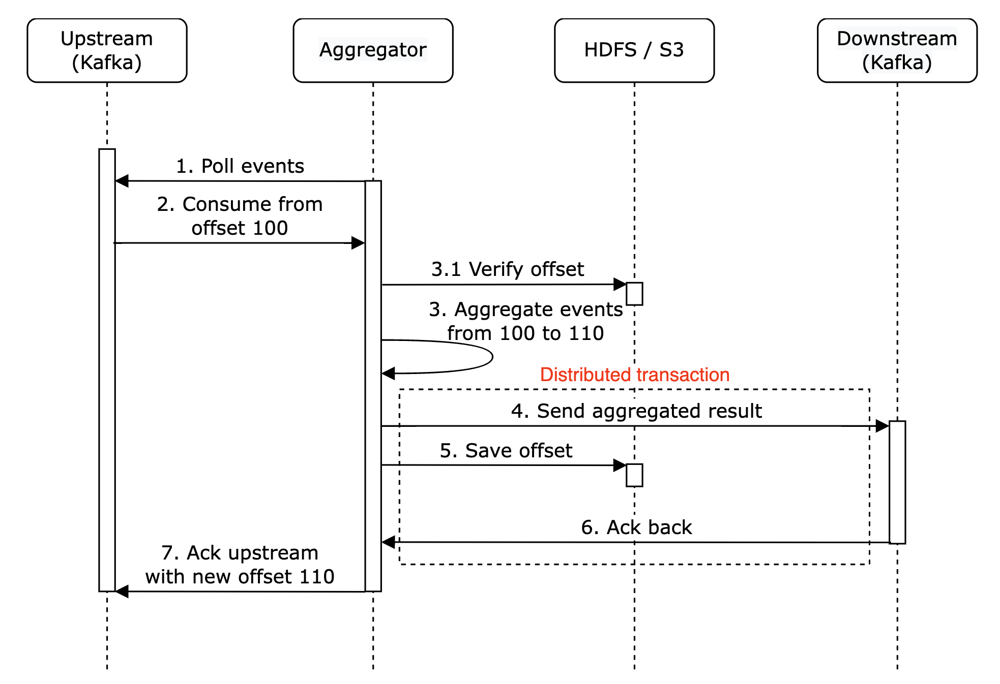

# 第21章：广告点击事件聚合

## 引言
**数字广告**是一个庞大的行业，随着 Facebook、YouTube、TikTok 等的崛起而迅速发展。

因此，追踪广告点击事件至关重要。在本章中，我们将探讨如何在 Facebook/Google 规模上设计一个**广告点击事件聚合**系统。

数字广告有一个称为**实时竞价（RTB）** 的流程，用于买卖数字广告库存：

<div style="margin-left:3rem">
    
</div>

RTB 的速度很重要，因为它通常在一秒钟内发生。数据准确性也非常重要，因为它会影响广告商的付费金额。

基于广告点击事件聚合，广告商可以做出诸如调整目标受众和关键词等决策。

---

## 第一步：理解问题并确定设计范围
 - C：输入数据的格式是什么？
 - I：每天 10 亿次广告点击，共 200 万个广告。广告点击事件数量每年增长 30%。
 - C：我们的系统需要支持哪些最重要的查询？
 - I：需要考虑的主要查询：
   - 返回广告 X 在过去 Y 分钟内的点击事件数量
   - 返回过去 1 分钟内点击量最高的前 100 个广告。两个参数都应可配置。聚合每分钟进行一次。
   - 支持按 `ip`、`user_id`、`country` 对上述查询进行数据过滤
 - C：我们是否需要关注边界情况？我能想到的一些情况：
   - 可能会有事件比预期更晚到达
   - 可能会有重复事件
   - 系统的不同部分可能会宕机，因此需要考虑系统恢复
 - I：这是一个很好的列表，将这些考虑在内
 - C：延迟要求是什么？
 - I：广告点击聚合的端到端延迟为几分钟。对于 RTB，要求小于一秒。广告点击聚合可以接受这个延迟，因为它通常用于计费和报表。

### **功能需求**
 - 聚合过去 Y 分钟内 `ad_id` 的点击次数
 - 每分钟返回点击量最高的前 100 个 `ad_id`
 - 支持按不同属性进行聚合过滤
 - 数据量达到 Facebook 或 Google 规模

### **非功能需求**
 - 聚合结果的准确性很重要，因为它用于 RTB 和广告计费
 - 正确处理延迟或重复事件
 - 鲁棒性——系统应能抵御部分故障
 - 延迟——端到端延迟最多几分钟

### **粗略估算**
 - 10 亿日活用户
 - 假设每个用户每天点击 1 个广告 → 每天 10 亿次广告点击
 - 广告点击 QPS = 10,000
 - 峰值 QPS 是该数字的 5 倍 = 50,000
 - 单次广告点击占用 0.1KB 存储空间。每日存储需求为 100GB
 - 每月存储 = 3TB

---

## 第二步：提出高层设计并获得认可
在本节中，我们将讨论查询 API 设计、数据模型和高层设计。

### **查询 API 设计**
API 是客户端与服务器之间的契约。在我们的场景中，客户端是仪表盘用户——数据科学家/分析师、广告商等。

以下是我们的功能需求：
 - 聚合过去 M 分钟内 `ad_id` 的点击次数
 - 返回过去 M 分钟内点击量最高的前 N 个 `ad_id`
 - 支持按不同属性进行聚合过滤

我们需要两个端点来实现这些需求。过滤可以通过其中一个端点的查询参数来完成。

**聚合过去 M 分钟内 ad_id 的点击次数**：

```
GET /v1/ads/{:ad_id}/aggregated_count
```

查询参数：
 - from - 开始分钟。默认为当前时间减去 1 分钟
 - to - 结束分钟。默认为当前时间
 - filter - 不同过滤策略的标识符。例如 001 表示"非美国点击"。

响应：
 - ad_id - 广告标识符
 - count - 开始和结束分钟之间的聚合次数

**返回过去 M 分钟内点击量最高的前 N 个 ad_id**

```
GET /v1/ads/popular_ads
```

查询参数：
 - count - 点击量最高的前 N 个广告
 - window - 聚合窗口大小（分钟）
 - filter - 不同过滤策略的标识符

响应：
 - ad_id 列表

### **数据模型**
在我们的系统中，有原始数据和聚合数据。

原始数据如下所示：

```
[AdClickEvent] ad001, 2021-01-01 00:00:01, user 1, 207.148.22.22, USA
```

以下是一个结构化格式的示例：
| ad_id | click_timestamp     | user  | ip            | country |
|-------|---------------------|-------|---------------|---------|
| ad001 | 2021-01-01 00:00:01 | user1 | 207.148.22.22 | USA     |
| ad001 | 2021-01-01 00:00:02 | user1 | 207.148.22.22 | USA     |
| ad002 | 2021-01-01 00:00:02 | user2 | 209.153.56.11 | USA     |

以下是聚合版本：
| ad_id | click_minute | filter_id | count |
|-------|--------------|-----------|-------|
| ad001 | 202101010000 | 0012      | 2     |
| ad001 | 202101010000 | 0023      | 3     |
| ad001 | 202101010001 | 0012      | 1     |
| ad001 | 202101010001 | 0023      | 6     |

`filter_id` 帮助我们实现过滤需求。
| filter_id | region | IP        | user_id |
|-----------|--------|-----------|---------|
| 0012      | US     | *         | *       |
| 0013      | *      | 123.1.2.3 | *       |

为了支持快速返回最近 M 分钟内点击量最高的 N 条广告，我们还需要维护以下结构：
| most_clicked_ads   |           |                                                  |
|--------------------|-----------|--------------------------------------------------|
| window_size        | integer   | 聚合窗口大小（M，单位：分钟）                    |
| update_time_minute | timestamp | 最后更新时间戳（1 分钟粒度）                     |
| most_clicked_ads   | array     | 广告 ID 列表（JSON 格式）                        |

存储原始数据和存储聚合数据各有哪些优缺点？
- 原始数据可以使用完整数据集，支持数据过滤和重新计算
- 另一方面，聚合数据使我们拥有更小的数据集，查询速度更快
- 原始数据意味着更大的数据存储和更慢的查询
- 然而，聚合数据是派生数据，因此存在一定的数据丢失

在我们的设计中，将同时采用这两种方式：
- 保留原始数据用于调试是个好主意。如果聚合逻辑存在 bug，我们可以发现并回填修复
- 同时也应存储聚合数据，以获得更快的查询性能
- 原始数据可以存储在冷存储中，以避免额外的存储成本

关于数据库，需要考虑以下几个因素：
- 数据是什么样的？是关系型、文档型还是 Blob？
- 工作负载是读密集、写密集还是两者兼有？
- 是否需要事务？
- 查询是否依赖 OLAP 函数，如 SUM 和 COUNT？

对于原始数据，我们可以看到平均 QPS 为 10k，峰值 QPS 为 50k，因此系统是写密集的。
另一方面，读流量较低，因为原始数据主要用作备份。

关系型数据库可以胜任，但扩展写入可能具有挑战性。
或者，我们可以使用 Cassandra 或 InfluxDB，它们对高写入负载有更好的原生支持。

另一个选择是使用 Amazon S3 配合列式数据格式，如 ORC、Parquet 或 AVRO。由于这种方案不太熟悉，我们将坚持使用 Cassandra。

对于聚合数据，工作负载既读密集又写密集，因为聚合数据会被持续查询用于仪表盘和告警。
同时它也是写密集的，因为聚合服务每分钟都会对数据进行聚合并写入。
因此，这里也将使用相同的数据存储（Cassandra）。

### **高层设计**
系统整体架构如下：

<div style="margin-left:3rem">
    
</div>

数据在输入和输出两端都以无界数据流的形式流动。

为了避免出现同步接收器（即消费者崩溃导致整个系统停滞），
我们将利用基于消息队列（Kafka）的异步处理来解耦消费者和生产者。

<div style="margin-left:3rem">
    
</div>

第一个消息队列存储广告点击事件数据：
| ad_id | click_timestamp | user_id | ip | country |
|-------|-----------------|---------|----|---------|

第二个消息队列包含按分钟聚合的广告点击次数：
| ad_id | click_minute | count |
|-------|--------------|-------|

以及按分钟聚合的点击量最高的 N 条广告：
| update_time_minute | most_clicked_ads |
|--------------------|------------------|

设置第二个消息队列是为了实现端到端的精确一次原子提交语义：

<div style="margin-left:3rem">
    
</div>

对于聚合服务，使用 MapReduce 框架是一个不错的选择：

<div style="margin-left:3rem">
    
</div>

<div style="margin-left:3rem">
    
</div>

每个节点负责单一任务，并将处理结果发送给下游节点。

Map 节点负责从数据源读取数据，然后进行过滤和转换。

例如，Map 节点可以根据 `ad_id` 将数据分配到不同的聚合节点：

<div style="margin-left:3rem">
    
</div>

另一种方式是将广告分配到 Kafka 分区，并让聚合节点在消费者组内直接订阅。
但映射节点使我们能够在后续处理之前对数据进行清洗或转换。

另一个原因可能是我们无法控制数据的产生方式，
因此与同一 `ad_id` 相关的事件可能会进入不同的分区。聚合节点每分钟按 `ad_id` 在内存中对广告点击事件进行聚合。

归约节点收集聚合节点的结果并生成最终结果：

<div style="margin-left:3rem">
    
</div>

该 DAG 模型采用 MapReduce 范式，处理大规模数据，并利用并行分布式计算将其转化为常规规模的数据。

在 DAG 模型中，中间数据存储在内存中，不同节点通过 TCP 或共享内存进行通信。

接下来，我们探讨该模型如何帮助我们实现各种用例。

**用例 1 - 聚合点击次数**：

<div style="margin-left:3rem">
    
</div>

 - 广告按 `ad_id % 3` 进行分区

**用例 2 - 返回点击量排名前 N 的广告**：

<div style="margin-left:3rem">
    
</div>

 - 在此场景中，我们聚合排名前 3 的广告，但可以轻松扩展至前 N 个
 - 每个节点维护一个堆数据结构，以便快速检索前 N 个广告

**用例 3 - 数据过滤**：
为支持快速数据过滤，我们可以预定义过滤条件并基于此进行预聚合：
| ad_id | click_minute | country | count |
|-------|--------------|---------|-------|
| ad001 | 202101010001 | USA     | 100   |
| ad001 | 202101010001 | GPB     | 200   |
| ad001 | 202101010001 | others  | 3000  |
| ad002 | 202101010001 | USA     | 10    |
| ad002 | 202101010001 | GPB     | 25    |
| ad002 | 202101010001 | others  | 12    |

该技术称为**星型模式**，广泛应用于数据仓库中。
过滤字段称为**维度**。

该方法具有以下优势：
 - 易于理解和构建
 - 当前聚合服务可复用，以在星型模式中创建更多维度。
 - 基于过滤条件访问数据速度快，因为结果已预计算。

该方法的一个局限是会产生更多的桶和记录，尤其是在过滤条件较多的情况下。

---

## 第三步：设计深入解析
让我们更深入地探讨一些更有趣的主题。

### **流处理与批处理**
我们提出的高层架构是一种流处理系统。
以下是三种系统的对比：
|                         | 服务（在线系统）      | 批处理系统（离线系统）                          | 流处理系统（准实时系统）     |
|-------------------------|-------------------------------|--------------------------------------------------------|----------------------------------------------|
| 响应性          | 快速响应客户端 | 无需响应客户端                       | 无需响应客户端             |
| 输入                   | 用户请求                 | 有界输入，规模有限。大量数据 | 输入无边界（无限流）     |
| 输出                  | 响应客户端          | 物化视图、聚合指标等。           | 物化视图、聚合指标等。 |
| 性能衡量 | 可用性、延迟         | 吞吐量                                             | 吞吐量、延迟                          |
| 示例                 | 在线购物               | MapReduce                                              | Flink [13]                                   |

在我们的设计中，结合使用了批处理和流处理。

我们使用流处理来实时处理到达的数据并生成近实时的聚合结果。
我们使用批处理来进行历史数据备份。

同时包含两条处理路径——批处理和流处理的系统，该架构称为 Lambda 架构。
其缺点是维护两条处理路径及两套不同的代码库。

Kappa 是一种替代架构，它将批处理和流处理结合在一条处理路径中。
核心思想是使用单一的流处理引擎。

Lambda 架构：

<div style="margin-left:3rem">
    
</div>

Kappa 架构：

<div style="margin-left:3rem">
    
</div>

我们的高层设计采用 Kappa 架构，因为历史数据的重新处理也经过聚合服务。

每当因聚合逻辑存在重大缺陷等原因需要重新计算聚合数据时，我们可以从存储的原始数据重新进行聚合。
 - 重新计算服务从原始存储中检索数据。这是一个批处理任务。
 - 检索到的数据被发送至专用的聚合服务，以免影响实时处理聚合服务。
 - 聚合结果被发送至第二个消息队列，随后我们更新聚合数据库中的结果。

<div style="margin-left:3rem">
    
</div>

### **时间**
我们需要一个时间戳来执行聚合操作。它可以在两个地方生成：
- 事件时间 —— 广告点击发生的时间
- 处理时间 —— 服务器处理事件时的系统时间

由于使用了异步处理（消息队列）和网络延迟，事件时间与处理时间之间可能存在较大差异。
- 如果使用处理时间，聚合结果可能不准确
- 如果使用事件时间，则需要处理延迟事件

没有完美的解决方案，我们需要权衡取舍：
|                 | 优点                                  | 缺点                                                                                 |
|-----------------|---------------------------------------|--------------------------------------------------------------------------------------|
| 事件时间        | 聚合结果更准确                     | 客户端时间可能不正确，或者时间戳可能被恶意用户伪造 |
| 处理时间        | 服务器时间戳更可靠                 | 如果事件到达较晚，时间戳不准确                                       |

由于数据准确性至关重要，我们将使用事件时间进行聚合。

为了缓解延迟事件的问题，可以采用一种称为"水印"的技术。

在下例中，事件 2 错过了需要聚合的窗口：

<div style="margin-left:3rem">
    
</div>

然而，如果我们有意延长聚合窗口，就可以降低事件遗漏的可能性。
窗口的延长部分称为"水印"：

<div style="margin-left:3rem">
    
</div>

- 较短的水印会增加事件遗漏的可能性，但降低延迟
- 较长的水印会降低事件遗漏的可能性，但增加延迟

无论水印设置如何，事件遗漏的可能性始终存在。但为这种极低概率事件做优化没有意义。

我们可以通过日终对账来解决此类不一致问题。

### **聚合窗口**
共有四种窗口函数类型：
- 滚动（固定）窗口
- 跳跃窗口
- 滑动窗口
- 会话窗口

在我们的设计中，使用滚动窗口进行广告点击聚合：

<div style="margin-left:3rem">
    
</div>

同时使用滑动窗口来实现"M 分钟内点击量最高的 N 条广告"聚合：

<div style="margin-left:3rem">
    
</div>

### **投递保证**
由于我们聚合的数据将用于计费，数据准确性是首要考虑因素。

因此，我们需要讨论：
- 如何避免处理重复事件
- 如何确保所有事件都被处理

我们可以使用三种投递保证——至多一次、至少一次和恰好一次。

在大多数情况下，如果少量重复可以接受，至少一次就足够了。
但我们的系统并非如此，因为哪怕很小的百分比差异也可能导致数百万美元的偏差。
因此，我们需要使用恰好一次投递语义。

### **数据去重**
最常见的数据质量问题之一是重复数据。

它可能来自多种来源：
- 客户端 —— 客户端可能会多次发送同一事件。恶意发送的重复事件最好由风控引擎处理。
- 服务器宕机 —— 聚合服务节点在聚合过程中宕机，上游服务未收到确认，因此事件被重新发送。

以下是一个由于最后一跳未确认事件而导致数据重复的示例：

<div style="margin-left:3rem">
    
</div>

在此示例中，偏移量 100 会被多次处理并发送下游。

一种尝试缓解此问题的方法是将最后看到的偏移量存储在 HDFS/S3 中，但这存在结果永远无法到达下游的风险：

<div style="margin-left:3rem">
    
</div>

最后，我们可以在与下游交互时原子性地存储偏移量。为此，我们需要实现分布式事务：

<div style="margin-left:3rem">
    
</div>

**个人补充说明**：另外，如果下游系统能够幂等地处理聚合结果，则无需分布式事务。

### **扩展系统**
让我们讨论随着系统增长如何进行扩展。我们有三个独立组件——消息队列、聚合服务和数据库。

由于它们是解耦的，我们可以独立扩展它们。

**如何扩展消息队列：**
- 我们不对生产者设置限制，因此可以轻松扩展
- 消费者可以通过分配到消费者组并增加消费者数量来扩展
- 为实现这一点，我们还需要确保预先创建足够的分区
- 另外，当有数千个消费者时，消费者再平衡可能需要一段时间，因此建议在非高峰时段进行
- 我们还可以考虑按地理位置对主题进行分区，例如 `topic_na`、`topic_eu` 等

<div style="margin-left:3rem">
    
</div>

**如何扩展聚合服务：**

<div style="margin-left:3rem">
    
</div>

- Map-Reduce 节点可以通过添加更多节点轻松扩展
- 聚合服务的吞吐量可以通过利用多线程来扩展
- 或者，我们可以利用 Apache YARN 等资源提供者来实现多进程处理
- 方案 1 更容易，但方案 2 在实际中更常用，因为它更具可扩展性
- 以下是一个多线程示例：

<div style="margin-left:3rem">
    
</div>

**如何扩展数据库：**
- 如果使用 Cassandra，它原生支持利用一致性哈希进行水平扩展
- 如果向集群中添加新节点，数据会自动在所有（虚拟）节点之间重新平衡
- 采用这种方法，无需手动进行（再）分片

<div style="margin-left:3rem">
    
</div>

另一个需要考虑的可扩展性问题是热点问题——如果某个广告更受欢迎并获得更多关注怎么办？

<div style="margin-left:3rem">
    
</div>

- 在上述示例中，聚合服务节点可以通过资源管理器申请额外资源
- 资源管理器分配更多资源，因此原始节点不会过载
- 原始节点将事件分为 3 组，每个聚合节点处理 100 个事件
- 结果写回原始聚合节点

处理热点问题的替代、更复杂的方法：
- 全局-局部聚合
- 拆分去重聚合

### **容错性**
在聚合节点内部，我们在内存中处理数据。如果一个节点宕机，已处理的数据将丢失。

我们可以利用 Kafka 中的消费者偏移量，以便在另一个节点接手时从上次中断处继续。
然而，由于我们正在聚合 M 分钟内的前 N 个广告，因此还需要维护额外的中间状态。

我们可以在特定时间点为正在进行的聚合制作快照：

<div style="margin-left:3rem">
    
</div>

如果一个节点宕机，新节点可以读取最新提交的消费者偏移量以及最新快照来继续任务：

<div style="margin-left:3rem">
    
</div>

### **数据监控与正确性**
由于我们聚合的数据至关重要，因为它用于计费，因此实施严格的监控以确保正确性非常重要。

我们可能需要监控的一些指标：
- **延迟**：可以跟踪不同事件的时间戳，以了解系统的端到端延迟
- **消息队列大小**：如果队列大小突然增加，我们需要添加更多聚合节点。由于 Kafka 是通过分布式提交日志实现的，我们需要跟踪 records-lag 指标
- **聚合节点上的系统资源**：CPU、磁盘、JVM 等

我们还需要实现一个对账流程，这是一个在每天结束时运行的批处理任务。
它从原始数据计算聚合结果，并与存储在聚合数据库中的实际数据进行比较：

<div style="margin-left:3rem">
    
</div>

### **替代方案**
在通用系统设计面试中，并不要求你了解大数据处理中使用的专业软件的内部机制。

解释思考过程和讨论权衡比了解特定工具更重要，这就是为什么本章涵盖通用解决方案的原因。

一种利用现成工具的替代方案是将广告点击数据存储在 Hive 中，并在其上构建 ElasticSearch 层以实现更快的查询。聚合通常在 ClickHouse 或 Druid 等 OLAP 数据库中完成。

<div style="margin-left:3rem">
    
</div>

---

## 第四步：总结
我们涵盖的内容：
 - 数据模型与 API 设计
 - 使用 MapReduce 聚合广告点击事件
 - 扩展消息队列、聚合服务和数据库
 - 缓解热点问题
 - 持续监控系统
 - 使用对账确保正确性
 - 容错能力

广告点击事件聚合是一个典型的大数据处理系统。

如果你具备相关技术的前置知识，理解和设计它会更容易：
 - Apache Kafka
 - Apache Spark
 - Apache Flink