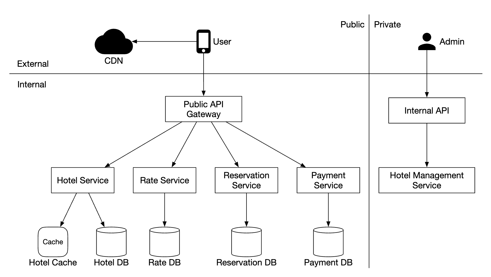
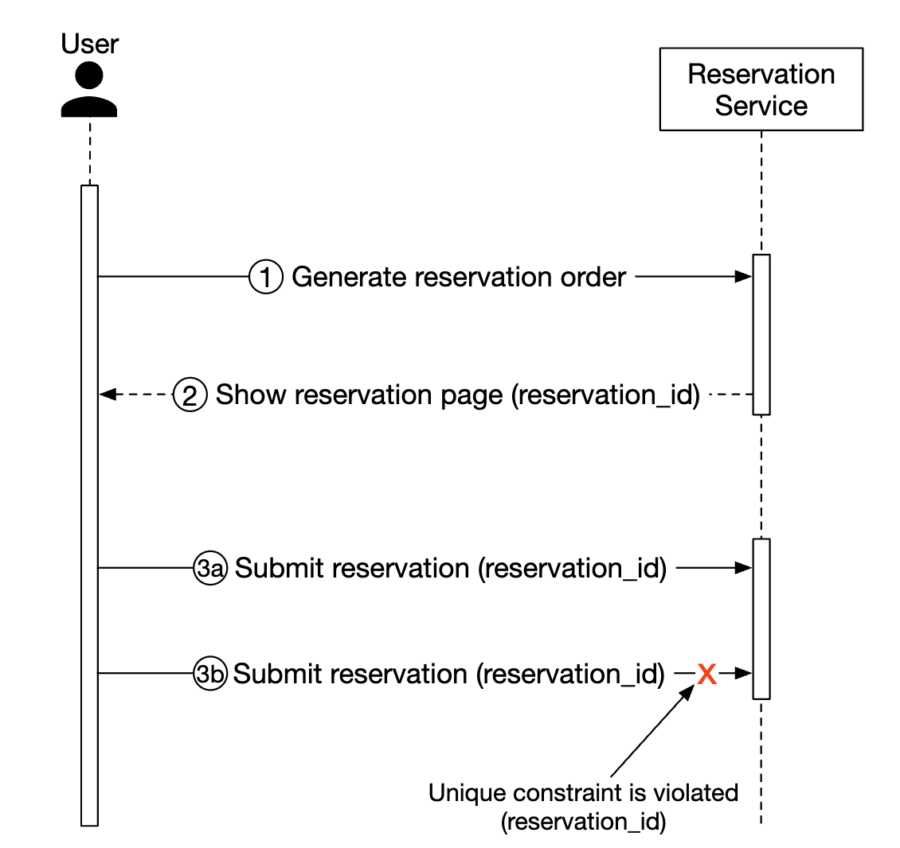
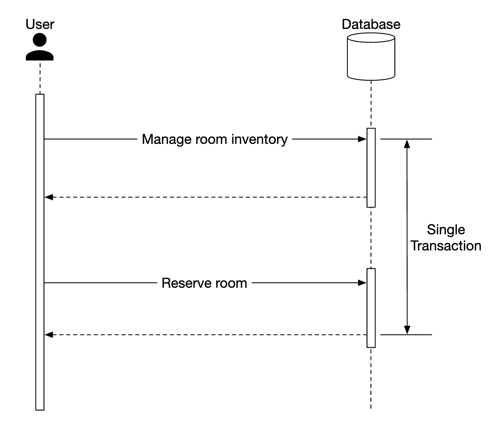

# 第22章：酒店预订系统

## 引言
在本章中，我们将设计一个**酒店预订系统**，类似于万豪国际（Marriott International）。

该系统也适用于其他类型的系统——例如 Airbnb、航班预订、电影票预订等。

---

## 第一步：理解问题并确定设计范围
在深入设计系统之前，我们应该向面试官提问以明确范围：
 - C：系统的规模有多大？
 - I：我们正在为一家拥有 5000 家酒店和 100 万间客房的连锁酒店构建网站
 - C：客户在预订时付款，还是到店时付款？
 - I：他们在预订时全额付款。
 - C：客户只通过网站预订酒店房间吗？我们是否需要支持电话等其他预订方式？
 - I：他们只通过网站或应用程序进行预订。
 - C：客户可以取消预订吗？
 - I：可以
 - C：还有其他需要考虑的事项吗？
 - I：有的，我们允许超额预订 10%。酒店会售出比实际更多的房间。酒店这样做是预期会有客户取消预订。
 - C：由于时间有限，我们将重点放在——展示酒店相关页面、酒店房间详情页、预订房间、管理面板，以及支持超额预订。
 - I：听起来不错。
 - I：还有一点——酒店价格随时都在变化。假设酒店房间的价格每天都会变化。
 - C：好的。

### **非功能性需求**
 - 支持高并发——旺季时可能会有大量客户尝试预订同一家酒店。
 - 适度的延迟——用户预订时延迟越低越好，但如果系统需要几秒钟来处理，也是可以接受的。

### **粗略估算**
 - 共 5000 家酒店，100 万间客房
 - 假设 70% 的客房被占用，平均入住时长为 3 天
 - 预估每日预订量——100 万 × 0.7 ÷ 3 = 每天约 24 万笔预订
 - 每秒预订数——24 万 ÷ 一天的 10⁵ 秒 = 约 3。平均预订 TPS 较低。

让我们估算 QPS。假设到达预订页面需要三个步骤，每个页面的转化率为 10%，
我们可以估算出，如果有 3 笔预订，那么预订页面必须有 30 次浏览，酒店房间详情页必须有 300 次浏览。

<div style="margin-left:3rem">
    
</div>

---

## 第二步：提出高层设计并获得认可
我们将探讨——API 设计、数据模型、高层设计。

### **API 设计**
本节的 API 设计聚焦于支持酒店预订系统所需的核心端点（使用 RESTful 风格）。

一个完整的系统需要更丰富的 API，支持基于多种条件搜索房间，但本节不会涉及这部分。
原因是这些功能在技术上并不具有挑战性，因此不在讨论范围内。

**酒店相关 API**
 - `GET /v1/hotels/{id}` - 获取酒店的详细信息
 - `POST /v1/hotels` - 添加新酒店。仅限运维人员使用
 - `PUT /v1/hotels/{id}` - 更新酒店信息。仅限运维人员使用
 - `DELETE /v1/hotels/{id}` - 删除酒店。API 仅限运维人员使用

**房间相关 API**
 - `GET /v1/hotels/{id}/rooms/{id}` - 获取房间的详细信息
 - `POST /v1/hotels/{id}/rooms` - 添加房间。仅限运维人员使用
 - `PUT /v1/hotels/{id}/rooms/{id}` - 更新房间信息。仅限运维人员使用
 - `DELETE /v1/hotels/{id}/rooms/{id}` - 删除房间。仅限运维人员使用

**预订相关 API**
 - `GET /v1/reservations` - 获取当前用户的预订历史
 - `GET /v1/reservations/{id}` - 获取预订的详细信息
 - `POST /v1/reservations` - 创建新预订
 - `DELETE /v1/reservations/{id}` - 取消预订

以下是一个预订请求的示例：

```
{
  "startDate":"2021-04-28",
  "endDate":"2021-04-30",
  "hotelID":"245",
  "roomID":"U12354673389",
  "reservationID":"13422445"
}
```

请注意，`reservationID` 是一个幂等性键，用于避免重复预订。详细信息在[并发章节](#concurrency-issues)中说明。

### **数据模型**
在选择数据库之前，让我们先考虑一下访问模式。

我们需要支持以下查询：
 - 查看酒店的详细信息
 - 根据日期范围查找可用的房间类型
 - 记录一笔预订
 - 查找某笔预订或过去的预订历史

根据我们的估算，我们知道系统规模不大，但需要应对流量高峰。

基于这些信息，我们将选择关系型数据库，因为：
 - 关系型数据库在读多写少的系统中表现良好。
 - NoSQL 数据库通常针对写入进行优化，但我们知道写入量不会很多，因为只有一小部分访问网站的用户会进行预订。
 - 关系型数据库提供 ACID 保证。这对这类系统非常重要，因为没有它们，我们将无法防止负余额、重复扣款等问题的发生。
 - 关系型数据库可以轻松地建模数据，因为其结构非常清晰。以下是我们的架构设计：

<div style="margin-left:3rem">
    
</div>

大部分字段都一目了然。唯一值得提及的字段是 `status` 字段，它表示给定房间的状态机：

<div style="margin-left:3rem">
    
</div>

这种数据模型适用于 Airbnb 这类系统，但不适用于酒店场景——用户预订的不是某个特定房间，而是某种房型。他们在预订时选择房间类型，房间号则在预订过程中分配。

这一不足将在 [改进的数据模型](#improved-data-model) 部分中解决。

### **高层设计**
我们为这个系统选择了微服务架构。这种架构近年来广受欢迎：

<div style="margin-left:3rem">
    
</div>

 - **用户**：通过手机或电脑预订酒店房间
 - **管理员**：执行管理职能，例如退款/取消支付等
 - **CDN**：缓存静态资源，如 JS 包、图片、视频等
 - **公共 API 网关**：全托管服务，支持限流、认证等功能
 - **内部 API**：仅对授权人员可见，通常通过 VPN 保护
 - **酒店服务**：提供酒店和房间的详细信息。酒店和房间数据是静态的，因此可以积极缓存
 - **费率服务**：提供不同未来日期的房间费率。该领域的一个有趣之处在于，价格取决于酒店在特定日期的满房率
 - **预订服务**：接收预订请求并预留酒店房间，同时跟踪预订和取消过程中的房间库存
 - **支付服务**：处理支付，并在成功后更新预订状态
 - **酒店管理服务**：仅对授权人员开放，允许执行某些管理职能，如管理和查看预订、酒店等信息

服务间的通信可以通过 gRPC 等 RPC 框架来实现。

---

## 第三步：深入设计
让我们深入探讨以下内容：
 - 改进的数据模型
 - 并发问题
 - 可扩展性
 - 解决微服务中的数据不一致问题

### **改进的数据模型**
如前文所述，我们需要修改 API 和架构，以支持预订房间类型而非特定房间。

对于预订 API，我们不再预订 `roomID`，而是预订 `roomTypeID`：

```
POST /v1/reservations
{
  "startDate":"2021-04-28",
  "endDate":"2021-04-30",
  "hotelID":"245",
  "roomTypeID":"12354673389",
  "roomCount":"3",
  "reservationID":"13422445"
}
```

以下是更新后的架构：

<div style="margin-left:3rem">
    
</div>

 - **room**：包含房间信息
 - **room_type_rate**：包含特定房间类型的价格信息
 - **reservation**：记录客人的预订数据
 - **room_type_inventory**：存储酒店房间的库存数据

让我们来看一下 `room_type_inventory` 表的列，因为这张表更有趣：
 - **hotel_id**：酒店 ID
 - **room_type_id**：房间类型 ID
 - **date**：单个日期
 - **total_inventory**：房间总数减去临时移出库存的房间数
 - **total_reserved**：为特定（hotel_id, room_type_id, date）预订的房间总数

设计这张表有其他方式，但每个（hotel_id, room_type_id, date）只对应一行数据，可以简化预订管理并使查询更便捷。

表中的行通过每日 CRON 任务预填充。

示例数据：
| hotel_id | room_type_id | date       | total_inventory | total_reserved |
|----------|--------------|------------|-----------------|----------------|
| 211      | 1001         | 2021-06-01 | 100             | 80             |
| 211      | 1001         | 2021-06-02 | 100             | 82             |
| 211      | 1001         | 2021-06-03 | 100             | 86             |
| 211      | 1001         | ...        | ...             |                |
| 211      | 1001         | 2023-05-31 | 100             | 0              |
| 211      | 1002         | 2021-06-01 | 200             | 16             |
| 2210     | 101          | 2021-06-01 | 30              | 23             |
| 2210     | 101          | 2021-06-02 | 30              | 25             |

查询某种房间类型可用性的示例 SQL：

```
SELECT date, total_inventory, total_reserved
FROM room_type_inventory
WHERE room_type_id = ${roomTypeId} AND hotel_id = ${hotelId}
AND date between ${startDate} and ${endDate}
```

如何使用这些数据检查指定数量房间的可用性（注意我们支持超售）：

```
if (total_reserved + ${numberOfRoomsToReserve}) <= 110% * total_inventory
```现在让我们对存储容量进行一些估算。
- 我们有 5000 家酒店。
- 每家酒店有 20 种房型。
- 5000 * 20 * 2（年）* 365（天）= 7300 万行数据。

7300 万行数据并不算多，单台数据库服务器即可处理。
不过，设置读副本（可能跨不同可用区）以实现高可用性是合理的。

后续问题——如果预订数据量太大，单台数据库无法承载，你会怎么做？
- 只存储当前和未来的预订数据。预订历史可以移至冷存储。
- 数据库分片——我们可以按 `hash(hotel_id) % servers_cnt` 进行分片，因为查询中始终使用 `hotel_id`。

### **并发问题**
另一个需要解决的重要问题是**重复预订**。

需要解决两个问题：
- 同一用户连续两次点击“预订”
- 多个用户同时尝试预订同一间房

以下是第一个问题的可视化：

<div style="margin-left:3rem">
    
</div>

解决此问题有两种方法：
- **客户端处理**——前端可以在点击后禁用预订按钮。但如果用户禁用了 JavaScript，他们将看不到按钮变灰。
- **幂等 API**——为 API 添加幂等键，使用户无论端点被调用多少次都只执行一次操作：

<div style="margin-left:3rem">
    
</div>

以下是该流程的工作方式：
- 当你开始填写信息并进行预订时，会生成一个预订订单。预订订单使用全局唯一标识符生成。
- 使用上一步生成的 `reservation_id` 提交预订 1。
- 如果第二次点击“完成预订”，会发送相同的 `reservation_id`，后端会检测到这是重复预订。
- 通过对 `reservation_id` 列设置唯一约束来避免重复，防止数据库中存储多条相同 ID 的记录。

<div style="margin-left:3rem">
    
</div>

如果有多个用户尝试进行相同的预订呢？

<div style="margin-left:3rem">
    
</div>

- 假设事务隔离级别不是可串行化
- 用户 1 和用户 2 同时尝试预订同一间房。
- 事务 1 检查是否有足够的房间——有
- 事务 2 检查是否有足够的房间——有
- 事务 2 预订了该房间并更新了库存
- 事务 1 也预订了该房间，因为它仍然看到 100 间房中有 99 间已被预订
- 两个事务都成功提交了更改

此问题可以通过某种锁定机制来解决：
- 悲观锁
- 乐观锁
- 数据库约束

以下是用于预订房间的 SQL：

```sql
# 步骤 1：检查房间库存
SELECT date, total_inventory, total_reserved
FROM room_type_inventory
WHERE room_type_id = ${roomTypeId} AND hotel_id = ${hotelId}
AND date between ${startDate} and ${endDate}

# 对于步骤 1 返回的每一条记录
if((total_reserved + ${numberOfRoomsToReserve}) > 110% * total_inventory) {
  回滚
}

# 步骤 2：预订房间
UPDATE room_type_inventory
SET total_reserved = total_reserved + ${numberOfRoomsToReserve}
WHERE room_type_id = ${roomTypeId}
AND date between ${startDate} and ${endDate}

提交
```

#### 方案 1：悲观锁
悲观锁通过在更新记录时对其加锁来防止同时更新。

在 MySQL 中可以通过使用 `SELECT... FOR UPDATE` 查询来实现，它会锁定查询选中的行，直到事务提交为止。

<div style="margin-left:3rem">
    
</div>

优点：
- 防止应用程序更新正在被修改的数据
- 易于实现，通过串行化更新来避免冲突。在数据竞争激烈时非常有用。

缺点：
- 当多个资源被锁定时可能会发生死锁。
- 这种方法不可扩展——如果事务锁定时间过长，会影响所有其他尝试访问该资源的事务。
- 当查询选中大量资源且事务生命周期较长时，影响尤为严重。

由于其可扩展性问题，作者不推荐此方案。

#### 方案 2：乐观锁
乐观锁允许多个用户同时尝试更新同一条记录。

有两种常见的实现方式——版本号和时间戳。由于服务器时钟可能不准确，推荐使用版本号。

<div style="margin-left:3rem">
    
</div>- 在数据库表中新增一个 `version` 列
- 用户修改数据库行之前，先读取版本号
- 用户更新行时，版本号加 1 并写回数据库
- 数据库校验会阻止插入，除非新版本号大于旧版本号

乐观锁通常比悲观锁更快，因为我们不会对数据库加锁。  
但当并发较高时，其性能会下降，因为会导致大量回滚。

优点：
- 防止应用程序编辑过期数据
- 无需在数据库中获取锁
- 在数据冲突较少时是首选方案，即更新冲突罕见

缺点：
- 数据冲突较高时性能较差

由于预订系统的 QPS 并不是特别高，乐观锁对我们系统来说是一个不错的选择。

#### 方案三：数据库约束
这种方法与乐观锁非常相似，但防护措施是通过数据库约束实现的：

```
CONSTRAINT `check_room_count` CHECK((`total_inventory - total_reserved` >= 0))
```

<div style="margin-left:3rem">
    
</div>

优点：
- 易于实现
- 数据冲突较小时效果良好

缺点：
- 与乐观锁类似，数据冲突较高时性能较差
- 数据库约束不像应用代码那样容易进行版本控制
- 并非所有数据库都支持约束

由于实现简单，这也是酒店预订系统的另一个不错选择。

### **可扩展性**
通常，酒店预订系统的负载并不高。

不过，面试官可能会问你，如果系统被推广到类似 booking.com 这样的大型热门旅游网站，该如何应对？  
在这种情况下，QPS 可能会高出 1000 倍。

在这种情况下，了解瓶颈所在非常重要。所有服务都是无状态的，因此可以通过复制轻松扩展。

然而，数据库是有状态的，其扩展方式并不那么明显。

一种扩展方式是实现数据库分片——我们可以将数据分布在多个数据库中，每个数据库只包含一部分数据。

我们可以按 `hotel_id` 进行分片，因为所有查询都基于它进行过滤。  
假设 QPS 为 30,000，将数据库分为 16 个分片后，每个分片处理 1875 QPS，这在单个 MySQL 集群的负载能力范围内。

<div style="margin-left:3rem">
    
</div>

我们还可以通过 Redis 对房间库存和预订进行缓存。可以设置 TTL，使过期天数的数据自动失效。

<div style="margin-left:3rem">
    
</div>

库存的存储方式基于 `hotel_id`、`room_type_id` 和 `date`：

```
key: hotelID_roomTypeID_{date}
value: 给定酒店 ID、房间类型 ID 和日期的可用房间数量。
```

数据一致性是异步的，通过 CDC 流式处理机制来管理——读取数据库变更并应用到另一个系统。  
Debezium 是同步数据库变更与 Redis 的常用方案。

使用这种机制，缓存和数据库可能会在一段时间内不一致。  
在我们的场景中，这没有问题，因为数据库会阻止无效预订的创建。

这会在 UI 上造成一定影响，用户可能需要刷新页面才能看到“已无剩余房间”，  
但如果用户在预订前犹豫较久，即使没有这个问题也可能出现这种情况。

缓存优点：
- 降低数据库负载
- 高性能，因为 Redis 在内存中管理数据

缓存缺点：
- 维护缓存与数据库之间的一致性较难，需要考虑不一致对用户体验的影响。

### **服务之间的数据一致性**
单体应用可以让我们使用共享关系型数据库来保证数据一致性。

在我们的微服务设计中，采用了混合方案：部分服务是独立的，  
但预订和库存 API 由同一个服务处理。

这是因为我们希望利用关系型数据库的 ACID 保证来确保一致性。

不过，面试官可能会质疑这种做法，因为它不是纯粹的微服务架构——每个服务都有独立的数据库：

<div style="margin-left:3rem">
    
</div>

这可能导致一致性问题。在单体服务器中，我们可以利用关系型数据库的事务能力来实现原子操作：

<div style="margin-left:3rem">
    
</div>然而，当操作跨越多个服务时，要保证这种原子性就更加困难了：

<div style="margin-left:3rem">
    
</div>

有一些众所周知的技巧可以处理这些数据不一致问题：
 - **两阶段提交（Two-phase commit）**：一种保证跨多个节点原子性事务提交的数据库协议。
   但它的性能不佳，因为单个节点的延迟会导致所有节点阻塞该操作。
 - **Saga**：一系列本地事务，当工作流中的某个步骤失败时，会触发补偿事务。这是一种最终一致性的方案。

值得注意的是，处理跨微服务的数据不一致是一个极具挑战性的问题，会增加系统复杂度。
考虑到我们更务实的做法是将依赖操作封装在同一个关系型数据库中，有必要权衡这样做的成本是否值得。

---

## 第四步：总结
我们展示了一个酒店预订系统的设计。

我们经历了以下步骤：
 - 收集需求并进行初步估算，以了解系统的规模
 - 在高层设计中，我们展示了 API 设计、数据模型和系统架构
 - 在深入探讨中，随着需求的变化，我们探索了替代的数据库表结构设计
 - 我们讨论了竞态条件并提出了解决方案——悲观锁/乐观锁、数据库约束
 - 通过数据库分片和缓存来扩展系统的方法
 - 最后，我们讨论了如何处理跨多个微服务的数据一致性问题