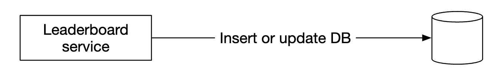
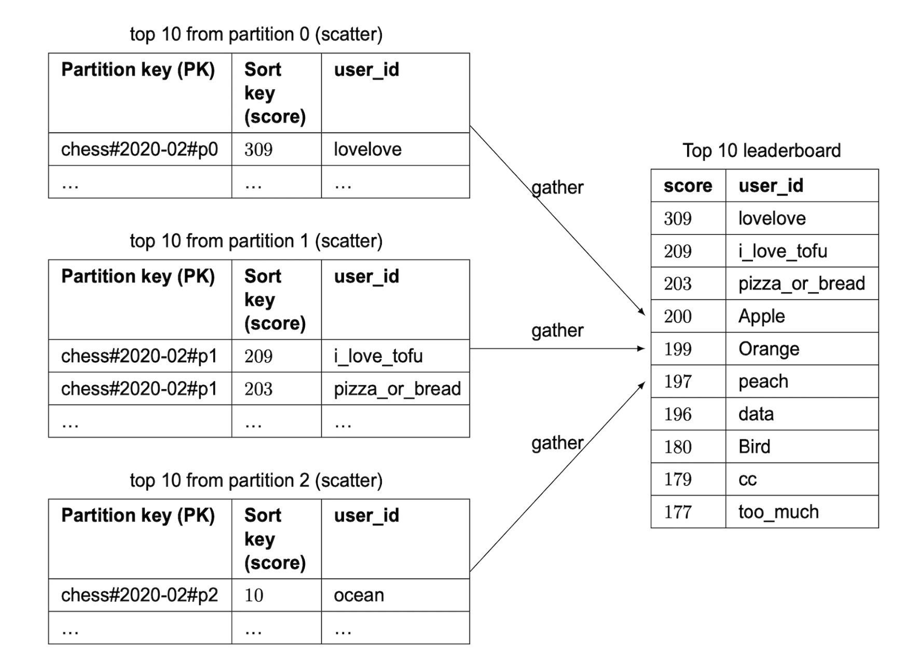

# 第25章：实时游戏排行榜

## 引言

我们将为一个在线手机游戏设计一个**排行榜**：

<div style="margin-left:3rem">
    
</div>

---

## 第一步：理解问题并确定设计范围

- C：排行榜的分数是如何计算的？
- I：用户每赢一局比赛获得一分。
- C：所有玩家都会出现在排行榜中吗？
- I：是的。
- C：排行榜是否有时间分段？
- I：每个月会开启一场新的锦标赛，对应一个新的排行榜。
- C：我们可以假设只关心排名前10的用户吗？
- I：我们希望展示前10名用户，以及特定用户的位置。如果时间允许，可以讨论展示排行榜中某个用户周围的玩家。
- C：一场锦标赛中有多少用户？
- I：500万日活跃用户（DAU），2500万月活跃用户（MAU）。
- C：一场锦标赛期间平均进行多少场比赛？
- I：平均每个玩家每天进行10场比赛。
- C：如果两名玩家分数相同，如何确定排名？
- I：他们的排名相同。如果时间允许，可以讨论如何打破平局。
- C：排行榜需要实时更新吗？
- I：是的，我们希望展示实时结果，或尽可能接近实时。展示批量历史结果是不可接受的。

### **功能需求**

- 在排行榜上展示前10名玩家
- 显示某个用户的具体排名
- 展示给定用户上下各四名的用户（附加功能）

### **非功能需求**

- 分数实时更新
- 分数更新实时反映在排行榜上
- 良好的可扩展性、可用性和可靠性

### **粗略估算**

以5000万DAU为例，如果游戏在24小时内玩家分布均匀，平均每秒约有50名用户在线。
但由于分布通常不均匀，我们可以估计峰值在线用户数为每秒250人。

用户得分请求的QPS——平均每天10场比赛，50用户/秒 × 10 = 500 QPS。峰值QPS为2500。

获取前10名排行榜的QPS——假设用户平均每天打开一次，QPS为50。

---

## 第二步：提出高层设计并获得认可

### **API设计**

我们需要的第一个API是更新用户分数的接口：

```
POST /v1/scores
```

该API接收两个参数——`user_id`和赢得游戏获得的`points`。

该API只应允许游戏服务器访问，不允许终端客户端访问。

接下来是获取排行榜前10名玩家的接口：

```
GET /v1/scores
```

示例响应：

```
{
  "data": [
    {
      "user_id": "user_id1",
      "user_name": "alice",
      "rank": 1,
      "score": 12543
    },
    {
      "user_id": "user_id2",
      "user_name": "bob",
      "rank": 2,
      "score": 11500
    }
  ],
  ...
  "total": 10
}
```

你也可以获取某个特定用户的分数：

```
GET /v1/scores/{:user_id}
```

示例响应：

```
{
    "user_info": {
        "user_id": "user5",
        "score": 1000,
        "rank": 6,
    }
}
```

### **高层架构**

<div style="margin-left:3rem">
    
</div>

- 当玩家赢得比赛时，客户端向游戏服务发送请求
- 游戏服务验证胜利是否有效，并调用排行榜服务来更新玩家分数
- 排行榜服务在排行榜存储中更新用户分数
- 玩家向排行榜服务发起请求以获取排行榜数据，例如前10名玩家和特定玩家的排名

另一种被考虑的设计方案是客户端直接向排行榜服务更新自己的分数：

<div style="margin-left:3rem">
    
</div>

这种方案不安全，因为它容易受到中间人攻击。玩家可以设置代理，随意修改自己的分数。

一个额外的注意事项是，对于游戏逻辑由服务器管理的游戏，客户端不需要显式调用服务器来记录胜利。
服务器会根据游戏逻辑自动为他们记录。

一个额外的考虑是，是否应该在游戏服务器和排行榜服务之间加入消息队列。如果其他服务对比赛结果感兴趣，这会很有用，但这并不是面试中的明确需求，因此未包含在设计中：

<div style="margin-left:3rem">
    
</div>

### **数据模型**

让我们讨论存储排行榜数据的选项——关系型数据库、Redis、NoSQL。

NoSQL方案将在深入探讨部分进行讨论。

#### 关系型数据库方案

如果规模不大且用户数量不多，关系型数据库可以很好地满足我们的需求。

我们可以从一个简单的排行榜表开始，每个月一张表（个人备注——这并不合理。你只需添加一个`month`列，就可以避免每月维护新表的麻烦）：

<div style="margin-left:3rem">
    
</div>

还有需要补充的数据，但与我们将要执行的查询无关，因此省略。

当用户赢得一个积分时会发生什么？

<div style="margin-left:3rem">
    
</div>

如果用户尚不存在于表中，我们需要先将其插入：

```
INSERT INTO leaderboard (user_id, score) VALUES ('mary1934', 1);
```

在后续调用中，我们只需更新其分数：

```
UPDATE leaderboard set score=score + 1 where user_id='mary1934';
```

我们如何查找排行榜中的顶级玩家？

<div style="margin-left:3rem">
    
</div>

我们可以运行以下查询：

```
SELECT (@rownum := @rownum + 1) AS rank, user_id, score
FROM leaderboard
ORDER BY score DESC;
```

但这种方式性能不佳，因为它需要扫描整个数据库表来对所有记录进行排序。

我们可以通过在 `score` 上添加索引，并使用 `LIMIT` 操作来避免扫描所有数据，从而进行优化：

```
SELECT (@rownum := @rownum + 1) AS rank, user_id, score
FROM leaderboard
ORDER BY score DESC
LIMIT 10;
```

然而，如果用户不在排行榜顶部，而你想定位他们的排名，这种方法的可扩展性就不好了。

#### Redis 解决方案

我们希望找到一种即使面对数百万玩家也能良好运行的解决方案，而无需依赖复杂的数据库查询。

Redis 是一个内存数据存储，由于其基于内存工作，并且拥有适合我们需求的数据结构——**有序集合（sorted set）**，因此速度非常快。

有序集合是一种类似于编程语言中集合的数据结构，它允许你根据给定的条件对数据结构进行排序。
在内部，它使用哈希表来维护键（user_id）与值（score）之间的映射，并使用跳表（skip list）来按排序顺序将分数映射到用户：

<div style="margin-left:3rem">
    
</div>

跳表是如何工作的？
- 它是一种支持快速搜索的链表
- 它由一个有序链表和多级索引组成

<div style="margin-left:3rem">
    
</div>

这种结构使我们在数据集足够大时能够快速搜索特定值。
在下图示例中（64 个节点），在基础链表中查找给定值需要遍历 62 个节点，而在跳表情况下只需遍历 11 个节点：

<div style="margin-left:3rem">
    
</div>

与关系型数据库相比，有序集合的性能更高，因为数据始终处于排序状态，其代价是添加和查找操作的时间复杂度为 O(logN)。

相比之下，以下是一个在关系型数据库中查找给定用户排名所需的嵌套查询示例：

```
SELECT *,(SELECT COUNT(*) FROM leaderboard lb2
WHERE lb2.score >= lb1.score) RANK
FROM leaderboard lb1
WHERE lb1.user_id = {:user_id};
```

要在 Redis 中操作排行榜，我们需要哪些操作？
- **ZADD** - 如果用户不存在，则将其插入集合；否则更新分数。时间复杂度为 O(logN)。
- **ZINCRBY** - 将用户的积分增加指定数量。如果用户不存在，分数从零开始。时间复杂度为 O(logN)。
- **ZRANGE/ZREVRANGE** - 获取按分数排序的用户范围。我们可以指定顺序（ASC/DESC）、偏移量和结果数量。时间复杂度为 O(logN+M)，其中 M 为结果数量。
- **ZRANK/ZREVRANK** - 获取给定用户在 ASC/DESC 顺序中的位置（排名）。时间复杂度为 O(logN)。

当用户获得一个积分时会发生什么？

```
ZINCRBY leaderboard_feb_2021 1 'mary1934'
```

每个月都会创建一个新的排行榜，而旧的排行榜会被移动到历史存储中。

当用户获取前 10 名玩家时会发生什么？

```
ZREVRANGE leaderboard_feb_2021 0 9 WITHSCORES
```

示例结果：

```
[(user2,score2),(user1,score1),(user5,score5)...]
```

用户获取自己的排行榜位置呢？

<div style="margin-left:3rem">
    
</div>

如果我们知道用户的排行榜位置，可以通过以下查询轻松实现：

```
ZREVRANGE leaderboard_feb_2021 357 365
```

用户的位置可以通过 `ZREVRANK <user-id>` 获取。

让我们看看存储需求：
- 假设最坏情况下，所有 2500 万月活跃用户都参与了该月的游戏
- ID 是 24 字符的字符串，分数是 16 位整数，我们需要 26 字节 × 2500 万 ≈ 650MB 的存储空间
- 即使由于跳表的开销使存储成本翻倍，这仍然可以轻松容纳在现代 Redis 集群中

另一个需要考虑的非功能性需求是支持每秒 2500 次更新。这完全在单台 Redis 服务器的能力范围内。额外注意事项：
- 我们可以启动一个 Redis 副本，以避免 Redis 服务器崩溃时数据丢失
- 我们仍然可以利用 Redis 持久化来防止崩溃时数据丢失
- 我们需要在 MySQL 中维护两张辅助表，用于获取用户名、显示名等用户详情，以及记录用户何时赢得比赛等事件
- MySQL 中的第二张表可用于在基础设施故障时重建排行榜
- 作为小幅性能优化，我们可以缓存排名前 10 玩家的用户详情，因为这些数据会被频繁访问

---

## 第三步：设计深入探讨

### **是否使用云服务商**

我们可以选择自行部署和管理服务，也可以使用云服务商来代为管理。

如果选择自行管理，我们将使用 Redis 存储排行榜数据，使用 MySQL 存储用户资料，并在需要扩展数据库时额外引入缓存：

<div style="margin-left:3rem">
    
</div>

或者，我们可以使用云服务来管理大量服务。例如，我们可以使用 AWS API Gateway 将 API 调用路由到 AWS Lambda 函数：

<div style="margin-left:3rem">
    
</div>

AWS Lambda 使我们无需自行管理或预置服务器即可运行代码。它只在需要时运行，并能自动扩展。

用户得分的示例：

<div style="margin-left:3rem">
    
</div>

用户获取排行榜的示例：

<div style="margin-left:3rem">
    
</div>

Lambda 是无服务器架构的一种实现方式。我们无需管理扩展和环境配置。

作者建议，如果我们要从零开始构建这款游戏，采用这种方案更为合适。

### **Redis 扩展**

在 500 万日活用户的情况下，从存储和 QPS 的角度来看，单个 Redis 实例就足以应对。

然而，如果用户规模增长 10 倍，达到 5 亿日活，则需要 65 GB 的存储空间，QPS 也将达到 25 万。

这样的规模将需要分片。

一种实现方式是基于范围进行数据分区：

<div style="margin-left:3rem">
    
</div>

在此示例中，我们将根据用户分数进行分片。我们将在应用代码中维护 user_id 与分片之间的映射关系。
这可以通过 MySQL 或另一个缓存来实现该映射。

要获取排名前 10 的玩家，我们将查询分数最高的分片（`[900-1000]`）。

要获取某位用户的排名，我们需要计算该用户在其分片内的排名，并加上其他所有分数更高分片中的用户总数。
后者是一个 O(1) 操作，因为每个分片的总记录数可以通过 `info keyspace` 命令快速获取。

另一种方式是使用 Redis Cluster 的哈希分片。它是一个代理，根据类似于一致性哈希的分区方式将数据分布到各个 Redis 节点上，但并不完全相同：

<div style="margin-left:3rem">
    
</div>

在此架构下计算排名前 10 的玩家颇具挑战。我们需要获取每个分片的前 10 名玩家，然后在应用中合并结果：

<div style="margin-left:3rem">
    
</div>

哈希分片存在一些局限性：
- 如果我们需要获取排名前 K 的用户，且 K 值较大，延迟会增加，因为我们需要从所有分片中获取大量数据
- 随着分区数量的增加，延迟也会上升
- 没有直接的方法可以确定用户的排名

由于以上原因，作者倾向于为这个问题使用固定分区。

其他注意事项：
- 最佳实践是为写密集型 Redis 节点分配两倍于所需的内存，以便在需要时容纳快照
- 我们可以使用名为 Redis-benchmark 的工具来跟踪 Redis 部署的性能，并做出数据驱动的决策

### **替代方案：NoSQL**

另一种值得考虑的方案是使用针对以下场景优化的 NoSQL 数据库：
- 大量写入
- 在同一分区内按分数高效排序

DynamoDB、Cassandra 和 MongoDB 都是不错的选择。

在本章中，作者决定使用 DynamoDB。它是一个全托管的 NoSQL 数据库，提供可靠的性能和出色的扩展性。
当我们需要查询不属于主键的字段时，它还支持使用全局二级索引。

<div style="margin-left:3rem">
    
</div>

让我们从一张用于存储国际象棋游戏排行榜的表开始：

<div style="margin-left:3rem">
    
</div>

这种方式效果很好，但如果我们需要按分数进行查询，就无法良好扩展。因此，我们可以将分数作为排序键：

<div style="margin-left:3rem">
    
</div>

这种设计的另一个问题是，我们按月份进行分区。这会导致热点分区，因为最新月份的访问频率会与其他月份不均衡。

我们可以使用一种称为**写分片**（write sharding）的技术，为每个键附加一个分区编号，通过 `user_id % num_partitions` 计算得出：

<div style="margin-left:3rem">
    
</div>

需要考虑的一个重要权衡是：我们应该使用多少个分区？
- 分区越多，写入可扩展性越高
- 但读取可扩展性会下降，因为我们需要查询更多分区来收集聚合结果

采用这种方法需要我们使用前面提到的**散射-聚集**（scatter-gather）技术，其时间复杂度会随着分区数量增加而增长：

<div style="margin-left:3rem">
    
</div>

要评估合适的分区数量，我们需要进行一些基准测试。

这种 NoSQL 方式仍有一个主要缺点——难以计算用户的具体排名。

如果我们有足够的规模需要分片，那么我们可以告诉用户他们处于哪个"百分位"分数段。

可以通过定期运行的 cron 任务来分析分数分布，据此确定用户的百分位，例如：

```
第10百分位 = 分数 < 100
第20百分位 = 分数 < 500
...
第90百分位 = 分数 < 6500
```

---

## 第四步：总结

如果时间允许，还可以讨论以下内容：
- **更快的检索** — 我们可以通过 Redis 哈希缓存用户对象，映射关系为 `user_id -> user object`。这比查询数据库更快。
- **平局处理** — 当两名玩家分数相同时，可以根据最后一次游戏时间进行排序来打破平局。
- **系统故障恢复** — 如果发生大规模 Redis 宕机，我们可以通过读取 MySQL 的 WAL 日志条目，并借助临时脚本重新生成排行榜。