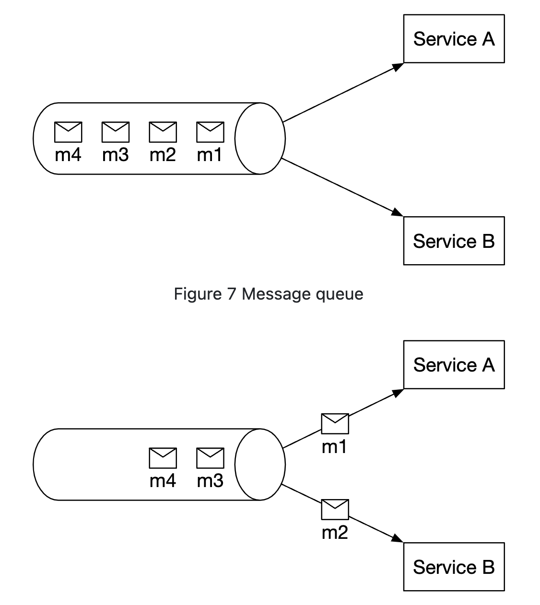
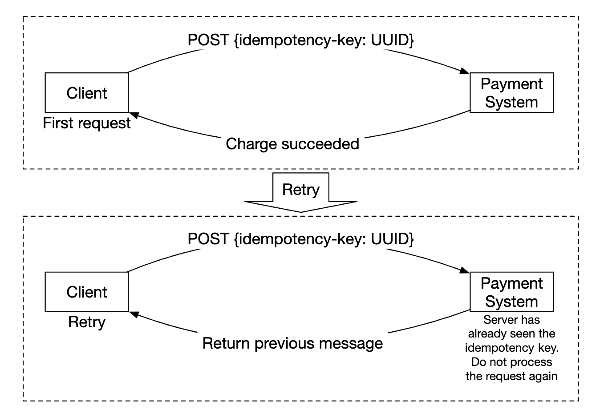

# 第26章：支付系统

## 引言
本章我们将设计一个**支付系统**，它是现代**电子商务**的基础。

**支付系统**用于结算金融交易，转移货币价值。

---

## 第1步：理解问题并确定设计范围
 * C：我们要构建什么样的支付系统？
 * I：一个类似 Amazon.com 的电子商务系统的支付后端。它处理所有与资金流动相关的事务。
 * C：支持哪些支付方式——信用卡、PayPal、银行卡等？
 * I：系统在实际中应支持所有这些选项。为了面试的需要，我们可以使用信用卡支付。
 * C：我们自己处理信用卡处理吗？
 * I：不，我们使用 Stripe、Braintree、Square 等第三方服务商。
 * C：我们在系统中存储信用卡数据吗？
 * I：由于合规原因，我们不在系统中直接存储信用卡数据。我们依赖第三方支付处理商。
 * C：应用是全球性的吗？是否需要支持不同货币和国际支付？
 * I：应用是全球性的，但为了面试需要，我们假设只使用一种货币。
 * C：每天支持多少笔支付交易？
 * I：每天 100 万笔交易。
 * C：我们需要支持付款流程吗，比如每月向付款人付款？
 * I：是的，我们需要支持这一点。
 * C：还有什么需要注意的吗？
 * I：我们需要支持对账，以修复与内部和外部系统通信中的任何不一致。

### **功能需求**
 * 收款流程——支付系统代表商户从客户处接收资金
 * 付款流程——支付系统向全球卖家发送资金

### **非功能需求**
 * 可靠性和容错性。失败的支付需要谨慎处理
 * 需要建立内部和外部系统之间的对账机制。

### **粗略估算**
系统需要每天处理 100 万笔交易，即每秒 10 笔交易。

这对任何数据库系统来说都不是高吞吐量，因此不是本次面试的重点。

---

## 第2步：提出高层设计并获得认可
从高层来看，有三个参与资金流动的实体：

<div style="margin-left:3rem">
    
</div>

### **收款流程**
以下是收款流程的高层概述：

<div style="margin-left:3rem">
    
</div>

 * 支付服务——接收支付事件并协调支付流程。它通常还使用第三方服务商进行反洗钱（AML）违规或犯罪活动的风险检查。
 * 支付执行器——通过支付服务提供商（PSP）执行单个支付订单。一个支付事件可能包含多个支付订单。
 * 支付服务提供商（PSP）——将资金从一个账户转移到另一个账户，例如从买家的信用卡账户转移到电商网站的银行账户。
 * 卡组织——处理信用卡业务的组织，例如 Visa、MasterCard 等。
 * 账本——记录所有支付交易的财务记录。
 * 钱包——维护所有商户的账户余额。

以下是一个收款流程示例：
 * 用户点击"下单"，支付事件被发送到支付服务
 * 支付服务将事件存储在数据库中
 * 支付服务为该支付事件中的所有支付订单调用支付执行器
 * 支付执行器将支付订单存储在数据库中
 * 支付执行器调用外部 PSP 处理信用卡支付
 * 支付执行器处理支付后，支付服务更新钱包以记录卖家拥有的金额
 * 钱包服务将更新的余额信息存储在数据库中
 * 支付服务调用账本记录所有资金流动

### **支付服务的 API**
```
POST /v1/payments
{
  "buyer_info": {...},
  "checkout_id": "some_id",
  "credit_card_info": {...},
  "payment_orders": [{...}, {...}, {...}]
}
```

示例 `payment_order`：
```
{
  "seller_account": "SELLER_IBAN",
  "amount": "3.15",
  "currency": "USD",
  "payment_order_id": "globally_unique_payment_id"
}
```

注意事项：
 * `payment_order_id` 会转发给 PSP 用于去重支付，即它是幂等键。
 * 金额字段为 `string` 类型，因为 `double` 不适合表示货币值。

```
GET /v1/payments/{:id}
```

此端点返回单个支付的执行状态，基于 `payment_order_id`。

### **支付服务的数据模型**
我们需要维护两张表——`payment_events` 和 `payment_orders`。

对于支付来说，性能通常不是重要因素。然而，强一致性是关键。

选择数据库的其他考虑因素：
 * 有大量 DBA 可供雇佣来管理数据库
 * 该数据库在其他大型金融机构中有成功的使用记录
 * 支持工具的丰富性
 * 出于 ACID 保证，优先选择传统 SQL 而非 NoSQL/NewSQL

以下是 `payment_events` 表的内容：
* `checkout_id` - 字符串，主键
* `buyer_info` - 字符串（个人备注——可能更适合作为指向另一张表的外键）
* `seller_info` - 字符串（个人备注——同上）
* `credit_card_info` - 取决于发卡机构
* `is_payment_done` - 布尔值

以下是 `payment_orders` 表的内容：
* `payment_order_id` - 字符串，主键
* `buyer_account` - 字符串
* `amount` - 字符串
* `currency` - 字符串
* `checkout_id` - 字符串，外键
* `payment_order_status` - 枚举（`NOT_STARTED`、`EXECUTING`、`SUCCESS`、`FAILED`）
* `ledger_updated` - 布尔值
* `wallet_updated` - 布尔值

注意事项：
* 存在许多支付订单，与某个支付事件相关联
* 在支付入账流程中不需要 `seller_info`，仅在支付出账时需要
* 当调用相应服务记录支付结果时，会更新 `ledger_updated` 和 `wallet_updated`
* 支付状态转换由后台任务管理，该任务检查进行中的支付更新，并在支付未在合理时间内处理时触发告警

### **复式记账系统**
复式记账机制是任何支付系统的核心。它是一种通过始终对两个账户执行资金操作来追踪资金流动的机制，其中一个账户余额增加（贷方），另一个减少（借方）：

| 账户 | 借方 | 贷方 |
|---------|-------|--------|
| 买方   | $1    |        |
| 卖方  |       | $1     |

所有交易分录的总和始终为零。该机制提供了系统内所有资金流动的端到端可追溯性。

### **托管支付页面**
为了避免存储信用卡信息并遵守各种严格的监管要求，大多数公司更倾向于使用由 PSP 提供的微件，该微件可为您存储和处理信用卡支付：

<div style="margin-left:3rem">
    
</div>

### **支付出账流程**
支付出账流程的组件与支付入账流程非常相似。

主要区别：
* 资金从电商网站的银行账户转移到商户的银行账户
* 我们可以利用第三方应付账款提供商，例如 Tipalti
* 支付出账方面也有大量账务处理和监管要求需要应对

---

## 第3步：设计深入解析
本节重点介绍如何使系统更快、更健壮、更安全。

### **PSP 集成**
如果我们的系统能够直接连接银行或卡组织，就可以不通过 PSP 进行支付。
这类连接非常罕见且不常见，通常只有大型公司才会进行此类投资。

如果走传统路线，PSP 可以通过以下两种方式之一集成：
* 通过 API，如果我们的支付系统可以收集支付信息
* 通过托管支付页面，以避免处理支付信息相关的监管要求

以下是托管支付页面的工作流程：

<div style="margin-left:3rem">
    
</div>

* 用户在浏览器中点击"结账"按钮
* 客户端使用支付订单信息调用支付服务
* 收到支付订单信息后，支付服务向 PSP 发送支付注册请求
* PSP 接收支付信息，如货币、金额、有效期等，以及一个用于幂等性的 UUID。通常是支付订单的 UUID
* PSP 返回一个唯一标识支付注册的令牌。该令牌存储在支付服务数据库中
* 令牌存储后，用户会看到 PSP 托管的支付页面。该页面使用令牌以及成功/失败的重定向 URL 进行初始化
* 用户在 PSP 页面上填写支付详情，PSP 处理支付并返回支付状态
* 用户随后被重定向回重定向 URL。示例重定向 URL：`https://your-company.com/?tokenID=JIOUIQ123NSF&payResult=X324FSa`
* 异步地，PSP 通过 Webhook 调用我们的支付服务，通知后端支付结果
* 支付服务根据收到的 Webhook 记录支付结果

### **对账**
上一节解释了支付的正常路径。异常路径通过后台对账流程进行检测和对账。

每天晚上，PSP 会发送一份结算文件，我们的系统使用该文件将外部系统的状态与内部系统的状态进行比较。

<div style="margin-left:3rem">
    
</div>

此流程还可用于检测例如账本服务与钱包服务之间的内部不一致。

不匹配项由财务团队手动处理。不匹配项的处理方式如下：
* 可分类的，因此是已知的不匹配，可以使用标准程序进行调整
* 可分类的，但无法自动化。由财务团队手动调整
* 不可分类的。由财务团队手动调查和调整

### **处理支付延迟**
在某些情况下，支付可能需要数小时才能完成，尽管通常只需几秒钟。

这可能由以下原因导致：
 * 支付被标记为高风险，需要人工审核
 * 信用卡需要额外保护，例如 3D Secure 认证，这需要持卡人提供额外信息才能完成

这些情况通过以下方式处理：
 * 等待 PSP 在支付完成后向我们发送 webhook，或者在 PSP 不提供 webhook 的情况下轮询其 API
 * 向用户显示“待处理”状态，并提供一个页面供其查询支付更新。支付完成后，我们也可以向他们发送邮件通知

### **内部服务间通信**
服务之间有两种通信模式：同步和异步。

同步通信（即 HTTP）适用于小规模系统，但随着规模增长会出现问题：
 * 性能低——随着更多服务参与调用链，请求-响应周期变长
 * 故障隔离差——如果 PSP 或任何其他服务失败，用户将无法收到响应
 * 耦合度高——发送方需要了解接收方
 * 难以扩展——由于没有缓冲区，无法轻松应对流量突增

异步通信可分为两类。

单接收者——多个接收者订阅同一主题，消息只处理一次：

<div style="margin-left:3rem">
    
</div>

多接收者——多个接收者订阅同一主题，但消息会转发给所有接收者：

<div style="margin-left:3rem">
    
</div>

后者模型对我们的支付系统非常适用，因为一笔支付可能触发多个副作用，由不同服务分别处理。

简而言之，同步通信更简单，但不允许服务自治。
异步通信以牺牲简单性和一致性为代价，换取可扩展性和弹性。

### **处理支付失败**
每个支付系统都需要处理支付失败。以下是我们将采用的一些机制：
 * 跟踪支付状态——每当支付失败时，我们可以根据支付状态决定是重试还是退款。
 * 重试队列——需要重试的支付会被发布到重试队列
 * 死信队列——彻底失败的支付会被推入死信队列，以便调试和检查失败原因。

<div style="margin-left:3rem">
    
</div>

### **精确一次交付**
我们需要确保一笔支付只被处理一次，以避免对客户重复扣款。

当某个操作同时满足“至少执行一次”和“至多执行一次”时，该操作就是精确一次执行的。

为实现“至少一次”的保证，我们将使用重试机制：

<div style="margin-left:3rem">
    
</div>

以下是决定重试间隔的常见策略：
 * 立即重试——客户端在失败后立即发送另一个请求
 * 固定间隔——等待固定时间后再重试支付
 * 递增间隔——每次重试之间逐步增加重试间隔
 * 指数退避——后续重试之间的间隔翻倍
 * 取消——客户端取消请求。当错误是致命的或达到重试阈值时会发生这种情况

经验法则：默认采用指数退避重试策略。一个好的实践是服务器使用 `Retry-After` 头部指定重试间隔。

重试的一个问题是服务器可能会重复处理一笔支付：
 * 用户多次点击“支付”按钮，导致被扣款两次
 * 支付被 PSP 成功处理，但下游服务（账本、钱包）未处理。重试会导致 PSP 再次处理该支付

为解决重复支付问题，我们需要使用幂等性机制——即多次应用的操作只被处理一次的特性。

从 API 角度看，客户端可以多次调用并产生相同的结果。
幂等性通过请求中的一个特殊头部（例如 `idempotency-key`）来管理，该头部通常是一个 UUID。

<div style="margin-left:3rem">
    
</div>

幂等性可以通过数据库的唯一键约束机制来实现：
 * 服务器尝试在数据库中插入新行
 * 由于唯一键约束冲突，插入失败
 * 服务器检测到该错误，并将现有对象返回给客户端

幂等性也应用于 PSP 端，使用之前讨论过的 nonce。PSP 会确保不会使用相同的 nonce 重复处理支付。

### **一致性**
在支付的生命周期中会调用多个有状态服务——PSP、账本、钱包、支付服务。

任意两个服务之间的通信都可能失败。
我们可以通过实现**恰好一次处理**和对账来确保所有服务之间的最终数据一致性。

如果使用复制，就必须处理复制延迟，这可能导致用户观察到主数据库与副本数据库之间的数据不一致。

为缓解该问题，我们可以将所有读和写操作都指向主数据库，仅将副本用于冗余和故障转移。
或者，我们可以通过使用 Paxos 或 Raft 等共识算法来确保副本始终同步。
我们也可以使用基于共识的分布式数据库，例如 YugabyteDB 或 CockroachDB。

### **支付安全**
以下是我们可以用来确保支付安全的一些机制：
* 请求/响应窃听 —— 我们可以使用 HTTPS 来保护所有通信
* 数据篡改 —— 强制实施加密和完整性监控
* 中间人攻击 —— 使用 SSL 和证书绑定
* 数据丢失 —— 跨多个区域复制数据并进行数据快照
* DDoS 攻击 —— 实施速率限制和防火墙
* 卡片盗用 —— 使用令牌代替在系统中存储真实卡信息
* PCI 合规 —— 针对处理品牌信用卡的组织的安全标准
* 欺诈 —— 地址验证、卡片验证码（CVV）、用户行为分析等

---

## 第4步：总结
其他讨论要点：
* 监控与告警
* 调试工具 —— 我们需要能够轻松理解支付失败原因的工具
* 货币兑换 —— 在设计面向国际使用的支付系统时非常重要
* 地域 —— 不同地区可能有不同的支付方式
* 现金支付 —— 在印度和巴西等地非常普遍
* Google/Apple Pay 集成
