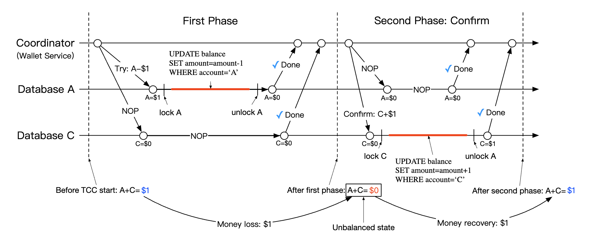

# 第27章：数字钱包

## 引言
**支付平台**通常提供**钱包服务**，允许客户在应用内存储资金，之后可以提现。

你也可以用它来购买商品或服务，或向其他使用**数字钱包**服务的用户转账。这种方式通常比通过常规支付渠道更快、更便宜。

<div style="margin-left:3rem">
    
</div>

---

## 第1步：理解问题并确定设计范围
 * C：我们是否只关注数字钱包之间的转账？是否还需要支持其他操作？
 * I：目前我们先聚焦于数字钱包之间的转账。
 * C：系统需要支持每秒多少笔交易？
 * I：假设为 100万 TPS。
 * C：数字钱包对正确性有严格要求。我们能否假设事务保障已经足够？
 * I：听起来不错。
 * C：我们需要证明正确性吗？
 * I：我们可以通过对账来验证，但对账只能发现差异，无法显示根本原因。相反，我们希望能够从最初开始重放数据，以重建完整的历史记录。
 * C：我们可以假设可用性要求为 99.99% 吗？
 * I：可以。
 * C：我们需要考虑外汇因素吗？
 * I：不需要，这不在范围内。

总结来说，我们需要支持以下内容：
 * 支持两个账户之间的余额转账
 * 支持 100万 TPS
 * 可靠性为 99.99%
 * 支持事务
 * 支持可重放性

### **粗略估算**
传统的关系型数据库在云环境中大约可以支持 ~1000 TPS。

为了达到 100万 TPS，我们需要 1000 个数据库节点。但如果每笔转账涉及两个操作，那么实际上我们需要支持 200万 TPS。

我们的设计目标之一是提高单个节点能够处理的 TPS，从而减少所需的数据库节点数量。

| 每节点 TPS | 节点数量 |
|--------------|-------------|
| 100          | 20,000      |
| 1,000        | 2,000       |
| 10,000       | 200         |

---

## 第2步：提出高层设计并获得认可

### **API 设计**
本次面试我们只需要支持一个端点：
```
POST /v1/wallet/balance_transfer - 在两个钱包之间转移余额
```

请求参数 - from_account、to_account、amount（使用字符串以避免精度丢失）、currency、transaction_id（幂等键）。

示例响应：
```
{
    "status": "success"
    "transaction_id": "01589980-2664-11ec-9621-0242ac130002"
}
```

### **内存分片方案**
我们的钱包应用为每个用户账户维护余额。

表示这一数据结构的良好选择是 `map<user_id, balance>`，可以使用基于内存的 Redis 存储来实现。

由于单个 Redis 节点无法承受 100万 TPS，我们需要将 Redis 集群划分为多个节点。

示例分区算法：
```
String accountID = "A";
Int partitionNumber = 7;
Int myPartition = accountID.hashCode() % partitionNumber;
```

Zookeeper 可以用来存储分区数量以及 Redis 节点的地址，因为它是一种高可用的配置存储。

最后，钱包服务是一个无状态服务，负责执行转账操作。它可以轻松地进行水平扩展：

<div style="margin-left:3rem">
    
</div>

尽管该方案解决了可扩展性问题，但它无法让我们以原子方式执行余额转账。

### **分布式事务**
处理事务的一种方法是在标准的分片关系型数据库之上使用两阶段提交协议：

<div style="margin-left:3rem">
    
</div>

以下是两阶段提交（2PC）协议的工作原理：

<div style="margin-left:3rem">
    
</div>

 * 协调者（钱包服务）对多个数据库执行正常的读写操作
 * 当应用准备好提交事务时，协调者要求所有数据库进行准备
 * 如果所有数据库都回复“是”，则协调者要求数据库提交事务
 * 否则，所有数据库都被要求中止事务

2PC 方案的缺点：
 * 由于锁竞争，性能不佳
 * 协调者是单点故障

### **使用 Try-Confirm/Cancel（TC/C）的分布式事务**
TC/C 是 2PC 协议的一种变体，它通过补偿事务来工作：
 * 协调者要求所有数据库为事务预留资源
 * 协调者收集数据库的回复——如果为“是”，则要求数据库尝试确认；如果为“否”，则要求数据库尝试取消。

TC/C 与 2PC 之间的一个重要区别是，2PC 执行的是单个事务，而在 TC/C 中，存在两个独立的事务。

以下是 TC/C 的分阶段工作方式：

| 阶段 | 操作 | A | C |
|-------|-----------|---------------------|---------------------|
| 1     | 尝试      | 余额变动：-1$ | 不执行任何操作          |
| 2     | 确认      | 不执行任何操作          | 余额变动：+1$ |
|       | 取消      | 余额变动：+1$ | 不执行任何操作 |

**第1阶段 - 尝试：**

<div style="margin-left:3rem">
    
</div>

 * 协调器在 A 的数据库中启动本地事务，将 A 的余额减少 1$
 * C 的数据库收到一条 NOP（空操作）指令，不执行任何操作

**第2a阶段 - 确认：**

<div style="margin-left:3rem">
    
</div>

 * 如果两个数据库都回复"是"，则开始确认阶段。
 * A 的数据库收到 NOP 指令，而 C 的数据库被指示将 C 的余额增加 1$（本地事务）

**第2b阶段 - 取消：**

<div style="margin-left:3rem">
    
</div>

 * 如果第1阶段的任何操作失败，则启动取消阶段。
 * A 的数据库被指示将 A 的余额增加 1$，C 的数据库收到 NOP 指令

以下是 2PC 与 TC/C 的对比：

|      | 第一阶段 | 第二阶段：成功 | 第二阶段：失败 |
|------|--------------------------------------------------------|------------------------------------|-------------------------------------------|
| 2PC  | 事务尚未完成 | 提交/取消所有事务 | 取消所有事务 |
| TC/C | 所有事务已完成 - 已提交或已取消 | 如有需要，执行新事务 | 回滚已提交的事务 |

TC/C 也称为**补偿式分布式事务**。高层操作由业务逻辑来处理。

TC/C 的其他特性：
 * 与数据库无关，只要数据库支持事务即可
 * 分布式事务的细节和复杂度需要在业务逻辑中处理

### **TC/C 故障模式**
如果协调器在运行过程中宕机，它需要恢复其中间状态。
这可以通过维护阶段状态表来实现，该表在数据库分片中原子更新：

<div style="margin-left:3rem">
    
</div>

该表包含以下内容：
 * 分布式事务的 ID 和内容
 * 尝试阶段的状态 - 未发送、已发送、已收到响应
 * 第二阶段名称 - 确认或取消
 * 第二阶段的状态
 * 乱序标志（稍后解释）

使用 TC/C 的一个注意事项是：在分布式事务执行期间，账户状态会有一段短暂的不一致时间：

<div style="margin-left:3rem">
    
</div>

只要我们始终能从这种状态恢复，并且用户无法利用中间状态（例如进行消费），这就没有问题。
这通过始终先执行扣款再执行入账来保证。

| 尝试阶段选择 | 账户 A | 账户 C |
|--------------------|-----------|-----------|
| 选择1 | -1$ | NOP |
| 选择2（无效） | NOP | +1$ |
| 选择3（无效） | -1$ | +1$ |

注意，上表中的选择3是无效的，因为我们无法在不依赖 2PC 的情况下保证跨不同数据库的事务原子执行。

需要处理的一个边界情况是乱序执行：

<div style="margin-left:3rem">
    
</div>

数据库可能在收到尝试操作之前就收到了取消操作。这个边界情况可以通过在阶段状态表中添加乱序标志来处理。
当我们收到尝试操作时，会先检查乱序标志是否已设置，如果已设置，则返回失败。

### **使用 Saga 的分布式事务**
另一种流行的方法是使用 Saga —— 一种在微服务架构中实现分布式事务的标准。

其工作方式如下：
 * 所有操作按顺序排列。所有操作在各自的数据库中相互独立。
 * 操作按从先到后的顺序执行
 * 当某个操作失败时，整个过程开始回滚，直到通过补偿操作回到起始状态

<div style="margin-left:3rem">
    
</div>

我们如何协调工作流？有两种方式：
 * **编排（Choreography）** —— Saga 中涉及的所有服务订阅相关事件，并在 Saga 中各自完成自己的部分
 * **编排（Orchestration）** —— 单个协调器指示所有服务按正确顺序执行各自的任务

使用编排方式的挑战在于业务逻辑被分散到多个服务中，它们通过异步方式进行通信。
编排方式能很好地处理复杂度，因此在数字钱包系统中通常是首选方案。

以下是 TC/C 与 Saga 的对比：

|                                           | TC/C            | Saga                     |
|-------------------------------------------|-----------------|--------------------------|
| 补偿动作                                   | 在 Cancel 阶段   | 在 rollback 阶段          |
| 中心协调                                   | 是              | 是（编排模式）            |
| 操作执行顺序                               | 任意             | 线性                     |
| 并行执行可能性                             | 是              | 否（线性执行）            |
| 可能出现部分不一致状态                     | 是              | 是                       |
| 应用或数据库逻辑                           | 应用             | 应用                     |

主要区别在于 TC/C 支持并行化，因此我们的决策基于延迟要求——如果需要实现低延迟，应选择 TC/C 方案。

无论采用哪种方案，我们仍然需要支持审计和历史重放，以从失败状态中恢复。

### **事件溯源**
在现实生活中，数字钱包应用可能需要接受审计，我们不得不回答某些问题：
 * 我们是否知道任意时间点的账户余额？
 * 我们如何确认历史余额和当前余额是正确的？
 * 代码变更后，我们如何证明系统逻辑是正确的？

事件溯源是一种帮助我们回答这些问题的技术。

它包含四个概念：
 * 命令——来自现实世界的意图动作，例如从账户 A 转账 1 美元到 B。由于需要全局顺序，它们被放入 FIFO 队列中。
   * 命令与事件不同，可能会失败，并因 IO 或无效状态等原因带有一定随机性。
   * 命令可以产生零个或多个事件。
   * 事件生成可能包含随机性，例如外部 IO。这将在后续讨论。
 * 事件——关于系统中发生的事件的历史事实，例如"从 A 转账 1 美元到 B"。
   * 与命令不同，事件是系统中已发生的事实。
   * 与命令类似，它们需要排序，因此被放入 FIFO 队列中。
 * 状态——事件导致的变化。例如账户与其余额之间的键值存储。
 * 状态机——驱动事件溯源过程。它主要负责验证命令并应用事件来更新系统状态。
   * 状态机应当是确定性的，因此不应读取外部 IO 或依赖随机性。

<div style="margin-left:3rem">
    
</div>

以下是事件溯源的动态视图：

<div style="margin-left:3rem">
    
</div>

对于我们的钱包服务，命令是余额转账请求。我们可以将它们放入 FIFO 队列，例如 Kafka：

<div style="margin-left:3rem">
    
</div>

以下是完整架构图：

<div style="margin-left:3rem">
    
</div>

 * 状态机从命令队列中读取命令
 * 余额状态从数据库中读取
 * 命令被验证。如果有效，为每个账户生成两个事件
 * 读取下一个事件并通过更新数据库中的余额（状态）来应用它

使用事件溯源的主要优势是其可重现性。在该设计中，所有状态更新操作都保存为所有余额变更的不可变历史记录。

历史余额始终可以通过从头重放事件来重建。
由于事件列表是不可变的，且状态机是确定性的，我们保证能够成功重放任何中间状态。

<div style="margin-left:3rem">
    
</div>

本节开头提出的所有审计相关问题都可以通过依赖事件溯源来解决：
 * 我们是否知道任意时间点的账户余额？——可以从起点重放事件直到感兴趣的时点。
 * 我们如何确认历史余额和当前余额是正确的？——可以通过从头重新计算所有事件来验证正确性。
 * 代码变更后，我们如何证明系统逻辑是正确的？——我们可以针对事件运行不同版本的代码，并验证其结果是否一致。

使用 CQRS 架构可以解决客户端关于余额的查询问题——可以存在多个只读状态机，负责基于不可变事件列表查询历史状态：

<div style="margin-left:3rem">
    
</div>

---

## 第3步：设计深入探讨
在本节中，我们将探讨一些性能优化，因为仍然需要扩展至 100 万 TPS。

### **高性能事件溯源**
我们将探讨的第一个优化是将命令和事件保存到本地磁盘存储，而不是像 Kafka 这样的外部存储。

这样可以避免网络延迟，而且由于我们只进行追加操作，该操作对硬盘来说通常很快。

下一个优化是将最近的命令和事件缓存到内存中，以节省从磁盘重新加载它们的时间。

在底层，我们可以通过利用称为 mmap 的命令来实现上述优化，该命令将数据存储在本地磁盘并同时缓存到内存中：

<div style="margin-left:3rem">
    
</div>

我们可以做的下一个优化是使用 SQLite（一种基于文件的本地关系型数据库）将状态存储在本地文件系统中。RocksDB 也是另一个不错的选择。

在我们的场景中，我们将选择 RocksDB，因为它使用日志结构合并树（LSM），该结构针对写操作进行了优化。读性能通过缓存进行优化。

<div style="margin-left:3rem">
    
</div>

为了提高可重现性，我们可以定期将快照保存到磁盘，这样我们就不必每次都从最开始重新生成某个状态。我们可以将快照作为大型二进制文件存储在分布式文件存储中，例如 HDFS：

<div style="margin-left:3rem">
    
</div>

### **可靠的高性能事件溯源**
迄今为止完成的所有优化都很棒，但它们使我们的服务变成了有状态的。我们需要引入某种形式的复制以确保可靠性。

在这样做之前，我们应该分析我们的系统中哪些数据需要高可靠性：
 * 状态和快照始终可以通过从事件列表重新生成来恢复。因此，我们只需要保证事件列表的可靠性。
 * 人们可能会认为我们始终可以从命令列表重新生成事件列表，但事实并非如此，因为命令是非确定性的。
 * 结论是我们只需要确保事件列表的高可靠性。

为了实现事件的高可靠性，我们需要在多个节点之间复制该列表。我们需要保证：
 * 不会发生数据丢失
 * 日志文件内数据的相对顺序在各个副本之间保持一致

为了实现这一点，我们可以采用共识算法，例如 Raft。

使用 Raft 时，有一个活跃的领导者和被动的跟随者。如果领导者死亡，其中一个跟随者将接管。只要超过一半的节点处于正常运行状态，系统就会继续运行。

<div style="margin-left:3rem">
    
</div>

采用这种方法，所有节点都会根据事件列表更新状态。Raft 确保领导者和跟随者具有相同的事件列表。

### **分布式事件溯源**
到目前为止，我们成功设计了一个具有高单节点性能且可靠的系统。

我们必须解决的一些限制：
 * 单个 Raft 组的容量是有限的。在某个时候，我们需要对数据进行分片并实现分布式事务。
 * 在 CQRS 架构中，请求/响应流程很慢。客户端需要定期轮询系统以了解其钱包何时更新。

轮询不是实时的，因此用户可能需要一段时间才能了解其余额的更新。此外，如果轮询频率过高，可能会使查询服务过载：

<div style="margin-left:3rem">
    
</div>

为了减轻系统负载，我们可以引入一个反向代理，它代表用户发送命令并代表他们轮询响应：

<div style="margin-left:3rem">
    
</div>

这减轻了系统负载，因为我们可以通过单个请求获取多个用户的数据，但它仍然没有解决实时接收的需求。

我们可以做的最后一个改变是让只读状态机在可用后将响应推回给反向代理。这可以给用户一种更新是实时发生的印象：

<div style="margin-left:3rem">
    
</div>

最后，为了进一步扩展系统，我们可以将系统分片为多个 Raft 组，并在它们之上使用协调器通过 TC/C 或 Saga 实现分布式事务：

<div style="margin-left:3rem">
    
</div>

以下是最终系统中余额转账请求的示例生命周期：
 * 用户 A 向 Saga 协调器发送一个包含两个操作的分布式事务——`A-1` 和 `C+1`。
 * Saga 协调器在阶段状态表中创建一条记录以追踪事务的状态。
 * 协调器确定需要向哪些分区发送命令。
 * 分区 1 的 Raft 领导者接收 `A-1` 命令，验证它，将其转换为事件，并在 Raft 组中的其他节点之间复制它。
 * 事件结果同步到读状态机，状态机将响应推回给协调器。
 * 协调器创建一条记录，指示操作成功，并继续执行下一个操作——`C+1`。
 * 下一个操作的执行方式与第一个类似——确定分区、发送命令、执行、读状态机将响应推回。
 * 协调器创建一条记录，指示操作 2 也成功，并最终将结果通知客户端。

## 第4步：总结
以下是我们的设计演进过程：
 * 我们从一个使用内存 Redis 的解决方案开始。这种方法的问题在于它不是持久化存储。
 * 我们转而使用关系型数据库，并在其上通过 2PC、TC/C 或分布式 Saga 执行分布式事务。
 * 接下来，我们引入了事件溯源，以便使所有操作可审计。
 * 我们最初将数据存储在外部数据库和队列中，但这种方式性能不佳。
 * 我们接着将数据存储在本地文件存储中，利用追加-only 操作的性能优势。我们还使用了缓存来优化读路径。
 * 尽管上述方法性能很好，但它并不持久。因此，我们引入了 Raft 共识与复制机制，以避免单点故障。
 * 我们还采用了 CQRS 配合反向代理，以代表用户管理事务的生命周期。
 * 最后，我们将数据分区到多个 Raft 组中，这些组通过分布式事务机制——TC/C 或分布式 Saga——进行编排。
