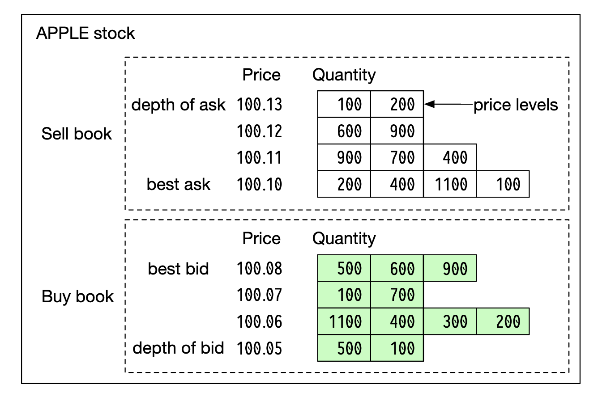
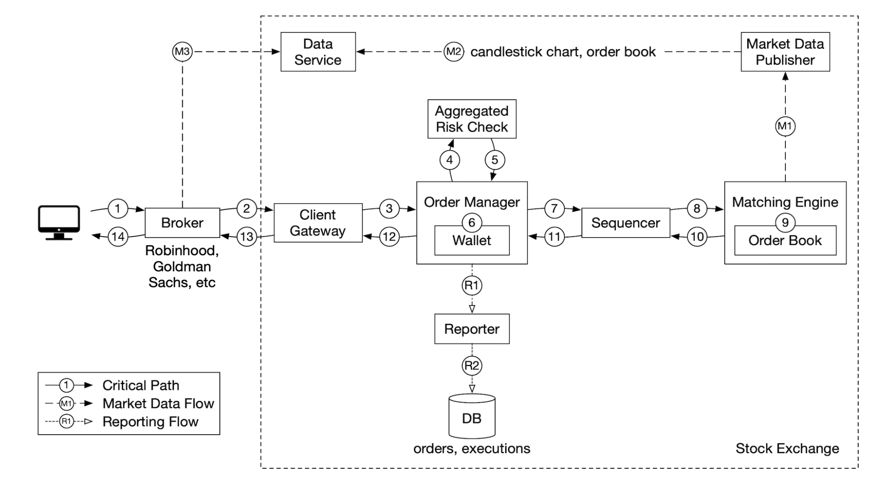
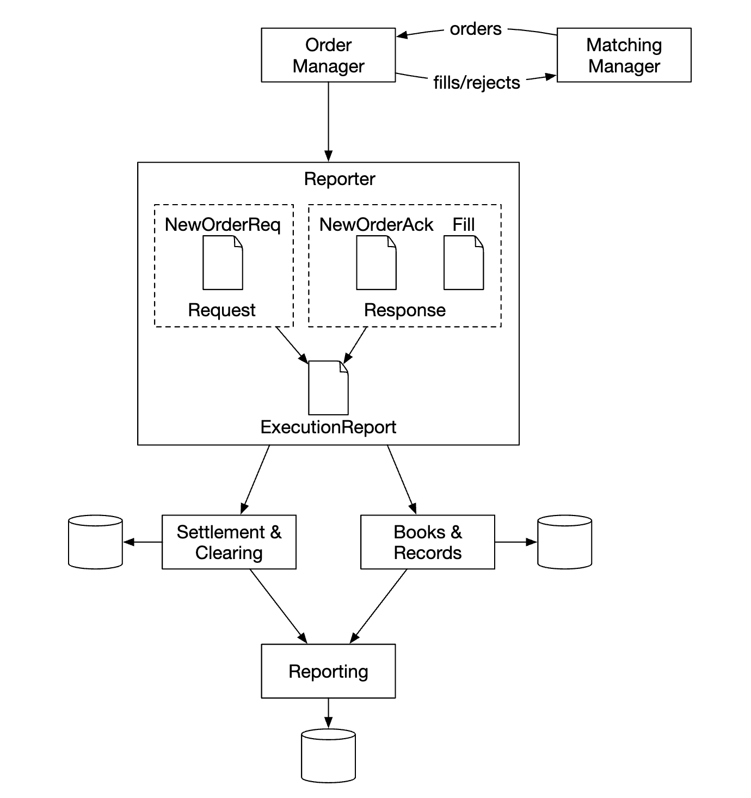
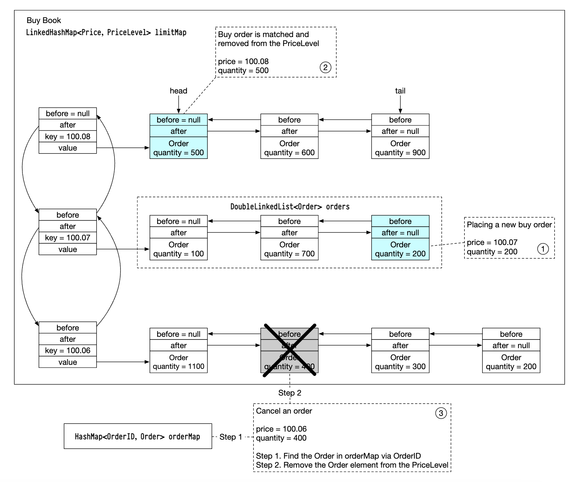
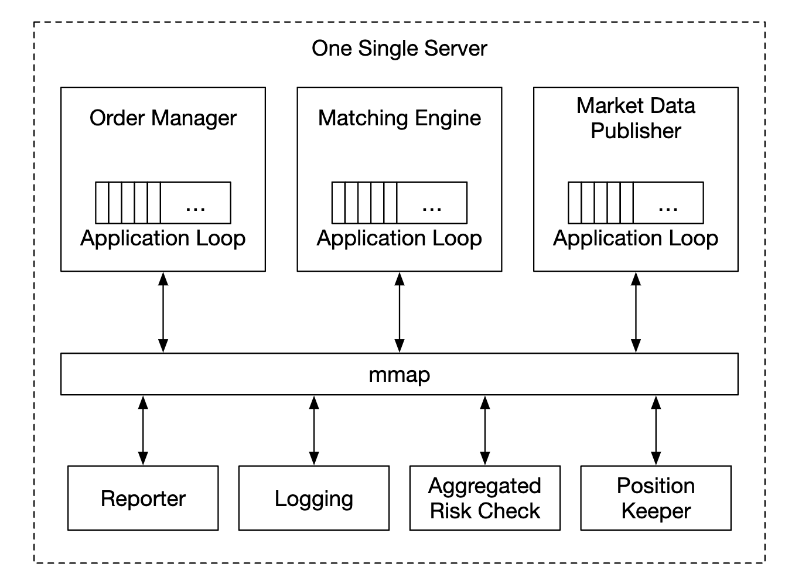
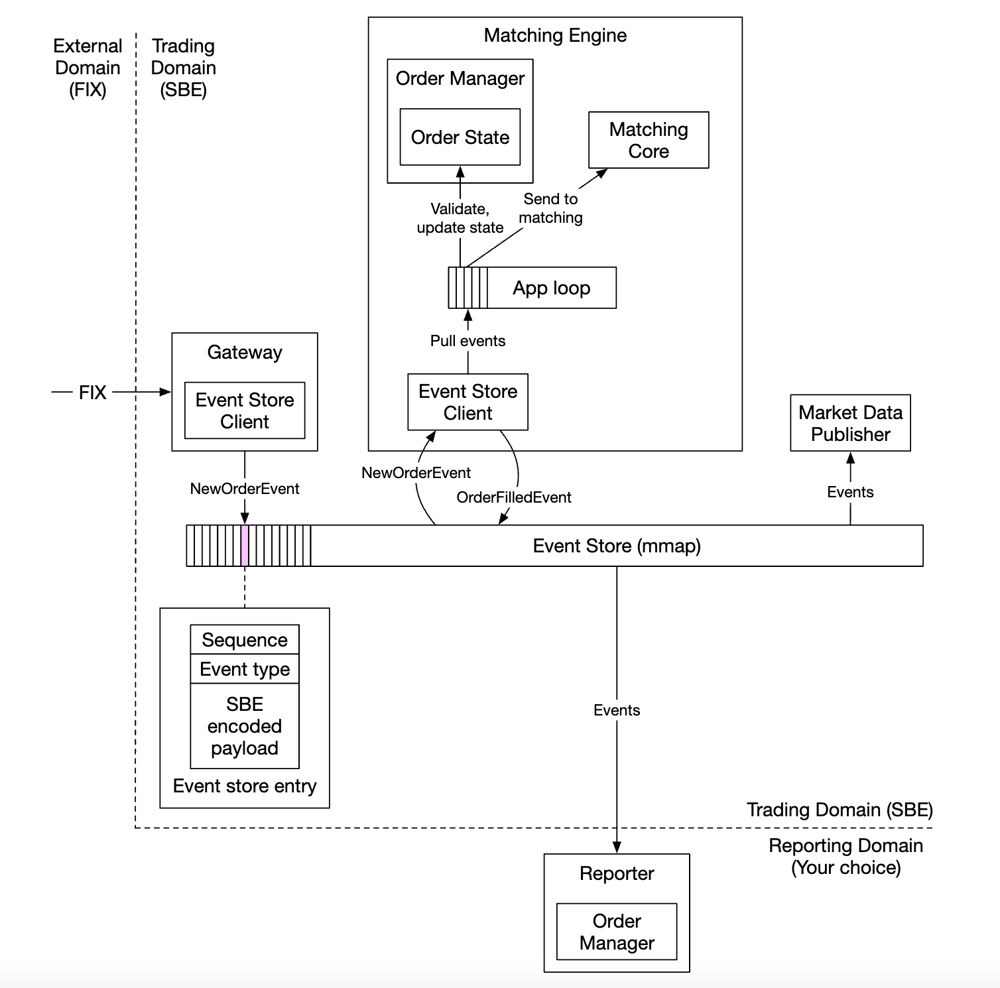
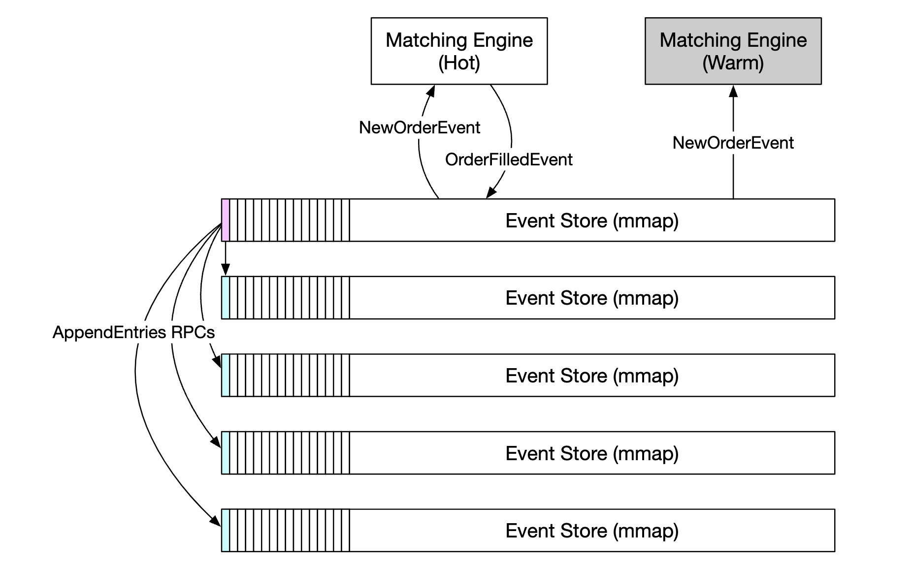

# 第28章：证券交易所

## 引言
本章我们将设计一个**电子证券交易所**。

其基本功能是高效地撮合买卖双方。

主要的证券交易所有**NYSE**、**NASDAQ**等。

<div style="margin-left:3rem">
    
</div>

---

## 第1步：理解问题并确定设计范围
 * C：我们要交易哪些证券？股票、期权还是期货？
 * I：为了简单起见，只交易股票
 * C：支持哪些订单类型——下单、取消、替换？限价单、市价单、条件单呢？
 * I：我们需要支持下单和取消订单。订单类型只考虑限价单。
 * C：系统需要支持盘后交易吗？
 * I：不需要，只支持正常交易时段
 * C：能描述一下交易所的基本功能吗？
 * I：客户可以下单或取消限价单，并实时收到撮合成交结果。他们应该能够实时查看订单簿。
 * C：交易所的规模有多大？
 * I：数万名用户同时交易，约100个交易对。每天数十亿笔订单。我们还需要支持合规相关的风控检查。
 * C：什么样的风控检查？
 * I：做简单的风控——比如限制一个用户一天只能交易100万股苹果股票
 * C：用户钱包方面呢？
 * I：我们需要确保客户在下单前有足额资金。用于待处理订单的资金需要被冻结，直到订单完成。

### **非功能性需求**
面试官提到的规模表明我们要设计一个中小规模的交易所。
我们还需要确保灵活性，以便未来支持更多的交易对和用户。

其他非功能性需求：
 * 可用性——至少99.99%。停机可能损害声誉
 * 容错性——需要容错和快速恢复机制，以限制生产事故的影响
 * 延迟——往返延迟应在毫秒级别，重点关注第99百分位。持续的高第99百分位延迟会给少数用户带来糟糕的体验
 * 安全性——我们应具备账户管理系统。为了法律合规，需要支持KYC来验证用户身份。还应保护公共资源免受DDoS攻击

### **粗略估算**
 * 100个交易对，每天10亿笔订单
 * 正常交易时段为09:30至16:00（6.5小时）
 * QPS = 10亿 / 6.5 / 3600 = 43000
 * 峰值QPS = 5 × QPS = 215000
 * 市场开盘时交易量显著更高

---

## 第2步：提出高层设计并获得认可

### **商业基础知识**
我们来讨论一些与交易所相关的基本概念。

经纪商在交易所和终端用户之间充当中介——Robinhood、Fidelity等。

机构客户使用专业交易软件进行大额交易。他们需要特殊处理。
例如，大额交易时需要拆分订单以避免对市场造成冲击。

订单类型：
 * 限价单——以固定价格买入或卖出。可能不会立即找到匹配，也可能部分匹配。
 * 市价单——不指定价格。立即以当前市场价格执行。

价格：
 * 买价——买方愿意买入股票的最高价格
 * 卖价——卖方愿意卖出股票的最低价格

美国市场有三个层级的价格报价——L1、L2、L3。

L1市场数据包含最优买卖价格和数量：

<div style="margin-left:3rem">
    
</div>

L2包含更多价格层级：

<div style="margin-left:3rem">
    
</div>

L3显示各层级及其排队数量：

<div style="margin-left:3rem">
    
</div>

K线图显示市场的开盘价和收盘价，以及给定区间内的最高价和最低价：

<div style="margin-left:3rem">
    
</div>

FIX是一种交换证券交易信息的协议，被大多数供应商使用。示例证券交易：
```
8=FIX.4.2 | 9=176 | 35=8 | 49=PHLX | 56=PERS | 52=20071123-05:30:00.000 | 11=ATOMNOCCC9990900 | 20=3 | 150=E | 39=E | 55=MSFT | 167=CS | 54=1 | 38=15 | 40=2 | 44=15 | 58=PHLX EQUITY TESTING | 59=0 | 47=C | 32=0 | 31=0 | 151=15 | 14=0 | 6=0 | 10=128 |
```

### **高层设计**

<div style="margin-left:3rem">
    
</div>

交易流程：
 * 客户端通过交易界面下单
 * 经纪商将订单发送给交易所
 * 订单通过客户端网关进入交易所，网关进行验证、限流、认证等处理。订单被转发给订单管理器。
 * 订单管理器根据风控管理员设定的规则执行风控检查
 * 通过风控检查后，订单管理器验证钱包中是否有足额资金
 * 订单被发送到撮合引擎。找到匹配后，撮合引擎为买入和卖出各生成一笔成交（称为fills）。两笔订单会被排序以确保确定性。
 * 成交结果返回给客户端。

市场数据流（M1-M3）：
* 撮合引擎生成执行流，发送至市场数据发布器
* 市场数据发布器构建K线图并发送至数据服务
* 市场数据存储在专用存储中，用于实时分析。券商连接到数据服务以及时获取市场数据。

报表流（R1-R2）：
* 报表收集器从订单和执行中收集所有必要的报表字段，并写入数据库
* 报表字段：client_id、price、quantity、order_type、filled_quantity、remaining_quantity

交易流处于关键路径上，而其余流则不是，因此它们之间的延迟要求有所不同。

#### 交易流
交易流处于关键路径上，因此必须针对低延迟进行高度优化。

撮合引擎是其核心，也称为交叉引擎。主要职责：
* 为每个交易对维护订单簿——即某个交易对的买入/卖出订单列表。
* 撮合买入和卖出订单——一次撮合会产生两个执行（成交），分别对应买方和卖方。此功能必须快速且准确。
* 分发执行流作为市场数据
* 撮合必须以确定性顺序产生。这是高可用性的基础。

接下来是排序器——它是通过为每个入站订单和出站成交添加序列ID，使撮合引擎具有确定性的关键组件。

<div style="margin-left:3rem">
    
</div>

我们对入站订单和出站成交进行标记的原因如下：
* 及时性和公平性
* 快速恢复/重放
* 精确一次保证

从概念上讲，我们可以使用 Kafka 作为排序器，因为它本质上就是一个入站和出站消息队列。然而，为了实现更低的延迟，我们将自行实现它。

订单管理器管理订单的状态。它还与撮合引擎进行交互——发送订单并接收成交。

订单管理器的职责：
* 发送订单进行风控检查——例如验证用户的交易量低于100万
* 检查订单对应的用户钱包，并验证是否有足够资金执行该订单
* 将订单发送至排序器，再转发至撮合引擎。为减少带宽，仅将必要的订单信息传递给撮合引擎
* 从排序器接收执行（成交），然后通过客户端网关发送至券商

实现订单管理器的主要挑战是状态转换管理。事件溯源是一种可行的解决方案（在深度分析中讨论）。

最后，客户端网关接收用户订单并将其发送至订单管理器。其职责如下：

<div style="margin-left:3rem">
    
</div>

由于客户端网关处于关键路径上，因此应保持轻量级。

可以为不同客户端设置多个客户端网关。例如，colo 引擎是券商在交易所数据中心租用的交易引擎服务器：

<div style="margin-left:3rem">
    
</div>

#### 市场数据流
市场数据发布器从撮合引擎接收执行，并从执行流中构建订单簿/K线图。

该数据被发送至数据服务，负责向订阅者展示聚合数据：

<div style="margin-left:3rem">
    
</div>

#### 报表流
报表收集器不在关键路径上，但它仍然是一个重要组件。

<div style="margin-left:3rem">
    
</div>

它负责交易历史、税务报表、合规报表、结算等。
报表流的延迟不是关键要求。准确性和合规性更为重要。

### **API 设计**
客户端通过券商与证券交易所交互，以下单、查看执行、市场数据、下载历史数据进行分析等。

我们使用 RESTful API 实现客户端网关与券商之间的通信。

对于机构客户，使用专有协议以满足其低延迟要求。

创建订单：
```
POST /v1/order
```

参数：
* symbol——股票代码。字符串
* side——买入或卖出。字符串
* price——限价单的价格。长整型
* orderType——限价或市价（我们的设计仅支持限价单）。字符串
* quantity——订单数量。长整型

响应：
* id——订单ID。长整型
* creationTime——订单的系统创建时间。长整型
* filledQuantity——已成功执行的数量。长整型
* remainingQuantity——待执行的数量。长整型
* status——new/canceled/filled。字符串
* 其余属性与输入参数相同

获取执行记录：
```
GET /execution?symbol={:symbol}&orderId={:orderId}&startTime={:startTime}&endTime={:endTime}
```

参数：
 * symbol - 股票代码。字符串
 * orderId - 订单 ID。可选。字符串
 * startTime - 查询起始时间（Unix 时间戳）。长整型
 * endTime - 查询结束时间（Unix 时间戳）。长整型

响应：
 * executions - 范围内的每笔执行记录（详见下方属性）。数组
 * id - 执行记录 ID。长整型
 * orderId - 订单 ID。长整型
 * symbol - 股票代码。字符串
 * side - 买入或卖出。字符串
 * price - 执行价格。长整型
 * orderType - 限价或市价。字符串
 * quantity - 成交数量。长整型

获取订单簿：
```
GET /marketdata/orderBook/L2?symbol={:symbol}&depth={:depth}
```

参数：
 * symbol - 股票代码。字符串
 * depth - 每侧订单簿深度。整数

响应：
 * bids - 包含价格和数量的数组。数组
 * asks - 包含价格和数量的数组。数组

获取K线数据：
```
GET /marketdata/candles?symbol={:symbol}&resolution={:resolution}&startTime={:startTime}&endTime={:endTime}
```

参数：
 * symbol - 股票代码。字符串
 * resolution - K线图窗口长度（秒）。长整型
 * startTime - 窗口起始时间（Unix 时间戳）。长整型
 * endTime - 窗口结束时间（Unix 时间戳）。长整型

响应：
 * candles - 每根K线数据（属性见下方）。数组
 * open - 每根K线的开盘价。双精度浮点
 * close - 每根K线的收盘价。双精度浮点
 * high - 每根K线的最高价。双精度浮点
 * low - 每根K线的最低价。双精度浮点

### **数据模型**
我们交易所的数据主要有三种类型：
 * 产品、订单、执行记录
 * 订单簿
 * K线图

#### 产品、订单、执行记录
产品描述交易标的的属性——产品类型、交易代码、UI 显示代码等。

这些数据不会频繁变动，主要用于 UI 渲染。

订单代表买入/卖出指令。执行记录是撮合后的结果。

以下是数据模型：

<div style="margin-left:3rem">
    
</div>

我们在所有三种流程中都会遇到订单和执行记录：
 * 在关键路径中，它们在内存中处理以获得高性能。它们由序列化器存储和恢复。
 * 报表模块将订单和执行记录写入数据库，用于报表场景
 * 执行记录被转发至行情服务，用于重建订单簿和K线图

#### 订单簿
订单簿是某一金融工具的买卖订单列表，按价格档位组织。

该模型的高效数据结构需要满足：
 * 常数级查找时间——获取某一价格档位或两个价格档位之间的成交量
 * 快速的添加/成交/撤单操作
 * 查询最优买价/卖价
 * 遍历价格档位

订单簿执行示例：

<div style="margin-left:3rem">
    
</div>

在完成这笔大额订单后，买卖价差扩大，价格随之上升。

订单簿的伪代码实现示例：
```
class PriceLevel{
    private Price limitPrice;
    private long totalVolume;
    private List<Order> orders;
}

class Book<Side> {
    private Side side;
    private Map<Price, PriceLevel> limitMap;
}

class OrderBook {
    private Book<Buy> buyBook;
    private Book<Sell> sellBook;
    private PriceLevel bestBid;
    private PriceLevel bestOffer;
    private Map<OrderID, Order> orderMap;
}
```

为了实现更高效率，我们可以使用双向链表代替普通列表：
 * 新增订单为 O(1)，因为我们将订单添加到链表尾部。
 * 撮合订单为 O(1)，因为我们从头部删除订单。
 * 撤单意味着从订单簿中删除订单。我们利用 `orderMap` 实现 O(1) 查找和 O(1) 删除（因为 `Order` 持有对链表中前一元素的引用）。

<div style="margin-left:3rem">
    
</div>

该数据结构也用于行情服务中重建订单簿。

#### K线图
K线数据由行情服务根据时间间隔内的订单处理计算得出：
```
class Candlestick {
    private long openPrice;
    private long closePrice;
    private long highPrice;
    private long lowPrice;
    private long volume;
    private long timestamp;
    private int interval;
}

class CandlestickChart {
    private LinkedList<Candlestick> sticks;
}
```

为避免占用过多内存的一些优化措施：
 * 使用预分配的环形缓冲区来存储K线，减少内存分配次数
 * 限制内存中的K线数量，其余持久化到磁盘

我们将使用内存中的列式数据库（例如 KDB）进行实时分析。收盘后，数据持久化到历史数据库。

## 第3步：深度设计
需要了解的一个有趣事实是，与大多数其他软件不同，现代交易所通常在单一巨型服务器上运行所有功能。

让我们来探讨细节。

### **性能**
对于交易所而言，所有百分位的整体延迟都非常重要。

我们如何降低延迟？
 * 减少关键路径上的任务数量
 * 通过减少网络/磁盘使用和/或减少任务执行时间来缩短每个任务的耗时

为了实现第一个目标，我们从关键路径中剥离了所有额外职责，甚至移除了日志记录以实现最优延迟。

如果遵循原始设计，存在几个瓶颈——服务之间的网络延迟和排序器的磁盘使用。

通过这种设计，我们可以实现数十毫秒的端到端延迟。我们希望实现数十微秒的延迟。

因此，我们将所有东西放在一台服务器上，进程将通过 mmap 作为事件存储进行通信：

<div style="margin-left:3rem">
    
</div>

另一个优化是使用应用循环（while 循环执行关键任务），绑定到同一个 CPU 以避免上下文切换：

<div style="margin-left:3rem">
    
</div>

使用应用循环的另一个副作用是没有锁竞争——多个线程争夺同一资源。

现在让我们来了解 mmap 的工作原理——它是一个 UNIX 系统调用，将磁盘上的文件映射到应用程序的内存。

我们可以使用的一个技巧是在 `/dev/shm` 中创建文件，它代表"共享内存"。因此，我们完全不需要磁盘访问。

### **事件溯源**
事件溯源在[数字钱包章节](/27-digital-wallet/)中有深入讨论。所有细节请参考该章节。

简而言之，我们不存储当前状态，而是存储不可变的状态转换：

<div style="margin-left:3rem">
    
</div>

 * 左侧——传统模式
 * 右侧——事件溯源模式

这是我们目前的设计：

<div style="margin-left:3rem">
    
</div>

 * 外部域使用 FIX 协议与我们的客户端网关交互
 * 订单管理器接收新订单事件，验证它并将其添加到内部状态。然后订单被发送到撮合核心
 * 如果订单撮合成功，生成 `OrderFilledEvent` 并通过 mmap 发送
 * 其他组件订阅事件存储并完成各自的处理

一个额外的优化——所有组件都持有订单管理器的副本，它被打包为库以避免管理订单的额外调用。

在此设计中，排序器不再是事件存储，而是作为单一写入者，在将事件转发到事件存储之前对事件进行排序：

<div style="margin-left:3rem">
    
</div>

### **高可用性**
我们的目标是 99.99% 的可用性——每天仅 8.64 秒的停机时间。

为了实现这一点，我们必须识别交易所架构中的单点故障：
 * 为关键服务（如撮合引擎）设置备用实例，处于待命状态
 * 积极自动化故障检测和向备用实例的故障转移

无状态服务（如客户端网关）可以通过添加更多服务器轻松水平扩展。

对于有状态组件，如果我们不是领导者，我们可以处理入站事件，但不能发布出站事件：

<div style="margin-left:3rem">
    
</div>

为了检测主副本宕机，我们可以发送心跳来检测其是否不可用。

这种机制仅在单台服务器的边界内有效。
如果我们想扩展它，可以设置整个服务器作为热/温副本，在故障时进行故障转移。

为了在副本之间复制事件存储，我们可以使用可靠 UDP 以实现更快的通信。

### **容错能力**
如果连温实例也宕机怎么办？这是一个低概率事件，但我们应该做好准备。

大型科技公司通过在多个城市的数据中心复制核心数据来解决这个问题，以缓解例如自然灾害的影响。

需要考虑的问题：
 * 如果主实例宕机，我们如何以及何时故障转移到备用实例？
 * 我们如何在备用实例之间选择领导者？
 * 恢复时间需要多长（RTO——恢复时间目标）？
 * 需要恢复哪些功能？我们的系统能否在降级条件下运行？

如何解决这些问题：
 * 系统可能因错误（影响主副本和副本）而宕机，我们可以使用混沌工程来暴露边缘情况和灾难性后果
 * 最初，我们可以手动执行故障转移，直到收集到关于系统故障模式的足够知识
 * 可以使用领导者选举（如 Raft）来确定主实例宕机时哪个副本成为领导者

跨服务器复制的工作原理示例：

<div style="margin-left:3rem">
    
</div>

领导者选举术语示例：

<div style="margin-left:3rem">
    
</div>

关于 Raft 的工作原理，[点击这里](https://thesecretlivesofdata.com/raft/) 查看详情。

最后，我们还需要考虑容损能力——在系统变得严重之前，我们最多能丢失多少数据？
这将决定我们备份数据的频率。

对于证券交易所来说，数据丢失是不可接受的，因此我们必须频繁备份数据，并依赖 Raft 的复制机制来降低数据丢失的概率。

### **撮合算法**
关于撮合如何工作的伪代码简要说明：
```
Context handleOrder(OrderBook orderBook, OrderEvent orderEvent) {
    if (orderEvent.getSequenceId() != nextSequence) {
        return Error(OUT_OF_ORDER, nextSequence);
    }

    if (!validateOrder(symbol, price, quantity)) {
        return ERROR(INVALID_ORDER, orderEvent);
    }

    Order order = createOrderFromEvent(orderEvent);
    switch (msgType):
        case NEW:
            return handleNew(orderBook, order);
        case CANCEL:
            return handleCancel(orderBook, order);
        default:
            return ERROR(INVALID_MSG_TYPE, msgType);

}

Context handleNew(OrderBook orderBook, Order order) {
    if (BUY.equals(order.side)) {
        return match(orderBook.sellBook, order);
    } else {
        return match(orderBook.buyBook, order);
    }
}

Context handleCancel(OrderBook orderBook, Order order) {
    if (!orderBook.orderMap.contains(order.orderId)) {
        return ERROR(CANNOT_CANCEL_ALREADY_MATCHED, order);
    }

    removeOrder(order);
    setOrderStatus(order, CANCELED);
    return SUCCESS(CANCEL_SUCCESS, order);
}

Context match(OrderBook book, Order order) {
    Quantity leavesQuantity = order.quantity - order.matchedQuantity;
    Iterator<Order> limitIter = book.limitMap.get(order.price).orders;
    while (limitIter.hasNext() && leavesQuantity > 0) {
        Quantity matched = min(limitIter.next.quantity, order.quantity);
        order.matchedQuantity += matched;
        leavesQuantity = order.quantity - order.matchedQuantity;
        remove(limitIter.next);
        generateMatchedFill();
    }
    return SUCCESS(MATCH_SUCCESS, order);
}
```

该撮合算法使用 FIFO 算法来决定在同一价格水平上撮合哪些订单。

### **确定性**
函数式确定性通过我们所使用的排序器技术得到保证。

事件发生的实际时间并不重要：

<div style="margin-left:3rem">
    
</div>

我们需要跟踪的是延迟确定性。我们可以通过监控 99 或 99.99 百分位延迟来计算它。

导致延迟尖峰的因素包括 Java 等语言中的垃圾回收事件。

### **行情发布器优化**
行情发布器从撮合引擎接收撮合结果，并据此重建订单簿和 K 线图。

我们只保留部分 K 线数据，因为内存是有限的。客户可以选择他们想要的颗粒度信息。更细粒度的信息可能需要更高的价格：

<div style="margin-left:3rem">
    
</div>

环形缓冲区（也称循环缓冲区）是一种首尾相连的固定大小队列。空间是预分配的，以避免内存分配。该数据结构也是无锁的。

另一种优化环形缓冲区的技巧是填充（padding），它可以确保序列号永远不会与其他数据处于同一个缓存行中。

### **行情数据分发的公平性与多播**
我们需要确保订阅者同时接收数据，因为如果某个订阅者比其他人更早收到数据，就会获得关键的市场洞察，从而可能被用于操纵市场。

为了实现这一点，我们可以使用可靠 UDP 多播来向订阅者发布数据。

数据可以通过以下三种方式在互联网上传输：
 * 单播 —— 一个源，一个目的地
 * 广播 —— 一个源发送到整个子网
 * 多播 —— 一个源发送到不同子网上的一组主机

理论上，使用多播时，所有订阅者应该同时接收到数据。

然而，UDP 是不可靠的，数据可能无法送达所有接收者。不过可以通过重传机制来增强。

### **托管**
交易所为经纪商提供将其服务器托管在与交易所相同数据中心的能力。

这可以大幅降低延迟，可被视为一种 VIP 服务。

### **网络安全**
DDoS 攻击是交易所面临的一大挑战，因为交易所存在一些面向互联网的服务。以下是我们的应对方案：
 * 将公共服务与私有服务隔离，使 DDoS 攻击不影响最重要的客户
 * 使用缓存层存储不常更新的数据
 * 强化 URL 以抵御 DDoS，例如优先使用 `https://my.website.com/data/recent` 而非 `https://my.website.com/data?from=123&to=456`，因为前者更易于缓存
 * 需要有效的白名单/黑名单机制
 * 可以使用限流来缓解 DDoS 攻击

## 第4步：总结
其他有趣的注意事项：
 * 并非所有交易所都依赖将所有内容放在一台大型服务器上，但有些仍然如此
 * 现代交易所更多地依赖云基础设施，也依赖自动做市商（AMM）来避免维护订单簿
